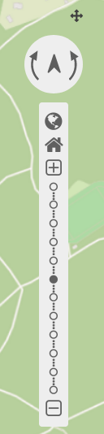

.. _zoom_bar:

Navigation Toolbar (Zoombar)
******************************

The Navigation Toolbar element provides a control to pan and zoom, similar to the OpenLayers PanZoomBar control. This element though is easier to use when custom styling is needed.

Configuration
=============

.. image:: ../../../../../figures/zoom_bar_configuration.png
     :scale: 80

YAML-Definition:

.. code-block:: yaml

   tooltip: 'Navigation Toolbar' # text to use as tooltip
   components: array("pan",      # components of the navigation toolbar, default all selected
     "history","zoom_box",
     "zoom_max","zoom_in_out",
     "zoom_slider")
   target: ~                     # Id of Map element to query
   stepSize: 50                  # step value for pan 
   stepByPixel: false            # step type "by pixel"/"percent", false = percent, default is false
   anchor: 'inline'/'left-top'/  # navigation toolbar alignment, default is 'left-top' 
     'left-bottom'/'right-top'/  # use inline f.e. in sidebar
     'right-bottom'
   draggable: true               # element is draggable or not, default true

Class, Widget & Style
============================

* Class: Mapbender\\CoreBundle\\Element\\ZoomBar
* Widget: mapbender.element.zoombar.js
* Style: mapbender.element.zoombar.css

HTTP Callbacks
==============

None.

JavaScript API
==============

None.

JavaScript Signals
==================

None.
