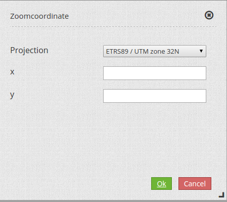
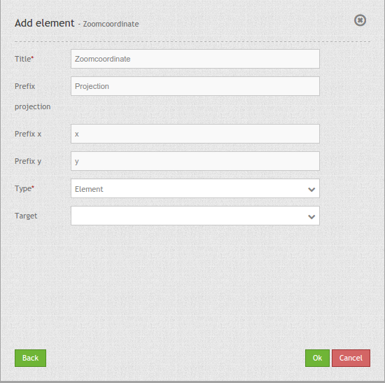

.. _zoomcoordinate:

Zoom to Coordinate
**********************************

This element offers a dialog where you can type in coordinates of different projections.  The coordinate will be transform to the actual projection of the map and will center the position.

Configuration
=============

YAML-Definition:

.. code-block:: yaml

   tooltip: 'Zoomcoordinate'            # text to use as title
   prefix_projection: 'projection'      # prefix for the projections
   prefix_x: 'x'                        # prefix for input column x-coordinate
   prefix_y: 'y'                        # prefix for input column y-coordinate
   type: 'element'                      # choose position of the element (element for sidepane or dialog for popup)
   target: ~                            # Id/Name of Map element to query

Repository
=============

* https://github.com/mapbender/mapbender-zoomcoordinate.git

Class, Widget & Style
===========================

* Class: Mapbender\\ZoomcoordinateBundle\\Element\\Zoomcoordinate
* Widget: mapbender.mbZoomcoordinate
* Style: mapbender.elements.zoomcoordinate.scss

HTTP Callbacks
==============

<action>
--------------------------------

JavaScript API
==============

<function>
----------

JavaScript Signals
==================

<signal>
--------

