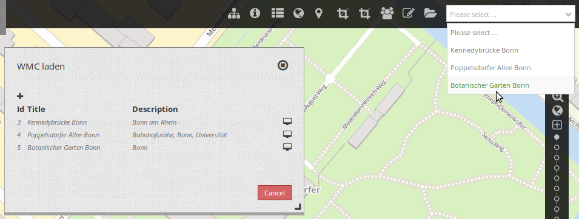
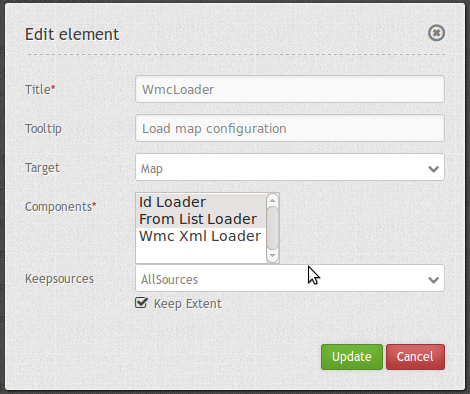

.. _wmc_loader:

WMC Loader
***********************

Mapbender can save configurations (see WMC Editor). This configurations can be loaded with the element WMC loader.

You can add WMC Loader to your application as a selectbox or a button which opens a dialog.

When you choose a configuration, the services in the configuration will be merged in your existing application.

Configuration
=============

You can configure this module as a selectbox or dialog. When you use dialog then you need a button to show this element. See :ref:`button_en` for inherited configuration options.

YAML-Definition:

.. code-block:: yaml

   title: WMC Loader
   tooltip: 'Load configuration'        # text to use as tooltip
   target: map                          # name of map element  
   components:  ['idloader', 'listloader', 'wmcloader'] # select components from 
                                        # idloader (load configuration by id on start of application), 
                                        # listloader (load configuration from a list), 
                                        # wmcloader (load from a file
   keepSources: false                   # keep the sources that are already loaded in an application,
                                        # default false
   keepExtent: false                    # keeps the actual extent, default is false (will apply the 
                                        # extent of the configuration)

Class, Widget & Style
==============

* Class: Mapbender\\WmcBundle\\Element\\WmcLoader
* Widget: <Put Widget name here>
* Style: <Put name of css file here>

HTTP Callbacks
==============

<action>
--------------------------------

JavaScript API
==============

<function>
----------

JavaScript Signals
==================

<signal>
--------

Controlling by URL
==================

Load a WMC by ID
------------------

To allow loading by ID you have to enable *Id Loader* in the configuration of the element. 

If you have a WMC with the id <wmcid> you may pass the URL parameter wmcid to load the WMC:

.. codeblock
  ?wmcid=<wmcid>

