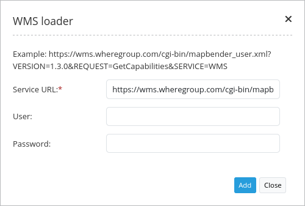

.. _wms_loader:

WMS Loader
***********************

Opens a dialog in  which a WMS can be loaded via the getCapabilities-Request.
You can load WMS 1.1.1 and  WMS 1.3.0.

Configuration
=============

.. image:: ../../../../../figures/wms_loader_configuration.png
     :scale: 80

You need a button to show this element. See :ref:`button_en` for inherited configuration options.

YAML-Definition:

.. code-block:: yaml

   target: ~                            # Id of Map element to query
   tooltip: 'WMS Loader'                # text to use as tooltip
   autoOpen: false                      # true/false open when application is started, default false 
   defaultFormat: 'image/png'           # default format is image/png, further possibilities: image/gif, image/jpeg
   defaultInfoFormat: 'text/html'       # default infoformat is text/html, further possibilities: text/xml, text/plain
   splitLayers: false                   # split layer on load of the service, default false
   useDeclarative: false                # allow to load service from a link (for example from featureInfo or search) 
                                        # and define the layers to activated, default false 

How to add a WMS by defining a link
====================================

You can add a WMS to Mapbender by defining a link f.e. in your WMS featureinfo or your search results.

Set **useDeclarative** true im mapbender.yml or check declarative in administration.

The link has to look like this:

.. code-block:: html

  <a mb-action="source.add.wms" mb-layer-merge="1" mb-wms-merge="1" 
  mb-wms-layers="Gewaesser,Fluesse" 
  href="http://wms.wheregroup.com/cgi-bin/germany.xml?VERSION=1.1.1&REQUEST=GetCapabilities&SERVICE=WMS">load service</a>

  <a mb-action="source.add.wms" mb-layer-merge="1" mb-wms-merge="1" 
  mb-wms-layers="Gewaesser,Fluesse" 
  mb-url="http://wms.wheregroup.com/cgi-bin/germany.xml?VERSION=1.1.1&REQUEST=GetCapabilities&SERVICE=WMS" href="">load service</a>

.. code-block:: yaml

    mb-action="source.add.wms"    # defines action to add a  WMS
    mb-wms-merge="1"              # adds the WMS only once, if WMS is already part of the application it will use the WMS which is there (default is 1)
    mb-layer-merge="1"            # default is 1 which means: activate the layers passed mb-wms-layers and do not disable the layers which are already active.
    mb-wms-layers="Gewaesser,Fluesse" # defines the layers to be activated, _all activates all layers, default all layers are deactivated
href oder mb-url              # refer to the WMS getcapabilities URL

   

Class, Widget & Style
=======================

* Class: Mapbender\\WmsBundle\\Element\\WmsLoader
* Widget: 
* Style: 

HTTP Callbacks
==============

None.

JavaScript API
==============

activate
----------

Opens a dialog in wich a WMS can be loaded via the getCapabilities-Request.
You can load WMS 1.1.1 and WMS 1.3.0.

JavaScript Signals
==================

None.
