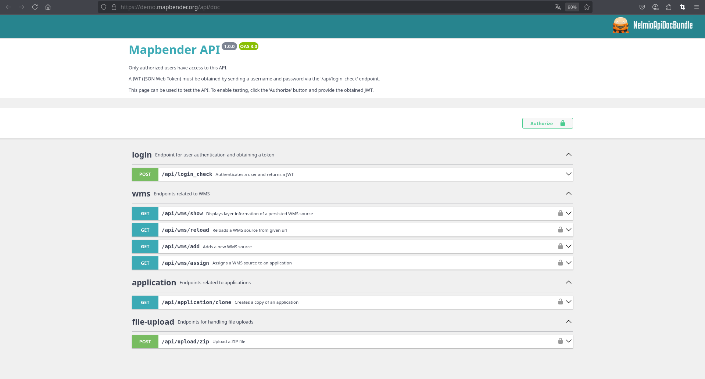

.. _api:

API
***

Mapbender provides a API through which clients can run several commands.

With the API clients can administrate Mapbender without needing to use the web administration interface. The REST API provides commands to get information for example about services and it also provides commands to publish or update services.

Documentation
-------------

The API documentation is integrated in every Mapbender installation and it is publicly available via http://localhost/mapbender/api/doc/

You find examples for each endpoint in the documentation. Please note that you need to login and authorize to run the examples. You also need the right "API" (see ACL).

You can browse through the documentation at the Mapbender demo: 

https://demo.mapbender.org/api/doc/

Apache Authorisation
--------------------

By default, Apache does not forward the Authorization header to the client for security reasons. However, this is necessary to use the API. The following must therefore be set in the VirtualHost or the configuration:

.. code-block:: apacheconf
     
   SetEnvIf Authorization "(.*)" HTTP_AUTHORIZATION=$1