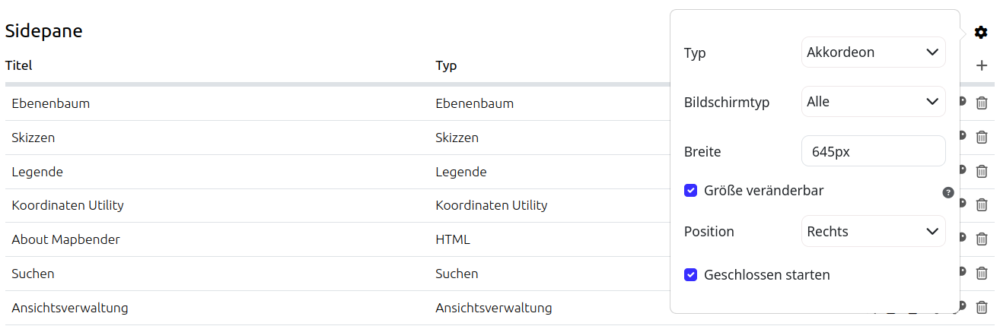

.. _mapbender_templates:

Mapbender Templates
###################

A Mapbender Template determines the basic representation (colour, font etc.) of an application. Furthermore, it defines the sections (e.g. toolbar or sidepane) in which new elements can be added.

There are three application templates in Mapbender that come with the installation:

* Fullscreen Template
* Basic Template (Fullscreen without Sidepane)
* Mobile Template

Fullscreen Template
*******************

.. image:: ../../figures/mapbender_fullscreen.png
     :width: 100%

View a demo of the Mapbender Fullscreen Template https://demo.mapbender.org/application/mapbender_user_yml

Regions of the Fullscreen Template:

  * Top toolbar (button region)
  * Sidepane (layertree, legend, search,...)
  * Map area (map, navigation toolbar, scalebar,...)
  * Footer (Copyright, scaledisplay, ...)

Specials:

  * dark background style of the template
  * fullscreen display with adjustable sidepane:

Configuration of the sidepane
*****************************

The fullscreen template offers an adjustable sidepane. The sidepane style can be changed via Mapbender backend (in the sidepane section of the Layouts tab).
The gear symbol in the sidepane section shows the following options:

* Type
* Screen type (mandatory field)
* Width
* Position
* Checkbox "Initially closed"

The option "Type" adjusts the inserted elements:

- "Accordion" shows elements via tabs:

.. image:: ../../figures/sidepane_accordion.png
     :scale: 80

- "Buttons" shows elements via buttons:

.. image:: ../../figures/sidepane_buttons.png
     :scale: 80

- "Unstyled" does not contain any styling options at all and displays the elements in the configured backend order:

.. image:: ../../figures/sidepane_nostyle.png
     :scale: 80

The option "Screen type" is a mandatory field and defines the device on which the sidepane is visible (any, mobile or desktop).

The option "Width" takes a pixel value and adjusts the sidepane width accordingly.

"Position" defines the placement of the sidepane: "Left" or "Right" can be selected.

The checkbox "Initially closed" hides the sidepane after the application is opened for the first time. It is possible to show or re-hide the sidepane while using the application.

Mobile Template
***************

.. image:: ../../figures/mapbender_mobile.png
     :scale: 80

View a demo of the Mapbender Mobile Template https://demo.mapbender.org/application/mapbender_mobile_yml

Regions of the mobile Template

  * Footer (button region)
  * Map area (map, navigation toolbar)
  * MobilePane (area that will overlap the map, when a dialog like Layertree or FeatureInfo is displayed)

Please note that not all elements can be used with the Mobile template at the moment. Here is a list of the elements that can be used:

  * Map
  * GPS-Position
  * Layertree (different design, will only show the root layer title of a service, you can only de-/activate a whole service)
  * BaseSourceSwitcher (different design: list not buttons)
  * FeatureInfo
  * Navigation Toolbar
  * HTML
  * Button
  * SimpleSearch
