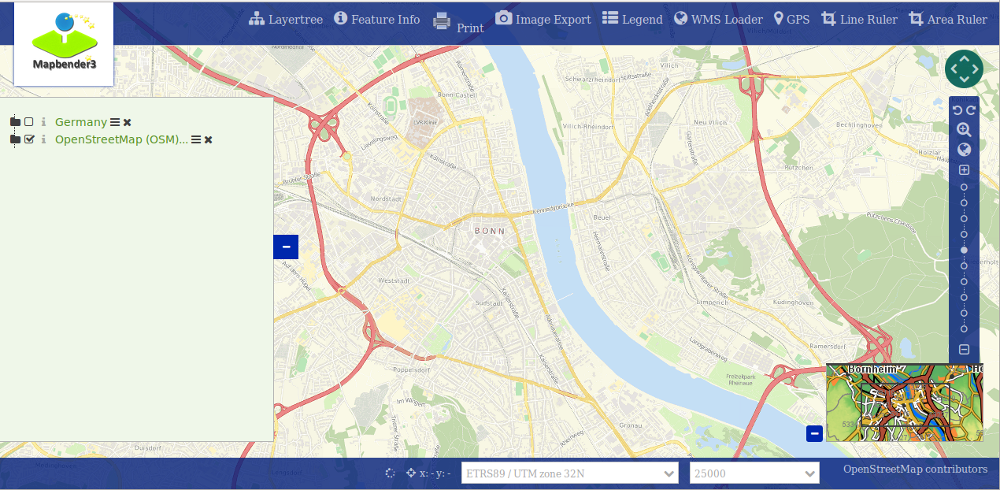

.. _templates:

How to create your own Template?
################################

Mapbender comes with application templates out of the box. But usually you want to use your own template with your own corporate design.
This document will show you how to create a Workshop DemoBundle for demonstration purposes.
The templates that come with Mapbender for demonstration purpose are located in the `Template` directory in the CoreBundle. To prevent overwriting your custom templates after an Mapbender upgrade you should create an extra bundle to safely store your custom files.

Since version 3.0.4.0 you can change the style of your application with the built-in CSS-Editor. You find the documentation about the CSS-editor at :doc:`How to change the style of your application with the CSS-editor? <css>`.

How to create your own template?
~~~~~~~~~~~~~~~~~~~~~~~~~~~~~~~~

**Steps for including your templates:**

* Create your own bundle
* Create a template PHP-file to register your template
* Create your own Twig-file
* Create your own CSS-file(s)
* Register your bundle in app/AppKernel.php
* Use your template

The new Application-template can be used in different ways:

* Entry in the YAML-file of the application (applications/app/config/applications/\*.yml)
* Choosing the template when you create a new application in the backend.
* Change the template of existing applications by changing the ``template`` column in the table ``mb_core_application``.

To use your own template we prepared a Workshop/DemoBundle, which can be used not only for application templates but also for customizing the administration interface. For the following steps, please download the files with the following links:

* https://github.com/mapbender/mapbender-workshop/tree/master

Create your own bundle
~~~~~~~~~~~~~~~~~~~~~~

User bundles are stored in the src-directory.

This is how the structure can look like:

.. code-block:: bash

 src/Workshop/DemoBundle/
                    WorkshopDemoBundle.php
                    /Resources
                                  /public
                                         demo_fullscreen.css
                                  /image
                                             workshop.ico
                                             workshop_logo.png
                                             print.png
                                             ...
                                  /views
					/Template
                                             fullscreen_demo.html.twig
                        /Template
		                DemoFullscreen.php

The following files have to be altered for design changes:

* twig - changes the structure (e.g. - delete a component like the sidebar)
* demo_fullscreen.css  - change colors, icons, fonts

Create a new namespace
**********************

The file WorkshopDemoBundle.php creates the namespace for the bundle and refers to the template and to your css-files.

.. code-block:: php

    <?php
    namespace Workshop\DemoBundle;
    use Mapbender\CoreBundle\Component\MapbenderBundle;
    class WorkshopDemoBundle extends MapbenderBundle
    {
        public function getTemplates()
        {
            return array('Workshop\DemoBundle\Template\DemoFullscreen');
        }
        public function getElements()
        {
            return array(
            );
        }
    }
    ?>

Create your own template file
*****************************

In our example the template file is called FullscreenDemo.php. You find it at src/Workshop/DemoBundle/Template/FullscreenDemo.php.

In the template file you define the name of your template, the regions that you want to provide and refer to a twig file.

.. code-block:: php

 <?php

 namespace Workshop\DemoBundle;

 use Mapbender\CoreBundle\Component\MapbenderBundle;

 class DemoFullscreen extends MapbenderBundle
 {
    ...
 }

 public static function getTitle()
 {
   return 'DemoFullscreen';
 }
 ....

 public static function listAssets()
 {
        $assets = array(
            'css' => array('@MapbenderCoreBundle/Resources/public/sass/template/fullscreen.scss','@WorkshopDemoBundle/Resources/public/demo_fullscreen.css'),
            'js'    => array(
                '/components/underscore/underscore-min.js',
            ...
            ),
            'trans' => array()
        );
    return $assets;
 }

 ...
 ->render('WorkshopDemoBundle:Template:demo_fullscreen.html.twig',...

Adding properties for your "sidepane" region
********************************************

For a "sidepane" region are "tabs" and "accordion" properties supported.

* "tabs" orders Mapbender elements in tabs
* "accordion" displays Mapbender elements as an accordion list

For adding you define the function "getRegionsProperties" in the template file.

For configuration you check an option in your application's configuration.

.. code-block:: php

    /**
      @inheritdoc
     */
    public static function getRegionsProperties()
    {
        return array(
            'sidepane' => array(
                'tabs' => array(
                    'name' => 'tabs',
                    'label' => 'mb.manager.template.region.tabs.label'),
                'accordion' => array(
                    'name' => 'accordion',
                    'label' => 'mb.manager.template.region.accordion.label')
            )
        );
    }

Create your own twig-file
~~~~~~~~~~~~~~~~~~~~~~~~~

You find the twig-files at the following path:

* mapbender\\src\\Workshop\\DemoBundle\\Resources\\views\\Template

The easiest way to create your own twig file is to copy an existing twig, save it under a new name and change the content like colors.

.. code-block:: bash

 cd mapbender/src/Workshop/DemoBundle/Resources/views/Template

Use the existing template from mapbender/src/Mapbender/CoreBundle/Resources/views/Template/fullscreen.html.twig and copy it to fullscreen_demo.html.twig

Create your own css-file
~~~~~~~~~~~~~~~~~~~~~~~~

Create an empty css-file and fill it with content. You only have to define the parts that have to look different from the default style of the element.

Firebug can help you to find out the styles you want to change.

Your file could be named like this: src/Workshop/DemoBundle/Resources/public/demo_fullscreen.css and have the following definition:

.. code-block:: css

 .toolBar {
   background-color: rgba(0, 29, 122, 0.8) !important;
 }

 .toolPane {
   background-color: rgba(0, 29, 122, 0.8) !important;
 }

 .sidePane {
   overflow: visible;
   background-image: url("");
   background-color: #eff7e9;
 }

 .sidePane.opened {
     width: 350px;
 }

 .logoContainer {
   background-color: white !important;
   background-image: url("") !important;
   -webkit-box-shadow: 0px 0px 3px #0028AD !important;
   -moz-box-shadow: 0px 0px 3px #0028AD !important;
   box-shadow: 0px 0px 3px #0028AD !important;
 }

 .sidePaneTabItem {
    background-color: #0028AD;
 }

 .layer-opacity-handle {
     background-color: #0028AD;
 }

 .mb-element-overview .toggleOverview {
     background-color: #0028AD;
 }

 .button, .tabContainerAlt .tab {
     background-color: #0028AD;
 }

 .iconPrint:before {
   /*content: "\f02f"; }*/
   content:url("image/print.png");
 }

 .popup {
   background-color: #eff7e9;
   background-image: url("");
 }

 .pan{
   background-color: rgba(0, 93, 83, 0.9);
 }

The result of these few lines of css will look like this:

When you open your new application a css-file will be created at:

* web/assets/WorkshopDemoBundle__demo_fullscreen__css.css

If you do further edits at your css file you may have to delete the generated css file in the assets directory to see the changes. You should also clear the browser cache.

.. code-block:: bash

 sudo rm -f web/assets/WorkshopDemoBundle__demo_fullscreen__css.css

Style the administrational pages
~~~~~~~~~~~~~~~~~~~~~~~~~~~~~~~~~

Please change the following css-files for the backend pages:

 * login.css : Change the design of the login page
 * manager.css : Change the design of the administration pages (e.g. application overview)
 * password.css : Change the design of the password pages (e.g. Reset Password - page)

You only have to define the parts that have to look different than the default page style.

Firebug can help you to find out the styles you want to change.

Referencing the CSS-files is possible with FOMManagerBundle and FOMUserBundle. They must be filed under app/Resources/. The already contained twig-files overwrite the default settings if configured correctly (Requirements from manager.html.twig file).
Alternatively, it is possible to copy a twig-file and adjust it afterwards.

 .. code-block:: bash

  cp fom/src/FOM/ManagerBundle/Resources/views/manager.html.twig app/Resources/FOMManagerBundle/views/

When the unchanged stylesheet remain, administration looks as follows:

 .. image:: ../../figures/customization/workshop_administration.png
      :scale: 80

Register your template
~~~~~~~~~~~~~~~~~~~~~~

To register your template you have to create a file at

* mapbender/src/Workshop/DemoBundle/Template/DemoFullscreen.php

.. code-block:: bash

 cd mapbender/src/Mapbender/CoreBundle/Template
 cp Fullscreen.php mapbender/src/Workshop/DemoBundle/Template/DemoFullscreen.php

Add your new css-file to the listAssets function as last array-entry:

.. code-block:: php

    public static function listAssets()
    {
        $assets = array(
            'css' => array('@MapbenderCoreBundle/Resources/public/sass/template/fullscreen.scss','@WorkshopDemoBundle/Resources/public/demo_fullscreen.css'),
            'js'    => array(
                '/components/underscore/underscore-min.js',
                '@FOMCoreBundle/Resources/public/js/widgets/popup.js',
                '@FOMCoreBundle/Resources/public/js/frontend/sidepane.js',
                '@FOMCoreBundle/Resources/public/js/frontend/tabcontainer.js',
                '@MapbenderCoreBundle/Resources/public/regional/vendor/notify.0.3.2.min.js',
                "/components/datatables/media/js/jquery.dataTables.min.js",
                '/components/jquerydialogextendjs/jquerydialogextendjs-built.js',
                "/components/vis-ui.js/vis-ui.js-built.js"
            ),
            'trans' => array()
        );
        return $assets;
    }

.. code-block:: php

    public function render($format = 'html', $html = true, $css = true, $js = true)
    {
        $templating = $this->container->get('templating');
        return $templating
                        ->render('WorkshopDemoBundle:Template:demo_fullscreen.html.twig',
                                 array(
                            'html' => $html,
                            'css' => $css,
                            'js' => $js,
                            'application' => $this->application));
    }

Register your bundle in app/AppKernel.php
~~~~~~~~~~~~~~~~~~~~~~~~~~~~~~~~~~~~~~~~~

When you create a new application through the Mapbender administration you have to choose a template you want to use.

Before your new template will show up you have to register your bundle in the file app/AppKernel.php

* mapbender/app/AppKernel.php

.. code-block:: php

 class AppKernel extends Kernel
 {
    public function registerBundles()
    {
        $bundles = array(
            // Standard Symfony bundles
            new Symfony\Bundle\FrameworkBundle\FrameworkBundle(),
            ....

            // Extra bundles required by Mapbender/OWSProxy3
            new FOS\JsRoutingBundle\FOSJsRoutingBundle(),

            // FoM bundles
            new FOM\CoreBundle\FOMCoreBundle(),
            ...

            // Mapbender bundles
            new Mapbender\CoreBundle\MapbenderCoreBundle(),
            ...

	        new Workshop\DemoBundle\WorkshopDemoBundle(),

        );

Add write access to the web-directory for your webserver user.

.. code-block:: bash

    chmod ug+w web

Update the web-directory. Each bundle has it's own assets - CSS files, JavaScript files, images and more -
but these need to be copied into the public web folder:

.. code-block:: bash

    app/console assets:install web

Alternatively, as a developer, you might want to use the symlink switch on that command to
symlink instead of copy. This will make editing assets inside the bundle
directories way easier.

.. code-block:: bash

   app/console assets:install web --symlink --relative

Now your template should show up in the template list when you create a new application.

Usage in YAML-applications
**************************

You can adjust the YAML-applications in app/config/applications and change the templtate parameter.

.. code-block:: yaml

  "template:   Workshop\DemoBundle\Template\DemoFullscreen"

Usage in new applications
*************************

If you create a new application in the administration interface of Mapbender, you can choose the new template. 

Usage in existing applications
******************************

For existing applications you can change the parameter in the Mapbender database in the column ``template`` of the table ``mb_core_application``.

For the *WorkshopDemoBundle* you change the entry from ``Mapbender\CoreBundle\Template\Fullscreen`` to ``Workshop\DemoBundle\WorkshopDemoBundle``.

Usecases
~~~~~~~~

How do I change my design?
**************************

You have to edit the following files, if want to change the design

* twig - changes in the structure (like - delete a component like sidebar), refer to a logo
* demo_fullscreen.css - changes of color, icons, fonts

How do I change the logo?
*************************

The logo (default is the Mapbender logo) can be changed in the parameters.yml. Which causes a global change.

.. code-block:: yaml

 server_logo:   bundles/workshopdemo/image/workshop_logo.png

Or in the twig file:

.. code-block:: html

 

How do I change the title and favicon?
**************************************

You can adjust the title and the favicon also in the twig-file:

.. code-block:: yaml

 Workshop - {{ application.title }}

 {{ asset('bundles/workshopdemo/imgage/workshop.ico') }}

How do I change the buttons?
****************************

Mapbender uses 'Font Awesome Icons' font icon collection:

.. code-block:: css

 @font-face {
   font-family: 'FontAwesome';
   src: url("../../bundles/fomcore/images/icons/fontawesome-webfont.eot?v=3.0.1");
   src: url("../../bundles/fomcore/images/icons/fontawesome-webfont.eot?#iefix&v=3.0.1") format("embedded-opentype"), url("../../bundles/fomcore/images/icons/fontawesome-webfont.woff?v=3.0.1") format("woff"), url("../../bundles/fomcore/images/icons/fontawesome-webfont.ttf?v=3.0.1") format("truetype");
   font-weight: normal;
   font-style: normal;
 }

In your css-file you can refer to a font images like this:

.. code-block:: css

  .iconPrint:before {
    content: "\f02f";
  }

If you want to use an image you could place the image in your bundle and refer to it like this

.. code-block:: css

  .iconPrint:before {
   content:url("imgage/print.png");
  }

Try this out
~~~~~~~~~~~~

* you can download the Workshop/DemoBundle at https://github.com/mapbender/mapbender-workshop
* change the color of your icons
* change the size of your icons
* change the color of the toolbar
* use an image instead of a font-icon for your button
* move the position of your overview to the left
* Have a look at the workshop files to see how it works
