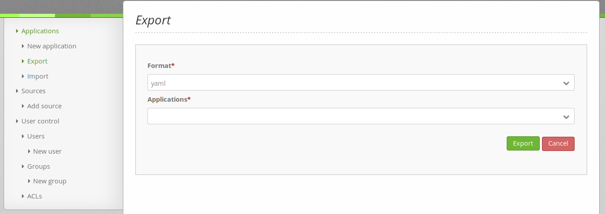
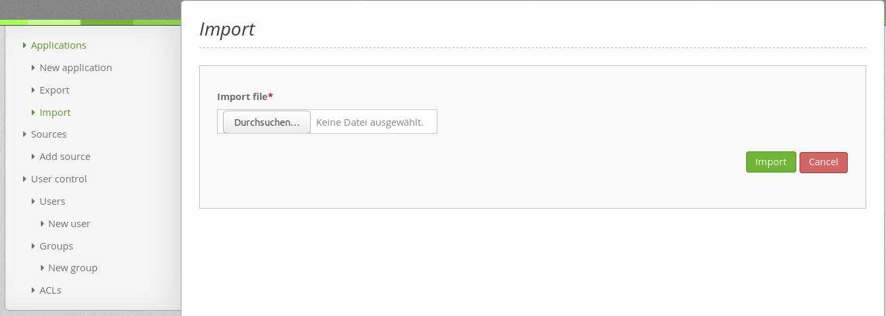

.. _yaml:

YAML Configuration (Configuration and Application files)
========================================================

The following Configuration files are under application/app/config.

parameters.yml
--------------
Fundamental parameters are specified here.

**Database**
************

To configurate the database the files config.yml and parameters.yml are needed.
The file config.yml contains placeholders for variables, which are specified in the file parameters.yml.

The default database definiton set in config.yml is as follows:

.. code-block:: yaml

    doctrine:                                               # Values, surrounded by %-marks, are variables
        dbal:
            default_connection: default                     # Database connection, used as standard in Mapbender (``default_connection: default``).
            connections:
                default:
                driver:    "%database_driver%"              # More information below the code
                host:      "%database_host%"                # Database host on which the database runs. Either name of the host (e.g. localhost) or IP address (e.g. 127.0.0.1).
                port:      "%database_port%"                # Port, the database listens to (e.g. 5432 for PostgreSQL).
                dbname:    "%database_name%"                # Name of the database (e.g. mapbender). Create a database with the command ``doctrine:database:create`` bzw. ``doctrine:schema:create``. More information:  `Installation<../installation.html>`_.
                path:      "%database_path%"                # %database_path%, path to the file of the SQLite database. If you don't use a SQ-lite database, write (~) or ``null``.
                user:      "%database_user%"                # User name for database connection.
                password:  "%database_password%"            # Password.
                charset:    UTF8                            # Coding of the database.
                logging:   "%kernel.debug%"                 # Option, SQLs won't be logged (standard: %kernel.debug%). `More information: <http://www.loremipsum.at/blog/doctrine-2-sql-profiler-in-debugleiste>`_.
                profiling: "%kernel.debug%"                 # Profiling SQL requests. This option can be turned of in production. (standard: %kernel.debug%)

* database_driver: Database driver. Possible values are:

  * pdo_sqlite - SQLite PDO driver
  * pdo_mysql - MySQL PDO driver
  * pdo_pgsql - PostgreSQL PDO driver
  * oci8 - Oracle OCI8 driver
  * pdo_oci - Oracle PDO driver

  Please notice: Necessary PHP drivers need to been installed and activated.

Example:
Database configuration in parameters.yml, when PostgreSQL is used:

.. code-block:: yaml

    database_driver:   pdo_pgsql
    database_host:     localhost
    database_port:     5432
    database_name:     mapbender
    database_path:     ~
    database_user:     postgres
    database_password: secret

**Use of several databases**
****************************

With Mapbender you can use several databases. This is recommended when you want to keep your data seperated from Mapbender data. Or when you want to use code that doesn't belong to a Mapbender bundle.

You already need a second database for *geo data search* (with SearchRouter)  and data collection (Digitizer).

The default database connection (``default_connection: default``) is used by Mapbender.

If you want to use another database, you have to define a database connection with a different name.

.. code-block:: yaml

    parameters:
        # database connection "default"
        database_driver:   pdo_pgsql
        database_host:     localhost
        database_port:     5432
        database_name:     mapbender
        database_path:     ~
        database_user:     postgres
        database_password: postgres

        # database connection "search_db"
        database2_driver:   pdo_pgsql
        database2_host:     localhost
        database2_port:     5432
        database2_name:     search_db
        database2_path:     ~
        database2_user:     postgres
        database2_password: postgres

Now you can refer to the database **search_db** in the elements SearchRouter and Digitizer.

More Information:

Symfony documentation <http://symfony.com/doc/current/best_practices/configuration.html>`_)

Mapbender uses Doctrine. Doctrine is a collection of PHP libaries (`Doctrine project <http://www.doctrine-project.org/>`_).

**Disclaimer**
**************

.. image:: ../../figures/disclaimer.png

A disclaimer can be added through the use of site links.

.. code-block:: yaml

    mapbender.sitelinks:
      - link: https://mapbender.org/en/legal-notice/				# Link URL
        text: Imprint & Contact									    # Link text
      - link: https://mapbender.org/en/privacy-policy/
        text: Privacy Policy

Site links will be seperated by "|".

**Language setting**
*********************

The language (locale) of the whole Mapbender installation can be changed, but not the language of a single application.

  Following language codes are available:
    * en for English (standard),
    * de for German,
    * es for Spanish,
    * it for Italian,
    * nl for Dutch,
    * pt for Portugese,
    * ru for Russian.

Configuration example:

.. code-block:: yaml

   # locale en, de, it, es, ru, nl, pt are available
    fallback_locale:   en
    locale:            en
    secret:            ThisTokenIsNotSoSecretChangeIt

More information: http://doc.mapbender.org/en/book/translation.html

**Logo**
********
The logo (default is the Mapbender logo) can be changed in parameters.yml. This change has a global impact on the whole Mapbender installation.

.. code-block:: yaml

    branding.logo:     new_logo.jpg

 The file of the logo needs to be added under application/web.

 **Mailer**
***********
Mailer information in parameters.yml (e.g. smtp or sendmail).
Configuration example:

.. code-block:: yaml

        mailer_transport:  smtp
        mailer_host:       localhost
        mailer_user:       ~
        mailer_password:   ~

The functions 'Self-Registration' and 'reset password' need a mailer.

More information in chapter :ref:`users`.

 **Project name**
*****************
The name of the project (default: Mapbender) can be changed in parameters.yml. The change has a global impact on the whole Mapbender installation.

.. code-block:: yaml

    branding.project_name:     Example

**Important note:** In parameters.yml **tabulators may not be used for indentation** instead you need to use space.

**Proxy settings**
******************
If you use a proxy, you need to change parameters.yml.

Configuration example:

.. code-block:: yaml

    # OWSProxy Configuration
        ows_proxy3_logging: false
        ows_proxy3_obfuscate_client_ip: true
        ows_proxy3_host: myproxy
        ows_proxy3_port: 8080
        ows_proxy3_connecttimeout: 60
        ows_proxy3_timeout: 90
        ows_proxy3_user: ~
        ows_proxy3_password: ~
        ows_proxy3_noproxy:
            - 192.168.1.123

config.yml
-----------

* **fom_user.selfregistration**: To enable or disable self-registration of users, change the fom_user.selfregistration parameter. You have to define self_registration_groups, so that self-registered users are added to these groups automatically, when they register. They will get the rights that are assigned to these groups.
* **fom_user.reset_password**: In the same way the possibility to reset passwords can be enabled or disabled.
* **framework.session.cookie_httponly**: For HTTP-only session cookies, make sure the framework.session.cookie_httponly parameter is set to true.

**Database**
*************
Important: Every database defined in parameters.yml needs to have a placeholder in config.yml as well:

.. code-block:: yaml

    doctrine:                                               # Values, surrounded by %-marks, are variables
        dbal:
            default_connection: default                     # Database connection, used as standard in Mapbender (``default_connection: default``).
            connections:
                default:
                driver:    "%database_driver%"              # More information below the code
                host:      "%database_host%"                # Database host on which the database runs. Either name of the host (e.g. localhost) or IP address (e.g. 127.0.0.1).
                port:      "%database_port%"                # Port, the database listens to (e.g. 5432 for PostgreSQL).
                dbname:    "%database_name%"                # Name of the database (e.g. mapbender). Create a database with the command ``doctrine:database:create`` bzw. ``doctrine:schema:create``. More information:  `Installation<../installation.html>`_.
                path:      "%database_path%"                # %database_path%, path to the file of the SQLite database. If you don't use a SQ-lite database, write (~) or ``null``.
                user:      "%database_user%"                # User name for database connection.
                password:  "%database_password%"            # Password.
                charset:    UTF8                            # Coding of the database.
                logging:   "%kernel.debug%"                 # Option, SQLs won't be logged (standard: %kernel.debug%). `More information: <http://www.loremipsum.at/blog/doctrine-2-sql-profiler-in-debugleiste>`_.
                profiling: "%kernel.debug%"                 # Profiling SQL requests. This option can be turned of in production. (standard: %kernel.debug%)

**Use of several databases**
****************************
Example with two database connections in **config.yml**:

.. code-block:: yaml

    doctrine:
        dbal:
            default_connection: default
            connections:
                # database connection default
                default:
                    driver:    "%database_driver%"
                    host:      "%database_host%"
                    port:      "%database_port%"
                    dbname:    "%database_name%"
                    path:      "%database_path%"
                    user:      "%database_user%"
                    password:  "%database_password%"
                    charset:    UTF8
                    logging:   "%kernel.debug%"
                    profiling: "%kernel.debug%"
                # database connection search_db
                search_db:
                    driver:    "%database2_driver%"
                    host:      "%database2_host%"
                    port:      "%database2_port%"
                    dbname:    "%database2_name%"
                    path:      "%database2_path%"
                    user:      "%database2_user%"
                    password:  "%database2_password%"
                    charset:    UTF8
                    logging:   "%kernel.debug%"
                    profiling: "%kernel.debug%"

More information under parameters.yml.

YAML Application files
-----------------------

YAML application files are stored under **app/config/applications**.
“**Mapbender mobile**”, “**Mapbender Demo Map**” and “**Mapbender Demo Map basic**” are pre-implemented as example applications.

If you do not want the three example applications to be visible, you can change the variable 'published' to 'false'.

.. code-block:: yaml

	parameters:
		applications:
			mapbender_mobile:
				[...]
				published: false

Now the applications will not be visible for users (except for root user).

New YAML applications can be placed in the folder and will be automatically recognized by Mapbender.

Mapbender Demo Map
------------------

Following functions are pre implemented:

Toolbar
    * Layer tree (Button)
    * Featureinfo (Button)
    * Print client (Button)
    * Image Export (Button)
    * Legend (Button)
    * WMS loader (Button)
    * GPS Position
    * measure (line und area) (Buttons)
    * about (About dialog)
    * POI (Button)

Sidepane
    * Layer tree
    * Redlining
    * Coordinates utility
    * About Mapbender (HTML)

Content
    * Map
    * Navigation toolbar
    * Legend
    * Featureinfo
    * WMS loader
    * Image export
    * Print client
    * measure line
    * measure area
    * Scale bar
    * Layer tree
    * Overview
    * Scale display
    * POI

Footer
    * Activity Indicator
    * Coordinates Display (mb.core.coordinates.class.title)
    * SRS selector
    * Scale selector
    * © OpenStreetMap contributors (Button)
    * HTML-powered by Mapbender (HTML)

Detailed descriptions of the functions: https://doc.mapbender.org/de/functions.html

Mapbender Demo Map basic
------------------------

Differences to Mapbender Demo Map:

Toolbar
    Instead of 'POI', 'Coordinates utility' is integrated.

Sidepane
    No functions pre-implemented.

Content
    Instead of 'Scale display' and 'POI', the function 'Coordinates utility' is integrated.

Detailed descriptions of the functions: https://doc.mapbender.org/de/functions.html

Mapbender mobile
----------------

For a mobile template on smartphones and tablets.

Following functions are pre-implemented:

Footer
    * Themes (Button)
    * Base source switcher (Button)
    * GPS Position
    * Imprint (Button)
    * help (Button)
    * about (Button)

Content
    * Map
    * Navigation toolbar

Mobilepane
    * Themes (Layer tree)
    * Featureinfo
    * Imprint (HTML)
    * help (HTML)
    * Base source switcher
    * about (HTML)

Export/import YAML application files over the user interface
------------------------------------------------------------

**Export**

You can export applications as JSON or YAML under **Applications --> Export**.

**Import**

You can import the export file into a Mapbender installation under **Applications --> Import**.

Export/import/clone YAML application files over the console
-----------------------------------------------------------

**Export**

Applications can be exported as .json or .yml -file over the console.

A YAML file that has been exported over the console cannot be placed under app/config/application to be imported in a Mapbender installation.
The YAML format that is produced by exporting over the console is different from the YAML format of the files under app/config/application.
The former is produced by a machine and the latter is code written by a developer.

.. code-block:: bash

	$ app/console mapbender:application:export mapbender_user_yml > ~/Downloads/demo.yaml

*> ~/Downloads/demo.yaml* creates a new file under the specified path
*$ app/console mapbender:application:export mapbender_user_yml* shows the data on the console.

**Import**

YAML files that have been exported over the user interface or console can be imported over the console.

.. code-block:: bash

	$ app/console mapbender:application:import ~/Downloads/demo.yaml

**Clone**

Clone an existing application.

.. code-block:: bash

	$ app/console mapbender:application:clone mapbender_user_yml

The name of the new application is mapbender_user_yml_imp1.

**Help for the commands**

.. code-block:: bash

    $ app/console mapbender:application:import --help

.. code-block:: bash

    $ app/console mapbender:application:export --help
