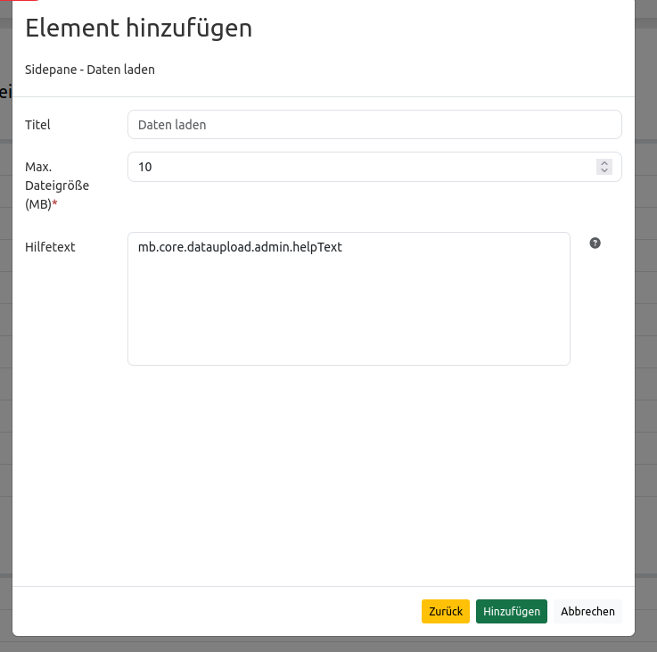
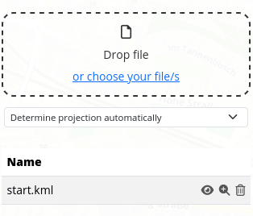

Data Uploader
*************

With the data uploader you can use polygons and multipolygons you already have in a file format, without having to do it manually inside Mapbender.

Files in GeoJSON, KML, GML and GPX format are accepted with drag and drop or from your files.
Additionally, you either choose a CRS or let Mapbender 'Determine projection automatically'. The file size should not exceed 10 MB.

After choosing your application and looking at the configurations, you will find the Data Uploader under sidepane the last one listed.

Now, in Mapbender you will find the application in the sidepane and you can either insert files via drag and drop or by klicking on the underlined part 'choose file'.

After the polygon is uploaded it will be shown in the map and sidepane.
Where you can make it (in)visible, zoom to the point, line or polygon, or delete the layer.
