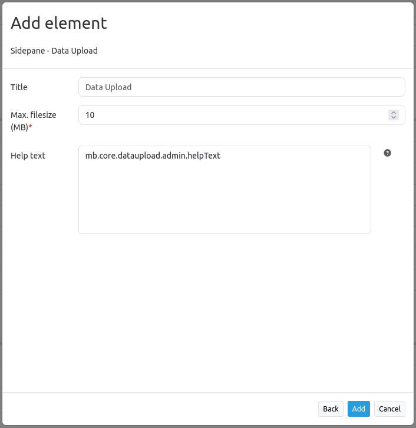
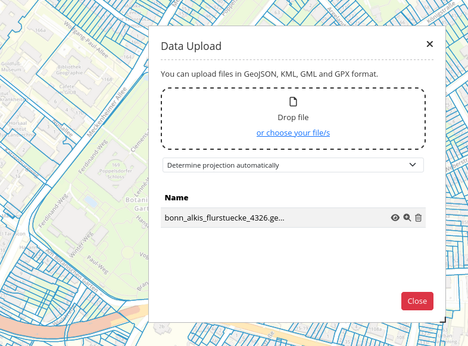

Data Upload
***********

With the Data Upload you can use polygons and multipolygons you already have in a file format, without having to do it manually inside Mapbender.

Files in GeoJSON, KML, GML and GPX format are accepted with drag and drop or from your files.
Additionally, you either choose a CRS or let Mapbender 'Determine projection automatically'. The file size should not exceed 10 MB.

Configuration
-------------

* **Show lable**: Shows a label which incorporates the title and appears next to the coordinates.
* **Title**: Title of the element. It will appear next to the coordinates if 'Show label' is activated.
* **Target**: Id of Map element to query
* **Group**: Optional group name.
* **Tooltip**: The text entered as a tooltip will be indicated by hovering over the element with the cursor.
* **Icon**: Choose an icon that will be displayed as the button of the element in the map.

After choosing your application and looking at the configurations, you will find the Data Upload under sidepane the last one listed.

Now, in Mapbender you will find the application in the sidepane and you can either insert files via drag and drop or by klicking on the underlined part 'choose file'.

After the polygon is uploaded it will be shown in the map and sidepane.
Where you can make it (in)visible, zoom to the point, line or polygon, or delete the layer.

YAML-Definition
---------------

This tamplate can be used to insert the element into a YAML application.

.. code-block:: yaml
     
     dataupload:
     class: Mapbender\CoreBundle\Element\DataUpload
     target: map
     maxFileSize: 10
     helpText: mb.core.dataupload.admin.helpText