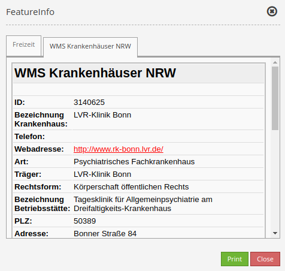

.. _feature_info:

FeatureInfo
***********

This element provides feature info capabilities to Mapbender. It works with WMS.

.. image:: ../../../figures/feature_info.png
     :scale: 80

The WMS Krankenhäuser NRW (https://www.wms.nrw.de/wms/krankenhaus?Service=WMS&Version=1.3.0&Request=getCapabilities) from 'Ministerium für Gesundheit, Emanzipation, Pflege und Alter NRW' serves as example service.

Configuration
=============

.. image:: ../../../figures/feature_info_configuration.png
     :align: center

* **Auto-open:** Enable or disable autoopening of the copyright window when starting the application (default: false).
* **Deactivate on close:** true/false to deactivate the functionality after closing the result dialog (default: true).
* **Print Result:** Offer a link to print the result of FeatureInfo (default: false).
* **Only valid:** Display valid WMS (default: false).
* **Title:** Title of the element. It will be indicated next to the button.
* **Display type:** Display of the information, tabs or accordion.
* **Max count:** Maximum number of results that should be displayed in the result dialog.
* **Width/Height:** Width/height of the dialog in px.
* **Highlighting enabled:** Deactivates/activates FeatureInfo Highlighting (default: false).
* **Default fill color** Sets the fill color for selected objects.
* **Default stroke color** Sets the stroke color for selected objects.
* **Opacity (%) of the default color** Sets the opacity of the default color.
* **Stroke width (pixels) of the default color** Sets the stroke width (in pixels) of the default color.
* **Hover fill color** Sets the hover fill color for selected objects.
* **Hover stroke color** Sets the hover stroke color for selected objects.
* **Opacity (%) of the hover color** Sets the opacity of the hover color.
* **Stroke width (pixels) of the hover color** Sets the stroke width (in pixels) of the hover color.

A :ref:`button` is also needed for complete frontend integration.

Layertree settings
------------------
The layer is visible and FeatureInfo request for the layer is activated.

.. image:: ../../../figures/de/feature_info_on.png
     :width: 50%

The layer is visible and the FeatureInfo request for the layer is deactivated.
 
.. image:: ../../../figures/de/feature_info_off.png
     :width: 50%

The layer is invisible and there will be no FeatureInfo request (even if FeatureInfo request is activated).

.. image:: ../../../figures/de/feature_info_on_layer_invisible.png
     :width: 50%
     

Display as tabs and accordion
-----------------------------

With the switch "type", the responses of multiple services can be displayed either in different tabs or in an accordion.

Example Tabs:

Example Accordion:

.. image:: ../../../figures/feature_info_accordion.png
     :scale: 80

     
Printing the results
--------------------

The switch "Print result" allows you to print the output of the FeatureInfo. A "Print" button will appear on the FeatureInfo dialogue. The printing itself is achieved with the printing dialogue of your web browser.

To make sure that all images and background colors are available in your printout, you should check the print settings of your web browser: In Firefox, you can check the option "Print background". In Chrome-based browsers the option is called "Background graphics". The used fonts can vary on a printout as PDF and depend on the specific viewer. Furthermore, most web browsers modify the pages a bit before printing to save ink/toner.

FeatureInfo Highlighting
------------------------

Individual geometries of a WMS can be highlighted with FeatureInfo. This is particularly helpful for the work with comprehensive WMS, because it allows an easier identification of geometries.

A FeatureInfo request with activated highlighting could look like this:

The figure above highlights several geometries in the map (Postcodes ('PLZ'): 53111, 53113 und 53115). The FeatureInfo dialog only displays information belonging to these geometries. The area 53115 is highlighted red due to hovering.

FeatureInfo Highlighting is activated within the Feature Info element. Here, users get the option to choose a default and hover color.

Furthermore, the HTML output of the FeatureInfo request has to be adjusted. In order to do so, the geometry query has to be hidded as a WKT in an HTML div (will not be displayed). In addition, the EPSG code must be transferred and there must be a unique ID in the HTML div (see configuration below). Mapbender evaluates this information and displays the geometries on the map. When you hover over the entries in the info window, the associated geometry is highlighted accordingly. The adaptation looks different depending on which WMS server software you are using. Adjustments can easily be made for MapServer, QGIS Server, GeoServer.

The necessary adjustment is shown here using a configuration for MapServer. In the DATA specification, the geometry is put out as a WKT. In addition, the FeatureInfo template is adapted. If a WMS is now queried via GetFeatureInfo, the corresponding areas are highlighted on the map.

.. code-block:: bash

  DATA "geom from (Select *, ST_AsText(geom) as geom_wkt from plz) as foo USING UNIQUE gid USING SRID 4326"

  

  <table>
  	...
  <table>
  

YAML-Definition:
----------------

This template can be used to insert the element into a YAML application.

.. code-block:: yaml

   title: FeaureInfo              # title of the element
   tooltip: Feature Info          # text to use as tooltip
   type: dialog                   # defines the element type (default: dialog)
   target: map                    # Id of Map element to query
   autoActivate: false            # true/false open when application is started (default: false)
   deactivateOnClose: true        # true/false to deactivate the functionality after closing the result dialog (default: true)
   onlyValid: false               # require correct HTML format of response (default: false)
   printResult: false             # offer a link to print the result of the featureInfo (default: false)
   displayType: tabs              # tabs/accordion (default: tabs)
   width: 700                     # width of the dialog in pixels (default: 700)
   height: 500                    # height of the dialog in pixels (default: 500)
   maxCount: 100	              # maximum count of hits to be displayed
   highlighting: false            # deactivates/activates FeatureInfo Highlighting (default: false)
   fillColorDefault: '#ffff00'    # fill color to highlight selected objects
   strokeColorDefault: '#ff00ff'  # stroke color to highlight selected objects
   opacityDefault: 25             # opacity for fill color of selected objects
   strokeWidthDefault: 3          # line width to highlight selected objects
   fillColorHover: '#00ffff'      # fill color to highlight selected objects during hovering
   strokeColorHover: '#0000ff'    # stroke color to highlight selected objects during hovering
   opacityHover: 50               # opacity for fill color of selected objects during hovering
   strokeWidthHover: 5            # line width to highlight selected objects during hovering

