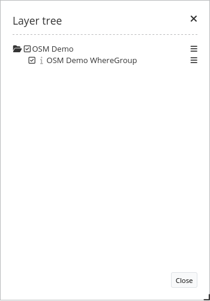
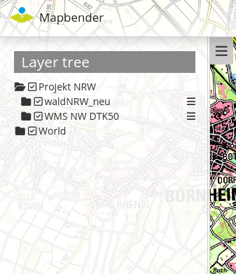
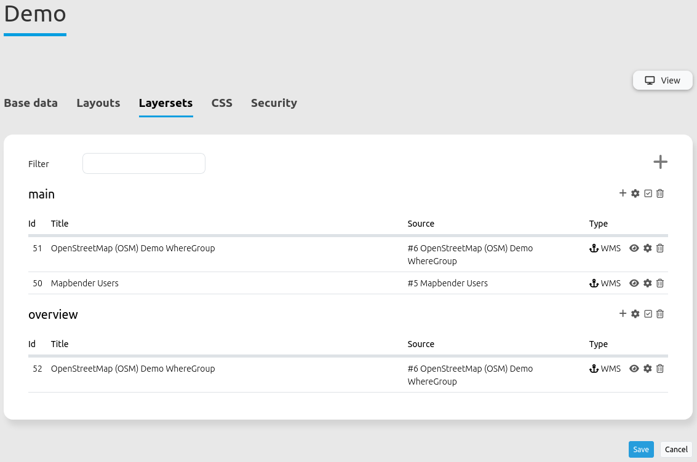
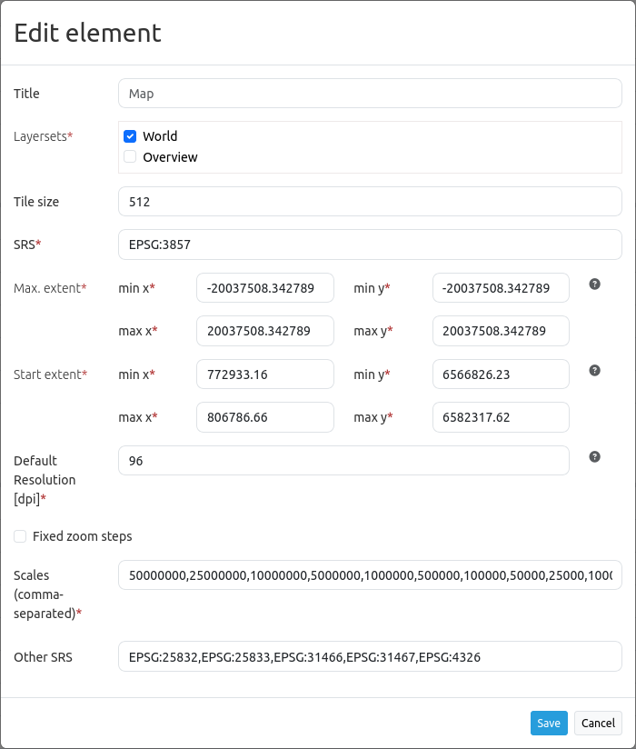
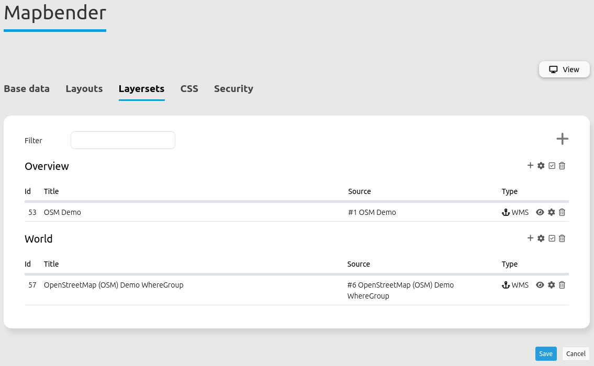
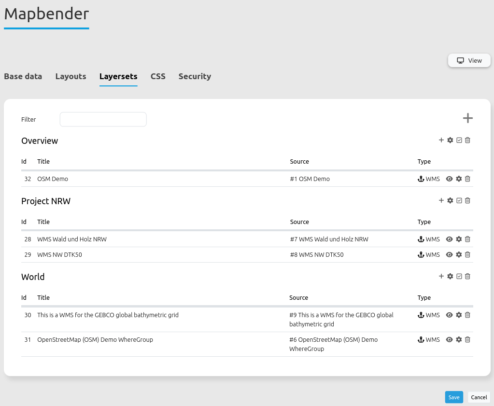

.. _layertree:

Layertree
*********

Functions
=========

* Display layers
* Display layergroups
* Display thematic layergroups
* Enable and disable layers
* Enable and disable queries for layers
* Change the order of layers
* Zoom to map extent of a layer
* Query the metadata of a layer
* Control the time dimension of a layer

           Layertree as a dialogue popup showing services with layers.

           Thematic Layertree integrated in the sidebar displaying the layerset titles.

Please also configure the elements below that are connected to the Layertree:

* :ref:`layerset`
* :ref:`map`
* :ref:`sources`

Configuration
=============

General Configuration
-----------------------

To use the different Layersets in our Layertree, various adjustments are necessary. These relate to:

#. Configuration of various Layersets
#. Configuration of the map to display the Layersets 
#. Configuration of the Layertree itself

Layers are included in the application via the **Layerset** tab in the backend.

The instances are the references to the individual WMS services. With the large ``+`` button, new Layersets can be created. New layers can be integrated in the application by adding registered instances into Layersets. In the example, the Layerset "overview" is used for displaying the overview map.
For a detailed documentation on how the services can be integrated and registered correctly, please head over to the :ref:`layerset` and :ref:`sources` documentation..

           Configuration of various Layersets for integration into the Layertree.

In order to let the newly integrated Layersets appear in the application, they must be specified in the :ref:`Map element <map>`. 
Here, you define which Layersets you want to use in the map by checking the boxes in the list. For example, the Layerset "overview" is not displayed on the main map.
In this step, you define the order in which the Layersets appear in your Layertree and the map. You can move the created Layersets from the list by drag & drop.

           Configuration of the Layersets in the map element.

Workflow Layertree with basic functions 
----------------------------------------

In the following section, we walk through an exemplary configuration of a Layertree with basic functions in three steps: 

#. Configuration of a Layerset
#. Configuration of the map to display the Layerset
#. Configuration of the Layertree itself

**Configuration of a Layerset**

In the example, we defined one **Layerset** with one instance:

* Layerset World: 
    * Instance OSM Demo Service https://osm-demo.wheregroup.com/service?&REQUEST=GetCapabilities&SERVICE=WMS&VERSION=1.3.0

The registered instance of the OSM  Demo Service is automatically included in Mapbender's installation. The WMS only has to be integrated into an existing Layerset. Switch to the tab Layersets. The following example uses the Layerset "World". 
In case of difficulties with the integration, :ref:`layerset` provides useful information.

           Configuration of a Layerset for integration into the Layertree.           

**Configuration of the map to display the Layerset**

In the next step, we configure the :ref:`Map element <map>`  to display the Layersets in the **Map**. To do this, you need to switch to the **Layouts** tab and edit the map element in the map area. 
It is important that you activate the checkbox next to the "World" Layerset so it appears in the application afterwards.

If you have questions for further configuration, the :ref:`Map element <map>` documentation can help.

           Configuration of the map element to display the Layerset.

**Configuration of the Layertree itself**

The last step is the configuration of the **Layertree** itself. 
The instances specified in the map element can be defined in more detail with the Layertree. If a predefined application has been copied, the Layertree should already work. If the element is newly created, it can already be used with the default settings without necessary further adjustments.
For a better understanding of the functions and their usage, we now edit the backend's Layertree element in the map area.

.. figure:: ../../../figures/layertree/layertree_configuration_1_en.png
           :scale: 80 
           :alt: Configuration of the simple Layertree in the map area.

           Configuration of the simple Layertree in the map area.           

By enabling **Show base sources**, instances that have been loaded as a base source in the application are displayed in the Layertree.

If you activate **Autoopen**, the Layertree is open by default and does not need to be activated by clicking on a button or the unfolding of a sidepane. The **Title** of the element is displayed in the "Layouts" list and allows you to distinguish between different layertrees.

Via the **Menu** a number of functions can be activated, which are then available in the layertree.

* *Remove layer* (remove layer from the application session)
* *Opacity* (change the opacity of a layer)
* *Zoom to layer* (zoom to full layer extent)
* *Metadata* (show the metadata of the layer)
* *Dimension* (change the dimension, e.g. time or elevation of the Layer - read more about the :ref:`dimensions_handler` )

           Configuration for the context menu.

The individual functions can be activated by clicking on the buttons. All active functions are highlighted. In addition, a symbol of the context menu appears next to each layer in the Layertree. By clicking on the menu, a window pops up and the individual features can be used. The menu can be closed by clicking on the x-button.

.. figure:: ../../../figures/layertree/layertree_menu_map.png
           :scale: 80
           :alt: Context menu of the layer in the Layertree.

           Context menu of the layer in the Layertree.          

The function **Hide visibility by folders** allows to save the configuration of the opacity. When active, the opacity of the individual layer is not displayed and cannot be changed.

The function **Hide info** allows you to disable the "i"-icon. If enabled, the "i"-icon next to a layer name indicates if the FeatureInfo function is active for that layer. The function is inactive if the "i"-icon is grayed out. If you activate the function with a click, the icon will turn dark gray and be framed. If activated, the requested information of the layer appears in a dialogue box. 

The checkbox **Thematic layer** activates the thematic division of levels. By clicking on the folder icon of the Layertree to the left of the instance, the embedded layers can be displayed. All layers that have been previously activated in the Layerset now appear in the list.

The checkbox **Allow Reorder at TOC** controls if layers are rearrangeable via drag & drop in the application's layertree (TOC).

The checkbox next to its respective layer name allows to turn a layer on and off. If the checkbox is set, the Layer will appear on the map. However, it will continue to respect the defined rules of the Layerset (such as scale-dependent display).

.. figure:: ../../../figures/layertree/layertree_buttons.png
           :scale: 80
           :alt: Layertree Buttons.

           Layertree Buttons.

Workflow thematic Layertree
-------------------------------

In the following section, we walk through an exemplary configuration of a Layertree with advanced features, such as thematic layersets, in three steps:

#. Configuration of multiple Layersets
#. Configuration of the map to display the Layerset
#. Configuration of the thematic Layertree itself

**Configuration of multiple Layersets**

In the example, we define two layersets with two instances each:

* Layerset Project NRW:
    * Instance `DTK50 NRW <https://www.wms.nrw.de/geobasis/wms_nw_dtk50?&REQUEST=GetCapabilities&SERVICE=WMS&VERSION=1.3.0>`_ 
    * Instance `Wald NRW <http://www.wms.nrw.de/umwelt/waldNRW?&REQUEST=GetCapabilities&SERVICE=WMS&VERSION=1.3.0>`_

* Layerset World: 
    * Instance OSM  Demo Service http://osm-demo.wheregroup.com/service?&REQUEST=GetCapabilities&SERVICE=WMS&VERSION=1.3.0
    * Instance `GEBCO <https://www.gebco.net/data_and_products/gebco_web_services/web_map_service/mapserv?&REQUEST=GetCapabilities&SERVICE=WMS&VERSION=1.3.0>`_ 

For the configuration of the layersets, the four services mentioned above were added as instances (For detailed information, see above or in the :ref:`layerset` and :ref:`sources` documentation).

For this example, the above mentioned steps were performed to add the Layerset "World" **[2]** with the instance "osm". Now we add the instance "GEBCO" in this Layerset. 
To use the thematic grouping, we create a new Layerset named "Project NRW" **[3]** and load the two instances "DTK50 NRW" and "Forest NRW" into our new Layerset "Project NRW".  

           Configuration of Layersets for a thematic Layertree.

The Layerset should now contain three Layersets. The **Overview** [1] for the overview map, the **Project NRW** Layerset [2] with two regional data sets from Western Germany and the **World**-Layerset [3] with the supraregional data. 

**Configuration of the map to display the Layerset**

Now, we configure the :ref:`Map element <map>` to display the Layersets in the map. To do this, we switch to the **Layouts** backend tab and edit the feature in the map area.
It is now important that you set an active checkbox in the Layerset "World" AND Layerset "Project NRW", so that they both appear in the application.

If you have questions regarding further configuration of the map, you can view its configuration in the :ref:`Map element <map>`.

.. figure:: ../../../figures/layertree/layertree_configuration_map_komplex_en.png
           :scale: 80 
           :alt: Configuration of Layersets for a thematic Layertree.

           Configuration of Layersets for a thematic Layertree.

**Configuration of the thematic Layertree itself**

The last step is the creation of the Layertree itself. In this example, we add the thematic Layertree to the sidepane.

If the option **Thematic layer** is disabled, the Layertree ignores the configured Layersets and shows the individual instances without thematic structuring in the main level. However, we want to show the layers of our thematic Layersets, so we activate the function **Thematic layer**.
Since we inserted both Layersets into the :ref:`Map element <map>` of the application, they are now displayed under the **Themes**-area.

.. figure:: ../../../figures/layertree/layertree_configuration_2_en.png
           :scale: 80 
           :alt: Configuration of the thematic Layertree in the map area.

           Configuration of the thematic Layertree in the map area.

Thus, to let the **themes** in the application appear as you want, there are several configuration options:

:[1] View theme:
  If this option is set, the Layerset appears as an additional level. If this option is not set, the defined instances are displayed on the main level.
:[2] Theme open or closed:
  If this option is set (symbol of the open folder), the theme in the Layertree is automatically opened or closed.

If we keep the default settings in the theme "World" and activate the other options in the theme "Project NRW", the configuration of the element will look like this:

.. figure:: ../../../figures/layertree/layertree_example_sidepane_config_en.png
           :scale: 80
           :alt: Backend configuration of the thematic layers.

           Backend configuration of the thematic layers.

Now we have the Layersets integrated as thematic groups. By configuring the thematic layer, the Layertree appears as follows:

           Configuration of the thematic Layertree in the sidepane.

The Layerset "World" is displayed as a theme, but it is closed and the two buttons are not available. In the Layerset "Project NRW" the theme is shown unfolded upon opening the application. The layers can be activated via a button.

YAML-Definition:
=================

This template can be used to insert the element into a YAML application.

.. code-block:: yaml
                
  title: layertree                                  # Title of layertree
  target: ~                                         # ID of the Map element to query
  type: ~                                           # Type of layertree (element or dialog)
  autoOpen: false                                   # Opens when application is started (default: false)
  showBaseSource: true                              # Shows base layer (default: true)
  showHeader: true                                  # Shows a headline which counts the number of services
  menu: [opacity,zoomtolayer,metadata,removelayer]  # show contextmenu for the layer (like opacity, zoom to layer, metadata, remove layer), default is menu: []
  hideInfo: null              
  hideSelect: null             
  allowReorder                 
  themes: {  }                  
