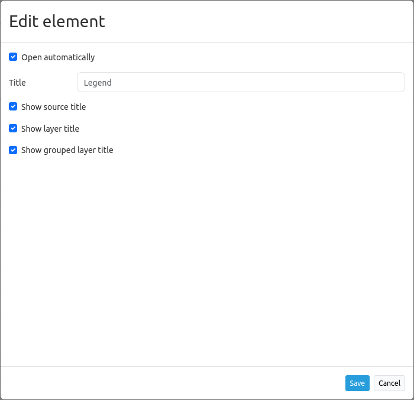
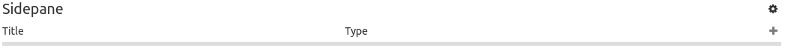
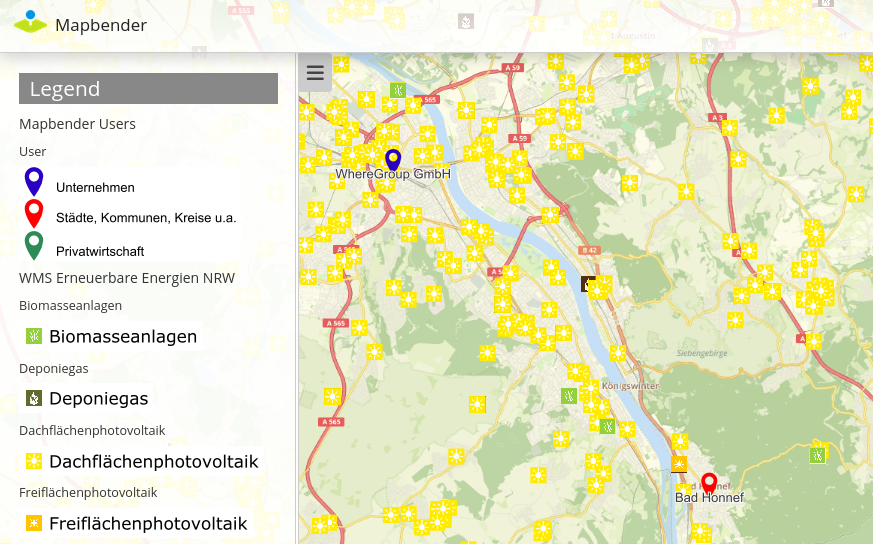
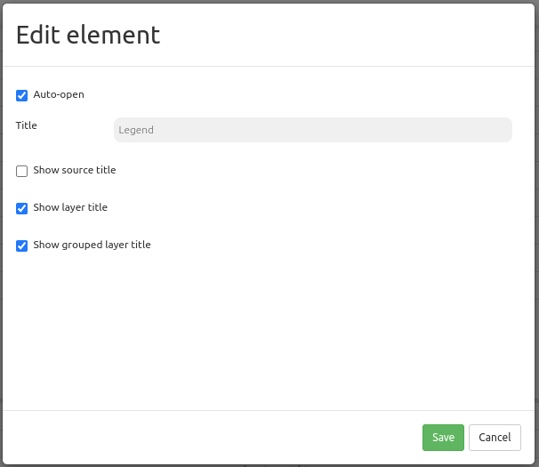
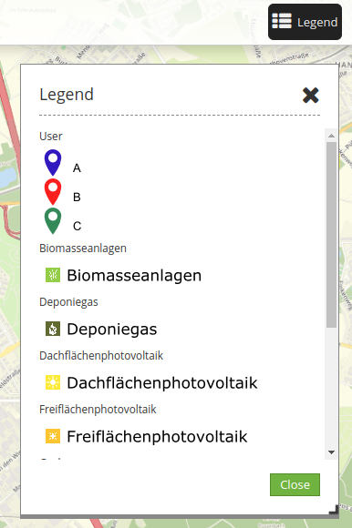
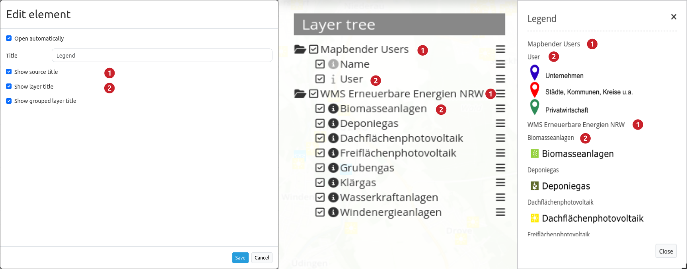

.. _legend:

Legend
******

The legend object shows a legend of the layers that are displayed in the map. Not every layer provides a legend. In addition to the legend image you can display the service title, layer name and group name (if a group exists).

.. image:: ../../../figures/legend.png
     :scale: 80

Configuration
=============

* **Auto-open:** If activated, the legend opens when the application is started (default: active)
* **Title:** Title of the element. The title will be listed in "Layouts". Is also shown next to the button, if "Show layer title" is activated.
* **Show source title:** shows WMS/source title (default: true)
* **Show layer title:** shows layer title (default: true)
* **Show grouped layer title:** shows group title for grouped layers (default: true)

The Legend element is integrated via a :ref:`button` or in the sidepane.

Configuration Examples
======================

Legend in the Sidepane:
-----------------------
If yout want to integrate a legend in the sidepane, click the ``+`` -button in the "Layouts"-tab (section "Sidepane").

Then, choose the element "Legend" in the appearing window. The configurational dialog "Add element – Legend" will open.

.. image:: ../../../figures/legend_example_sidepane_dialog.png
     :scale: 80

Our configured element has the title "Legend". The legend opens automatically (set checkbox *Auto-open*). Moreover, the layer title and the title of all grouped layers will appear if the checkboxes *Show layer title* and *Show grouped layer title* are set.

Given this configuration, the result looks like this:

In the example the legend was added to the sidepane.

Legend in the toolbar
---------------------
The legend element can be integrated with a button in the toolbar. First step: Open the application backend and add the legend element into the map area section of the Layout tab.

.. image:: ../../../figures/add_map_area.png
     :scale: 80

In this example, the following settings are chosen:

In our example, the checkbox *Auto-open* is dismissed. Therefore, the legend opens only with a click on a button.
This :ref:`button` has to be implemented into the toolbar section.

The configuration of a button can look like this:

.. image:: ../../../figures/legend_example_button.png
     :scale: 80

Following the above instructions, the result in the application looks like this:

The toolbar shows the button for the legend element. If the button is clicked, the dialog with the generated legend opens.

The activation and deactivation of checkboxes in the configurational settings leads to:

YAML-Definition
---------------

This template can be used to insert the element into a YAML application.

.. code-block:: yaml

   tooltip: 'Legend'                    # text to use as tooltip
   elementType: dialog                  # dialog/blockelement (default: dialog)
   autoOpen: true                       # true/false open when application is started (default: true)
   displayType: list                    # accordion/list type of display (default: list)
   target: ~                            # Id of Map element to query
   hideEmptyLayer: true                 # true/false hide when no legend is available (default: true)
   showWmsTitle: true                   # true/false show WMS title (default: true)
   showLayerTitle: true                 # true/false show layer title (default: true)
   showGroupedLayerTitle: true          # true/false show group title for grouped layers (default: true)

You can optionally use a button to show this element. See :ref:`button` for inherited configuration options.

