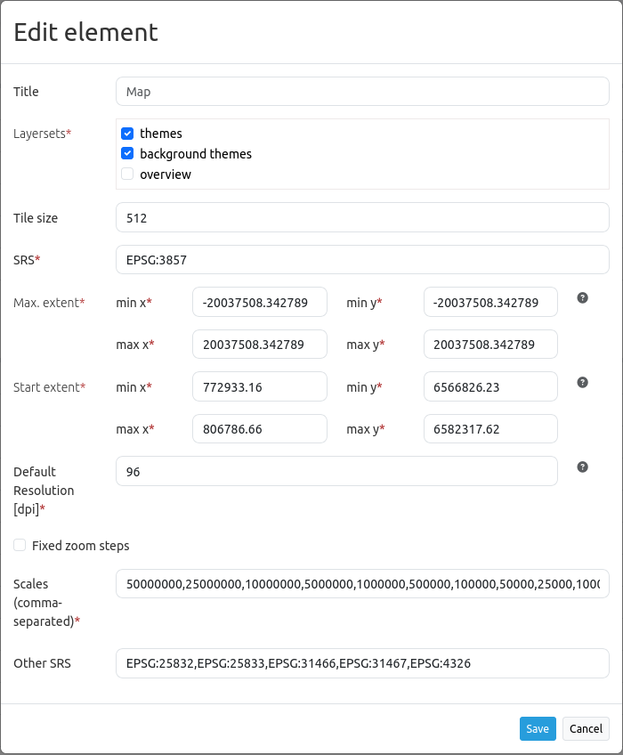
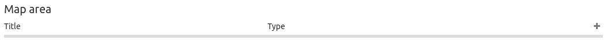

.. _map:

Map
***
The map is the central element of a Mapbender application. It is based on OpenLayers and has be integrated into the Map area of the :ref:`backend`.

.. image:: ../../../figures/map.png
     :width: 75%

Configuration
=============

* **Title:** Title of the element. It will be listed in the :ref:`layouts` section.
* **Layersets:** Select which :ref:`layerset` will be displayed on the map. Their order is changeable via drag & drop.
* **Tile size:** Size of the tiles of tiled WMS services.
* **SRS:** Spatial reference system. Two ways of SRS definitions are supported: EPSG:CODE or EPSG:CODE|MY SRS TITLE. If you do not enable a custom SRS title, the default title for each SRS from the *mb_core_srs* table is used.
* **Max. Extent:** Maximal map extent, defined by BBOX parameters. This rectangle defines the possible map extent. In response to clicking the globe icon in the :ref:`navigation_toolbar`, the map view will zoom out to this extent.
* **Start Extent:** Map extent that is visible at application launch, defined by BBOX parameters. This rectangle defines the start map extent. In response to clicking the home icon in the :ref:`navigation_toolbar`, the map view will zoom to this extent.
* **Default resolution [dpi]**: The default resolution adapts to the screen resolution based on the configured value in dpi. Default: 96 dpi.
* **Fixed zoom steps:** This option activates a zoom behaviour with fixed scales. This is useful to increase visual quality of services that are cached on very particular resolution steps only. When set true, scale denominator snaps to one of the values given in the *scales* option as defined below (default: false).
* **Scales (csv):** A csv scale list. These scales will be supported in your application if you zoom (e.g. via mouse wheel)
* **Other SRS:** Other spatial reference systems. Two SRS definitions are supported: EPSG:CODE or EPSG:CODE|MY SRS TITLE.

Configuration example
=====================

The map element has to be included into the Map area:

The map can entail all instances that are defined in the layerset. The following example distinguishes between a *main* (1) and *overview* (2) layerset.

.. image:: ../../../figures/map_example_layersets.png
     :width: 100%

In order to display all *Layersets* on the map, they have to be activated. Multiple selections are possible as well. De-selected layersets can function as an :ref:`overview`. In the example, *main* is displayed on the main map and *overview* as an overview map.

The field *SRS* defines the coordinate reference system that is used at application start. In this example, the coordinate reference system EPSG:25832 or ETRS89/UTM Zone 32N was chosen. If the application should support other coordinate systems, simply add those in the *Other SRS* field. In this example, the following codes are used: EPSG:25833 (ETRS89/UTM Zone 33N), EPSG:31466 (DHDN/3-degree Gauss-Kruger Zone 2), EPSG:31467 (DHDN/3-degree Gauss-Kruger Zone 3), EPSG:3857 (WGS 84/Pseudo-Mercator) and EPSG:4326 (WGS 84).

The field *max. Extent* states the maximum zoomable extent of the map application. If there is data outside of the extent, it will not appear in the map. The field *start Extent* refers to the extent of the map that is visible when the application is started in the browser (in this example: the city of Bonn).

The *Default resolution* in dpi defines the resolution of the device being used; the corresponding default value of 96 dpi can be adjusted through this field. If the displayed resolution of the map does not match that of the WMS service, changing this value can help to align the map accordingly.

.. note:: The scale-dependent resolution currently only works reliably on desktops with regular resolution. Moreover, *Default resolution* is only available from Mapbender 3.3.5 onwards.

Furthermore, the field *scales (csv)* defines the scales that are usable in the application. It is possible to switch between the defined scales with :ref:`scale_selector` or :ref:`navigation_toolbar`. *Fixed zoom steps* were deactivated in the example. That means it is possible to display undefined zoom levels via mouse scrolling.
     

YAML-Definition
---------------

This template can be used to include the map into a YAML application.

.. code-block:: yaml

   layerset: null             # refer to a layerset, define the layerset first and refer to it
   srs: "EPSG:4326"           # coordinate reference system. Two ways of srs definitions are supported:
                                - "EPSG:CODE" or
                                - "EPSG:CODE|MY SRS TITLE"
   extents:
       max: [0, 40, 20, 60]    # maximal map extents
       start: [5, 45, 15, 55]  # map extents for the start of the application
   scales: "25000000,10000000,5000000,1000000,500000" # a csv scale list
   otherSrs:
       - EPSG:31466
       - EPSG:31467
       - EPSG:25832          # other coordinate reference systems. Two srs definitions are supported:
                                - ["EPSG:CODE","EPSG:CODE"] or
                                - ["EPSG:CODE|MY SRS TITLE","EPSG:CODE|MY SRS TITLE"]
   tileSize: 256             # size of tiles

Controlling URL parameters
==========================

.. _layer_visibility:

Make Layer visible
------------------

If you have a layer with an ``<InstanceLayerID>`` in a service with an ``<InstanceID>``, you may pass them with the URL parameter ``visiblelayers`` to turn the layer visible:

.. code-block:: php

  ?visiblelayers=<InstanceID>/<InstanceLayerID>

The InstanceID and InstanceLayerID values are specific to an application. To display these values, in the Layerset tab of the application, there are icons with three dots next to each layer. Click on the icon and a popup window will appear.

.. image:: ../../../figures/wms_instance_layer_id.png
     :scale: 80

In the textfield, the first value lists the SourceID and SourceLayerID (31-591). The second value lists the InstanceID and InstanceLayerID (73-836).

We will use the second value for the ``visibleLayers`` parameter in your URL, and seperate them by a forward slash (instead of a hyphen).

For example: http://localhost/mapbender/application/myapp?visiblelayers=73/836

Multiple invisible layers can also be passed in the URL separated by commas. To do this, insert the respective InstanceIDs and InstanceLayerIDs using the same pattern.

For example: http://localhost/mapbender/application/myapp?visiblelayers=73/836,73/840

Passing POIs
------------

You can pass one or more POIs in the URL. Each POI has the following parameters:

- point: coordinate pair with values separated by comma (mandatory)
- label: Label to display (optional)
- scale: Scale to show POI in (optional, makes only sense with one POI)

If you pass more than one POI, the map will zoom to 150% of the POIs bounding.

To pass a single POI, use the following URL format:

.. code-block:: php

   ?poi[point]=363374,5621936&poi[label]=Label&poi[scale]=5000

Passing BBOX
------------

You can pass a BBOX to zoom to by using the following URL query parameter:

.. code-block:: php

   ?bbox=364286,5622263,365979,5622806

Passing the scale
-----------------

You can set the scale from the list of available scales.

.. code-block:: php

   ?scale=1000

Passing SRS
-----------

You can pass a favorite EPSG code you want to use on start of the application by URL query parameter:

.. code-block:: php

   ?srs=EPSG:4326

Passing Center
--------------

You can pass a coordinate. The application will open and display the coordinate in the center. In this case, you also have to set the SRS.

.. code-block:: php

   ?center=364286,5622263

More Start Parameters
---------------------

The elements WMS Loader and WMC Loader also provide parameters you can use on start. Have a look at the element descriptions for further information.

