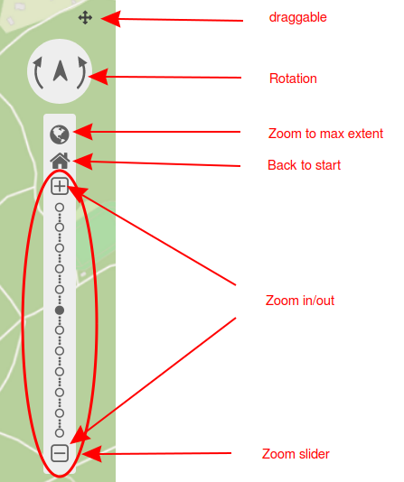

.. _navigation_toolbar:

Navigation Toolbar
******************

This element is a tool to simplify navigation within the map via rotation, zoom and buttons. Different scales can be selected from a bar or slider. Users also have the option to zoom to max extent or return to the start configuration. The navigation toolbar itself can be configured to be draggable.

.. image:: ../../../figures/navigation_toolbar.png
     :scale: 80

Configuration
=============

* **Draggable:** Element is draggable or not (default: true).
* **Title:** Title of the element. The title will be listed in :ref:`layouts` and allows to distinguish between different buttons. It will be indicated if "Show label" is activated.
* **Components:** Components of the navigation toolbal (all selected by default). Options: Rotation, Zoom to maximum extent, Back to start, Zoom in and out, Zoom slider
* **"Back to start" also resets layer settings:** Resets layer settings (default: false).
* **Position:** Navigation toolbar alignment, default is 'left-top' (use inline e.g. in sidebar); mandatory field. Options: inline (for using the element in the sidepane), left-top, left-bottom, right-top, right-bottom.

.. note:: The element must be integrated into the Map area.

Components of the Navigation Toolbar element:
---------------------------------------------

You can integrate various different *components* in the configuration dialog box.

In the application these components look like this:

* **Draggable:** If you set the checkmark at draggable, then a small cross will appear next to the navigation toolbar that allows the user to move the element around.
* **Rotation:** Enables changes of the map orientation. A click on the north arrow allows for a restoration of the original rotation.
* **Zoom to maximum extent:** Users can zoom to the smallest map scale by zoom to max extent. This can be set individually in the :ref:`map element <map>`.
* **Zoom to start:** Restore the initial center, scale, SRS and rotation.
* **Zoom in and out:** Allows to zoom in and out of the map. The element automatically sets to the next higher or lower scale. Zoom steps can be defined in the map element as well. There, users also have the option to deactivate fixed zoom steps.
* **Zoom slider:** This component already includes *Zoom in/out*. Additionally, the user can select different scales from a bar.

YAML-Definition
---------------

This template can be used to insert the element into a YAML application.

.. code-block:: yaml

   tooltip: 'Navigation Toolbar'    # text to use as tooltip
   components: ["rotation",         # components of the navigation toolbar (default: all selected)
   "zoom_max", "zoom_home",
   "zoom_in_out", "zoom_slider"]
   target: ~                        # ID of Map element to query
   stepsize: 50                     # step value for pan
   stepbypixel: false               # step type "by pixel"/"percent", false = percent (default: false)
   anchor: left-top                 # navigation toolbar alignment (default: 'left-top')
                                    # use inline e.g. in sidebar
                                    # Options: 'inline', 'left-top', 'left-bottom', 'right-top', 'right-bottom'
   draggable: true                  # element is draggable or not (default: true)
   zoomHomeRestoresLayers: false    # resets layer settings (default: false)

