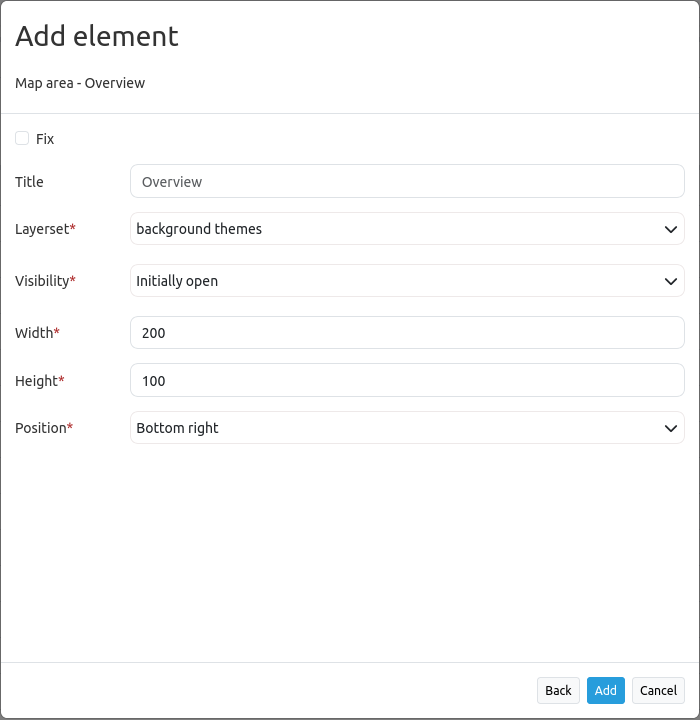

.. _overview:

Overview
********

Mapbender provides an overview map in addition to its main map. This element can be individually adjusted in terms of size, position and zoom behaviour. The overview map refers to a specific layerset and the instance(s) it contains.

.. image:: ../../../figures/overview.png
     :scale: 80

Configuration
=============

The configuration dialog offers the following settings:

* **Fix:** Fixes the overview extent (default: false).
* **Title:** Title of the element, will be listed in :ref:`layouts`.
* **Layerset:** Refers to a previously defined layerset, e.g. overview.
* **Visibility:** Initially open/Initially closed/Permanently open. Defines whether the overview will be open or closed on start. The first two options will show a button to close the overview map. The third option provides an overview map and does not show a button (Default: Initially open). 
* **Width:** Width of the element.
* **Height:** Height of the element.
* **Position:** Position of the overview map frame in the application; options are: top left, bottom left, top right and bottom right.

Configuration examples
======================

.. image:: ../../../figures/overview_configuration_example.png
     :scale: 80

The element provides various configuration options. In the example, the settings *Visibility Initially open* and *Fix* are activated. As a result, the element is displayed (i.e. maximized) when the application is opened and the view of the map is fixed.
If the latter function is deactivated, the overview adapts as soon as the map is moved or the scale is changed. The start extent is displayed when the application is opened.
In the example, the element has the title "Overview". It is necessary that the overview map is linked to a layerset. The following layersets are available:

.. image:: ../../../figures/map_example_layersets.png
     :width: 100%

In this first example, the layerset "Overview" was chosen. Width and height of the element correspond to the default setting. The position is defined as "lower right". The element looks like this in the application:

.. image:: ../../../figures/de/overview_example_right-bottom_fixed.png
     :scale: 80

In the second example, an adjustment of the parameters (unchecking *Fix*, *Position*: left-bottom, *Width* 400 and *Height* 200) results in an overview like this:

.. image:: ../../../figures/de/overview_example_left-bottom.png
     :width: 100%

YAML-Definition
---------------

This template can be used to insert the element into a YAML application.

.. code-block:: yaml

   tooltip: 'Overview'          # text to use as tooltip
   target: ~                    # Id of Map element to query
   layerset: ~                  # refer to a layerset, e.g. overview, define the layerset first and refer to it
   width: 200                   # overview width
   height: 100                  # overview height
   anchor: 'right-top'          # overview alignment (default: 'right-top')
                                # use inline e.g. in sidebar
                                # Options: 'inline', 'left-top', 'right-top', 'left-bottom', 'right-bottom'
   visibility: open             # open/closed/open-permanent to open/closed on start will show a button to close the overview map (default: open), open-permanent will open the overview map and does not show a button
   fixed: true                  # true/false to fix the overview extent (default: true)

