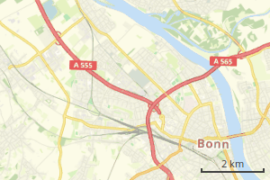
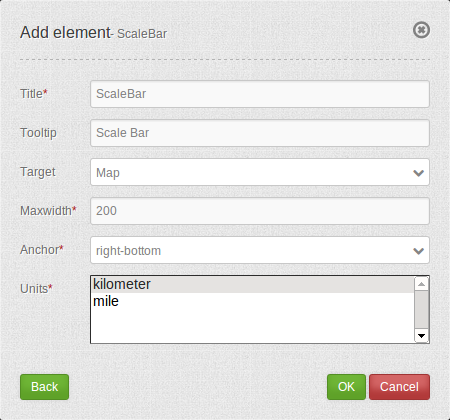

.. _scalebar:

Scale Bar
*********

The Scale bar is a small line which represents the current map scale graphically.

Configuration
=============

* **Title:** Title of the element. The title will be listed in "Layouts".
* **Max width:** The maximum width of the scale bar (default: 200px).
* **Units:** Scale bar units 'kilometer' or 'miles' (default: kilometer).
* **Position:** Scale bar alignment (default: Bottom right).

YAML-Definition
---------------

This template can be used to insert the element into a YAML application.

.. code-block:: yaml

   tooltip: 'Scale Bar'             # text to use as tooltip
   target: ~                        # ID of the Map element to query
   anchor: 'inline'/'left-top'/     # scale bar alignment (default:'right-bottom')
     'left-bottom'/'right-top'/     # use inline, e.g. in sidebar
     'right-bottom'
   position: ['10px', '10px']       # scale bar position (default:x=20px, y=20px)
   maxWidth: 200                    # the maximum width of the scale bar (default: 200px)
   units: ['km']                    # scale bar units 'kilometer' and/or 'miles' (ml) (default: ['km'])

