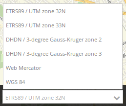

.. _srs_selector:

SRS Selector
************

The spatial reference system selector changes the map's spatial reference system. The selectbox offers SRS that are defined within the :ref:`Map element <map>`.

Configuration
=============

.. image:: ../../../figures/srs_selector_configuration.png
     :scale: 80

* **Show label:** Labels the SRS Selector (default: false).
* **Title:** Title of the element. The title will be listed in "Layouts" and allows to distinguish between different buttons. It will be indicated if "Show label" is activated.
* **Tooltip:** Text to use as tooltip.

YAML-Definition:
----------------

This template can be used to insert the element into a YAML application.

.. code-block:: yaml

   tooltip: 'SRS Selector'  # text to use as tooltip
   label: false             # true/false to label the SRS Selector (default: false)
   target: ~                # Id of the Map element to query

