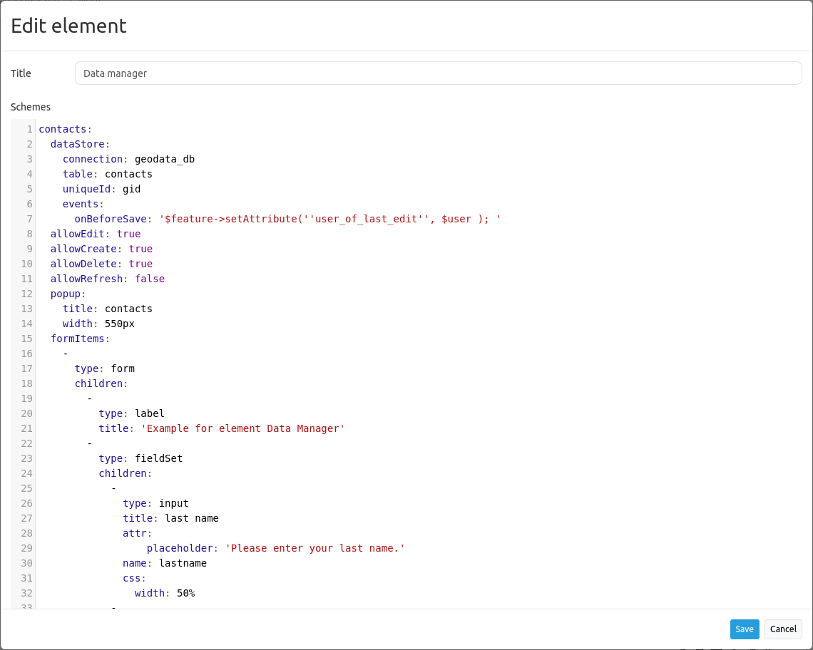

.. _datamanager:

Data Manager
************

 .. |mapbender-button-add| image:: ../../../figures/mapbender_button_add.png

The element Data Manager is similar to the :ref:`digitizer`. 
However, Data Manager only works with nonspatial data, i. e. you can not create geometries.
Data Manager can be used to maintain reference tables, for example a table with contact information.

Configuration
-------------
Data Manager needs access to a database where the editable tables are. You have to define a new database configuration to be able to connect with. 
Read more about this under :ref:`yaml`.

Configuration example
---------------------

The definition of the Data Manager is done in YAML syntax in the textarea configuration at schemes.
Here you define the database connection, the editable tables, the attribute form.

.. hint:: If errors occur in the database, fields or form, various error messages will appear. Here, the productive environment will only give a general error message. If you want to see the exact error, you should call the page as development environment. Find more under en/quickstart:Start Mapbender in a productive environment.

Data Manager is a good solution to store simple contact information in Mapbender:

In the example, an input template is opened after clicking |mapbender-button-add|. 
   

SQL for the contact table
--------------------------

The following SQL commands must be executed in your database to create the contact table for the example.

.. code-block:: postgres

   CREATE TABLE public.contacts (
        gid serial PRIMARY KEY,
        firstname varchar,
        lastname varchar,
        street varchar,
        housenumber varchar,
        postcode integer,
        location varchar,
        phone varchar,
        email varchar,
        notes varchar,
        public boolean,
        date_of_creation date DEFAULT date(now()),
        user_of_last_edit varchar,
        date_favorite date,
	color_favorite varchar
    );

Element configuration
---------------------

Afterwards, the element can be embedded into the sidepane.

YAML-Definition
---------------

You can find the necessary YAML code of the configuration example below:

.. code-block:: yaml

    contacts:
      dataStore:
        connection: geodata_db
        table: contacts
        uniqueId: gid
        events:
          onBeforeSave: '$feature->setAttribute(''user_of_last_edit'', $user ); '    
      allowEdit: true
      allowCreate: true
      allowDelete: true
      allowRefresh: false
      popup:
        title: contacts
        width: 550px
      formItems:
        -
          type: form
          children:
            -
              type: label
              title: 'Example for element Data Manager'        
            -
              type: fieldSet
              children:
                -
                  type: input
                  title: last name
                  attr:
                      placeholder: 'Please enter your last name.'
                  name: lastname
                  css:
                    width: 50%
                -
                  type: input
                  title: 'first name'
                  name: firstname
                  css:
                    width: 50%
            -
              type: breakLine
            -
              type: fieldSet
              children:
                -
                  type: input
                  title: street
                  name: street
                  css:
                    width: 30%
                -
                  type: input
                  title: 'house number'
                  name: housenumber
                  css:
                    width: 20%
                -
                  type: input
                  title: postcode
                  name: postcode
                  css:
                    width: 20%
                -
                  type: input
                  title: location
                  name: location
                  css:
                    width: 30%

            -
              type: fieldSet
              children:
                -
                  type: date
                  title: date_favorite
                  name: date_favorite
                  css:
                    width: 50%
                -
                  type: colorPicker
                  title: color favorite
                  name: color_favorite
                  attr:
                    placeholder: '#ff0000'
                  css:
                    width: 50%
            #-
            #  type: breakLine
            -
              type: fieldSet
              children:
                -
                  type: input
                  title: phone number
                  name: phone
                  mandatory: true
                  mandatoryText: 'Please add your phone number.'
                  infoText: 'Help: Please add your phone number.'
                  copyClipboard: true              
                  css:
                    width: 50%              
                -
                  type: input
                  title: email
                  infoText: 'Help: Please add your e-mail.'
                  copyClipboard: true              
                  placeholder: 'Please enter your e-mail.'
                  name: email
                  css:
                    width: 50%
            -
              type: breakLine
            -
              type: textArea
              title: notes
              placeholder: 'You can leave notes here.'
              name: notes
              value: 'Guter Tester'
            -
              type: checkbox
              name: public
              value: true
              title: 'publish contact'          
            -
              type: text
              title: 'Information'
              text: "'user: ' + data.user_of_last_edit + ' Datum:' + data.date_of_creation\n"           
            - type: radioGroup
              title: Choose one
              name: choice_column_1
              options:
                - label: Option 1
                  value: v1
                - label: Option 2
                  value: v2
                - label: Option 3
                  value: v3                          
              value: v2   # Pre-select second option by default for new items
            - type: select
              title: Select at least one (multiple choice)
              attr:
                required: required
                multiple: multiple
              name: choice_column_2
              options:
                - label: Option 1
                  value: v1
                - label: Option 2 (disabled)
                  value: v2
                  attr:
                    disabled: disabled
                - label: Option 3
                  value: v3
                - label: Option 4
                  value: v4                            
              value: v1,v3   # use comma-separated values for default multi-select value          
      table:
        autoWidth: false
        columns:
          -
            data: lastname
            title: last name
          -
            data: firstname
            title: first name
        info: true
        lenghtChange: false
        ordering: true
        pageLength: 10
        paging: true
        processing: true
        searching: true

