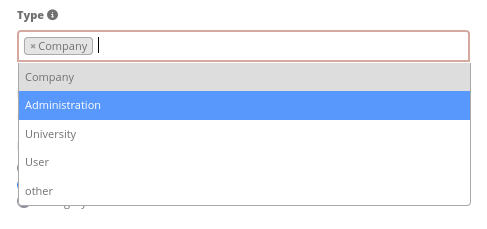
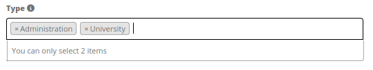
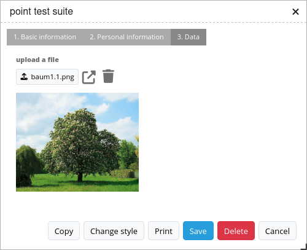

.. _digitizer_configuration:

Setting up of Digitizer
=======================

In an application, the Digitizer element can only be embedded into the sidepane. However, it is possible to add multiple instances.
The element itself is set up in the backend. For this, a YAML definition has to be adjusted accordingly.
The definition is used to configure the database connection, editable fields, display forms and other behaviours of the digitizer.

.. image:: ../../../../figures/digitizer_configuration.png
     :width: 100%

* **Title:** Title of the element. Allows the implementation of several instances.
* **Schemes:** YAML definition of the element.

In addition to this, Digitizer needs access to a database with editable tables.
You have to define a new database configuration to be able to connect with the geo database. Read more about this under :ref:`yaml`.

.. warning:: Do **not** place spatial data into the "default" Mapbender database containing your Doctrine entities. You will encounter errors running Doctrine schema updates.
 
.. hint:: If errors occur in the database, fields or form, various error messages will appear. The productive environment will only give a general error message. If you want to see the exact error message, you should use the development environment. Find more under :ref:`en/installation/installation_configuration:Production and Development environment and Caching`.

This page is divided into several chapters:

1. :ref:`en/elements/editing/digitizer/digitizer_configuration:SQL for the demo tables` uses SQL commands to create a database connection and three demo tables for the digitizer.
2. :ref:`en/elements/editing/digitizer/digitizer_configuration:YAML definition` gives a YAML configuration example for a fully configured Digitizer instance.
3. :ref:`en/elements/editing/digitizer/digitizer_configuration:configuration` explains the functional scope of the features built into the YAML block (and more Digitizer functions).

SQL for the demo tables
-----------------------

The following SQL statements must be executed in your geodata database to create the three table for the demo. With them you can test the Digitizer functionality using the :ref:`en/elements/editing/digitizer/digitizer_configuration:YAML definition`.

.. note:: The `PostGIS extension <https://postgis.net/>`_ must be configured in the database.

.. code-block:: postgres

    CREATE TABLE public.poi (
        gid serial PRIMARY KEY,
        name varchar,
        type varchar,
        abstract varchar,
        public boolean,
        date_favorite date,
        year int,
        title varchar,
        firstname varchar,
        lastname varchar,
        email varchar,
        interests varchar,
        category varchar,
        user_name varchar,
        group_name varchar,
        modification_date date,
        my_type varchar,
        file_reference varchar,
        x float,
        y float,
        city varchar,
        style text,
        fill_color varchar,        
        geom geometry(point,4326)
    );

.. code-block:: postgres

    CREATE TABLE  public.lines (
        gid serial PRIMARY KEY,
        name varchar,
        type varchar,
        abstract varchar,
        public boolean,
        date_favorite date,
        year int,
        title varchar,
        firstname varchar,
        lastname varchar,
        email varchar,
        interests varchar,
        length float,
        category varchar,
        user_name varchar,
        group_name varchar,
        modification_date date,
        my_type varchar,
        file_reference varchar,
        x float,
        y float,
        city varchar,
        style text,
        fill_color varchar,
        geom geometry(linestring,4326)
    );

.. code-block:: postgres

    CREATE TABLE public.polygons (
        gid serial PRIMARY KEY,
        name varchar,
        type varchar,
        abstract varchar,
        public boolean,
        date_favorite date,
        year int,
        title varchar,
        firstname varchar,
        lastname varchar,
        email varchar,
        interests varchar,
        area float,
        category varchar,
        user_name varchar,
        group_name varchar,
        modification_date date,
        my_type varchar,
        file_reference varchar,
        x float,
        y float,
        city varchar,
        style text,
        fill_color varchar,
        geom geometry(polygon,4326)
    );

YAML definition
---------------

The following YAML block contains definitions for three Digitizer forms.
Copy and paste it in its entirety under **schemes** in the backend mask of the element to configure a Digitizer element for points, lines and polygons.

.. code-block:: yaml

    poi:
        label: point digitizing
        minScale: 5000
        maxScale: 20000
        maxResults: 500 
        featureType:
            connection: search_db
            table: poi
            uniqueId: gid
            geomType: point
            geomField: geom
            srid: 4326
        allowEditData: true # Allow attribute editing (default: true)
        allowDelete: true # Allow user to remove features from the database (default: true)
        allowDigitize: true # Allow geometry creation and editing (default: true)
        roles: #Show this schema only to users with (at least one of) these roles
            - root
            - ROLE_GROUP_EDITING
        displayPermanent: true # Keep features visible on map even after switching to a different schema
        displayOnInactive: true # Keep features visible on map even after deactivating Digitizer
        continueDrawingAfterSave: # Keep drawing tool active after creating and saving a new feature (~fast batch mode feature creation)
        printable: false
        allowChangeVisibility: true
        inlineSearch: true
        searchType: currentExtent
        pageLength: 5 # Limits the number of rows per page (default 16)
        tableFields:
            gid:
                label: Nr.
                width: 20%
            name:
                label: Name
                width: 80%
        toolset:
            - type: drawPoint
            - type: moveFeature
        popup:
            title: point test suite
            width: 500px
        searchType: currentExtent
        tableFields:
            gid: {label: Nr. , width: 20%}
            name: {label: Name , width: 80%}
        styles:
            default:
                strokeWidth: 2
                strokeColor: '#0e6a9e'
                fillColor: '#1289CD'
                fillOpacity: 1
                fillWidth: 2
                pointRadius: 10
            select:
                strokeWidth: 3
                strokeColor: '#0e6a9e'
                fillOpacity: 0.7
                pointRadius: 10
            unsaved:
                strokeWidth: 3
                strokeColor: "#f0f0f0"
                fillColor:   "#ffffff"
                fillOpacity: 0.5
                pointRadius: 6
                label: 'Please save'
                fontColor: red
                fontSize: 18
        formItems:
           - type: tabs
             children:
               - type: form
                 title: Basic information
                 css: {padding: 10px}
                 children:
                     - type: label
                       title: Welcome to the digitize demo. Try the new Mapbender feature!
                     - type: input
                       title: Name
                       mandatory: true
                       name: name
                       mandatoryText: Please give a name to the poi.
                       infoText: "Help: Please give a name to the new object."
                     - type: input
                       title: Title
                       mandatory: false
                       name: title
                       mandatoryText: Please give a title to the poi.
                     - type: textArea
                       name: abstract
                       title: Abstract
                       placeholder: 'please edit this field'
                     - type: select
                       title: Type
                       name: type
                       options: {A: A, B: B, C: C, D: D, E: E}
                     - type: breakLine
               - type: form
                 title: Personal information
                 css: {padding: 10px}
                 children:
                     - type: label
                       title: Please give us some information about yourself.
                     - type: fieldSet
                       children:
                           - type: input
                             title: Firstname
                             name: firstname
                             css: {width: 30%}
                           - type: input
                             title: Lastname
                             name: lastname
                             css: {width: 30%}
                           - type: input
                             title: E-Mail
                             name: email
                             css: {width: 40%}
                     - type: select
                       multiple: false
                       title: Interests
                       name: interests
                       options: {maps: maps, reading: reading, swimming: swimming, dancing: dancing, beer: beer, flowers: flowers}
                     - type: date
                       title: favorite Date
                       name: date_favorite
                       mandatory: true
                       css: {width: 25%}
                     - type: breakLine
                     - type: breakLine
                     - type: checkbox
                       name: public
                       value: true
                       title: public (this new object is public)
    line:
        label: line digitizing
        inlineSearch: true
        featureType:
            connection: search_db
            table: lines
            uniqueId: gid
            geomType: line
            geomField: geom
            srid: 4326
        openFormAfterEdit: true
        allowDelete: true
        toolset:
            - type: drawLine
            - type: modifyFeature
            - type: moveFeature
        popup:
            title: line test suite
            width: 500px
        searchType: currentExtent
        tableFields:
            gid: {label: Nr. , width: 20%}
            name: {label: Name , width: 80%}
        styles:
            default:
                strokeWidth: 2
                strokeColor: '#0e6a9e'
                fillColor: '#1289CD'
                fillOpacity: 1
                fillWidth: 2
                pointRadius: 10
            select:
                strokeWidth: 3
                strokeColor: '#0e6a9e'
                fillOpacity: 0.7
                pointRadius: 10
        formItems:
           - type: form
             title: Basic information
             css: {padding: 10px}
             children:
                 - type: label
                   title: Welcome to the digitize demo. Try the new Mapbender feature!
                 - type: input
                   title: Name
                   name: name
                   mandatory: true
                   mandatoryText: Please give a name to the new object.
                   infoText: "Help: Please give a name to the new object."
                 - type: select
                   title: Type
                   name: type
                   options: {A: A, B: B, C: C, D: D, E: E}
    polygon:
        label: polygon digitizing
        inlineSearch: true
        featureType:
            connection: search_db
            table: polygons
            uniqueId: gid
            geomType: polygon
            geomField: geom
            srid: 4326
        openFormAfterEdit: true
        allowDelete: false
        useContextMenu: true
        toolset:
            - type: drawPolygon
            - type: drawRectangle
            - type: drawDonut
            - type: drawEllipse
            - type: drawCircle
            - type: modifyFeature
            - type: moveFeature
        popup:
            title: polygon test suite
            width: 500px
        searchType: currentExtent
        tableFields:
            gid: {label: Nr. , width: 20%}
            name: {label: Name , width: 80%}
        styles:
            default:
                strokeWidth: 2
                strokeColor: '#0e6a9e'
                fillColor: '#1289CD'
                fillOpacity: 1
                fillWidth: 2
                pointRadius: 10
            select:
                strokeWidth: 3
                strokeColor: '#0e6a9e'
                fillOpacity: 0.7
                pointRadius: 10
        formItems:
           - type: form
             title: Basic information
             css: {padding: 10px}
             children:
                 - type: label
                   title: Welcome to the digitize demo. Try the new Mapbender feature!
                 - type: input
                   title: Name
                   mandatory: true
                   name: name
                   mandatoryText: Please give a name to the new object.
                   infoText: "Help: Please give a name to the new object."
                 - type: select
                   title: Type
                   name: type
                   options: {A: A, B: B, C: C, D: D, E: E}

Configuration
=============

The following chapter explains the individual components of the element that can be included into the YAML configuration, offering the base structure that is used in the Digitizer.

Basic definition
----------------

A basic definition for a Digitizer capturing instance (in this example for *poi*) may look like the following YAML snippet.

.. code-block:: yaml

    poi:
      label: 'point digitizing'
      minScale: 1000
      maxScale: 5000
      maxResults: 500
      zoomBuffer: 100
      filterUser: false
      trackUser: false
      featureType:
        connection: geodata_db
        table: poi
        uniqueId: gid
        geomType: point
        geomField: geom
        srid: 4326
        filter: null
        styleField: style
        userColumn: user_name
      allowCustomStyle: true
      allowChangeVisibility: true
      allowCreate: true
      allowDelete: true
      allowDigitize: true
      allowEditData: true
      allowRefresh: true
      continueDrawingAfterSave: true
      displayPermanent: true
      displayOnInactive: true
      refreshLayersAfterFeatureSave:
        - wms_point_layer
      inlineSearch: true
      searchType: currentExtent
      pageLength: 5
      printable: true
      toolset:
        -
          type: drawPoint
        -
          type: moveFeature
      popup:
        title: 'point test suite'
        width: 500px
      styles:
        select:
          strokeWidth: 3
          strokeColor: '#00ffff'
          fillColor: '#FF00ff'
          fillOpacity: 0.5
          pointRadius: 20
          label: '${name}'
      tableFields:
        gid:
          label: Nr.
          width: 20%
        name:
          label: Name
          width: 80%
      formItems:
        -
          type: label
          title: 'Welcome to the digitize demo. Try the new Mapbender feature!'
        -
          type: input
          title: Name
          name: name
          copyClipboard: true
          infoText: 'Info: Please give a name to the new object.'
          mandatoryText: 'Mandatory Field: Please give a name to the poi.'
          required: true
          css:
            color: green
          attr:
            placeholder: 'Please give a name to the poi.'
        -
          type: input
          title: Title
          required: false
          name: title

The possible options are:

* **label:** Label of the Digitizer instance.
* **minScale:** Minimum scale denominator for visualizing features.
* **maxScale:** Maximum scale denominator for visualizing features.
* **featureType:** Connection to the database.
    * connection: Name of the database connection (see `packages/doctrine.yaml`).
    * table: Name of the feature table.
    * uniqueId: Column name of the unique identifier (Default if empty: [id]).
    * geomType: Geometry type - point, line, polygon, or multipolygon.
    * geomField: Name of the geometry column.
    * srid: Coordinate reference system of the geometry column as EPSG code (e.g. 4326).
    * filter: Data filters for values in a defined column (e.g. filter: interests = 'maps').
    * userColumn: Stores the user name on save (see filterUser/trackUser).
    * styleField: Column to store the style for a feature.
* **allowChangeVisibility:** Offer buttons to toggle feature visibility (default: true).
* **allowCreate:** Allow feature creation (default: true).
* **allowDelete:** Allow data deletion (default: true).
* **allowDigitize:** Allow geometry creation and editing (if false, no Digitizer buttons will appear (new Point, move, etc.). Attribute editing may still be allowed via allowEdit (default: true).
* **allowEditData:** Allow attribute editing (default: true).
* **displayOnInactive:** The current FeatureType will still be displayed on the map, although Digitizer is deactivated in the sidepane (Accordion, Tabs) [true/false]. If switched to true, this option is a bit intricate, due to the still activated Digitizer events. For experienced users, it will be helpful in some scenarios.
* **allowCustomStyle:** Allow user-specific styles for features in the map (default: false). For each feature you can set unique styles. If not set, the default style is used. Needs ``styleField`` definition in featureType section.

 .. image:: ../../../../figures/digitizer/stylemanager.png
              :width: 100%

* **allowRefresh:** Offer a button to refresh data (for tables frequently modified by several users) (default: false).
* **continueDrawingAfterSave:** Keep the drawing tool active after creating and saving a new feature.
* **displayPermanent:** Keep features visible on the map, even after switching to a different schema (default: false).
* **displayOnInactive:** Keep features visible on map, even after deactivating Digitizer (default: false).
* **pageLength:** Limits the number of rows per page (default: 16).
* **refreshLayersAfterFeatureSave:** List of Mapbender source instance IDs/names (see :ref:`en/backend/applications/layerset:layerset-instances`) that will reload after any item is created, updated or deleted (default: none).

.. code-block:: yaml

        refreshLayersAfterFeatureSave:
            - mapbender_users # or WMS InstanceID

* **roles:** List of roles. Show this schema only to users with (at least one of) these roles.

.. code-block:: yaml

        roles: #Show this schema only to users with (at least one of) these roles
            - root
            - ROLE_GROUP_EDITING

Combination schema
------------------

If a schema defines a combine setting (``combine``), it is treated as a combination schema. Data from multiple other schemas is then displayed together. The entries in the combine list must be the names of the sub-schemas to be combined.

* A schema with ``combine`` only allows a reduced set of other settings.
* It may define roles to limit user access to the whole combination.
* It may define table to explicitly specify table formatting of data common to all referenced sub-schemas.
* A schema referenced by a combine list may not itself define combine.

.. code-block:: yaml

                        schemes:
                            combine_schemes_together:
                                label: combine schemes (in this case poi and line)
                                searchType: currentExtent 
                                combine:
                                    - poi
                                    - line
                                roles: # Show this schema only to users with (at least one of) these roles
                                    - root
                                    - ROLE_GROUP_EDITING

User specific data
------------------

Data shown in each schema can be separate for different users. 

Each schema may define:

* **filterUser** Keep data separate for each user (default: false). Needs definition of userColumn in featureType.
* **trackUser** Store the creating / modiying user (default: false). Can be done without actually filtering selection. Needs definition of userColumn in featureType.

Setting either of these to true additionally requires ``userColumn`` (string) to be defined in the dataStore/featureType definition. This must name a table column of sufficient length to store the user name.

.. hint:: Note that with ``filterUser: true``, *trackUser* is implied and its setting, if present, is ignored.

.. code-block:: yaml

        poi:
        label: 'point digitizing'
        filterUser: true
        trackUser: true
        featureType:
            connection: geodata_db
            table: poi
            uniqueId: gid
            geomType: point
            geomField: geom
            srid: 4326
            userColumn: user_name

Definition of the available toolsets (Toolset Type)
---------------------------------------------------

Each schema may define a toolset setting to configure the types of drawing tools available during geometry creation. This should be a list of strings, or ``null`` for auto-configuration (which is the default).

Toolset types
^^^^^^^^^^^^^

* **drawPoint** - Draw a point.
* **drawLine** - Draw a line.
* **drawPolygon** - Draw a polygon.
* **drawRectangle** - Draw a rectangle.
* **drawCircle** - Draw a circle.
* **drawEllipse** - Draw an ellipse.
* **drawDonut** - Draw a donut (enclave).
* **modifyFeature** - Move the vertices of a geometry.
* **moveFeature** - Move the whole geometry.

YAML definition of toolset types
^^^^^^^^^^^^^^^^^^^^^^^^^^^^^^^^

.. code-block:: yaml

    polygon:
        [...]
        toolset:
            - type: drawPolygon
            - type: drawRectangle
            - type: drawDonut

Some example configurations:

* If ``toolset`` is set as an empty list, no geometry creation tools will be offered.
* If ``toolset`` is null or not set, and the connected feature type declares its geomType, Digitizer will reduce the selection of tools to to those compatible with the ``geomType`` (e.g., no line drawing for datasets containing only points or polygons).
* If neither ``toolset`` nor the ``geomType`` are defined, all supported tools are offered.
* If feature modification is allowed (via ``allowDigitize``/``allowEdit``), vertex modification and feature translation tools will also be offered.
* If ``allowCreate: false``, no creation tools from the toolset setting will be offered. ``drawDonut`` (inherently a modification, not creation tool) may still be offered, if editing is allowed.

Definition of the feature table
-------------------------------

The Digitizer provides an feature table in the sidepane. It can be used to navigate to features and open their editing form. The table can be filtered and sorted. 
The width of the individual columns can optionally be specified in percent or pixels.

* **tableFields:** Define the columns for the feature table. (default - display primary key only).
    * definition of a column: ``[table column]: {label: [label text], width: [css-definition, like width]}``.
* **searchType:** Initial state of a checkbox for limiting feature loading to current visible map portion. [all/currentExtent] (default: currentExtent).
* **inlineSearch:** Allows to search in the table (default: true).
* **paging:** De/activate paging, showing several pages in the feature table (default: true).
* **pageLength:** Define the length of a page when paging is activated (default: 16).

You can find more detailed information on possible configurations `here <https://datatables.net/reference/option/>`_.

.. code-block:: yaml

    poi:
      []
        searchType: currentExtent
        pageLength: 10
        inlineSearch: true
        tableFields:
            gid:
                label: Nr.
                width: 20%
            name:
                label: Name
                width: 80%

Search in the tables (inline Search)
^^^^^^^^^^^^^^^^^^^^^^^^^^^^^^^^^^^^

You can use the inline search to search for an element in the table. 
The activated search bar will be displayed above the table. After entering a search request, it shows all the search results for the records of the table.

.. code-block:: yaml

  poi:
      ...
      inlineSearch: true      # true: allows the search in the table (default: true).
      ...

Configuring forms
-----------------

Very complex forms can be defined to collect attributes for your features. Each schema configuration contains a list of (potentially nested) objects under ``formItems``, defining the contents and structure of the form shown when an item is created or edited. 

.. hint:: Note that this form will also be used purely as a detail display vehicle even if editing is disabled.

.. image:: ../../../../figures/digitizer.png
     :width: 100%

The following options for the configuration of the forms are available as type:

* Textfields (type: input).
* Text (type: label or type: text).
* Textareas (type: textArea).
* Definition of html (type: html).

* Checkboxes (type: checkbox).
* Selectboxes, Multiselectboxes (type: select).
* Radiobuttons (type: radioGroup).

* Datepicker (type: date).
* Color picker (type: colorPicker).

* File upload (type: file).
* Image Display (type: image).

* Definition of tabs (type: tabs).
* Break line (type: breakLines).

Form fields
^^^^^^^^^^^

Form input fields come in a multitude of different types, controlled by the ``type`` value. All inputs share a common set of configuration options:

.. list-table::
   :widths: 20 20 40 10
   :header-rows: 1

   * - name
     - type
     - description
     - default
   * - type
     - string
     - Type of form input field (see below)
     - -none-
   * - name
     - string
     - Table column mapped to the input
     - -none-
   * - value
     - string
     - Initial field value on newly created items
     - -none-
   * - title
     - string
     - Label text for form input field 
     - -none-
   * - attr
     - object
     - Mapping of HTML attributes to add to the input 
     - -none-
   * - infoText
     - string
     - Explanatory text placed in a tooltip next to the label
     - -none-
   * - css
     - object
     - Mapping of CSS rules to add to the form group (container around label and input)
     - -none-
   * - cssClass
     - string
     - Added to the class attribute of the form group (container around label and input)
     - -none-

.. image:: ../../../../figures/digitizer_with_tabs.png
     :scale: 80

Text fields (type: input)
^^^^^^^^^^^^^^^^^^^^^^^^^

Text fields are produced via the ``type: input`` flag.

.. code-block:: yaml

         - type: input                                      # element type definition
           title: Title for the field                       # Definition of a labeling (optional, if not defined no labeling is set)
           name: column_name                                # Reference to table column
           copyClipboard: false                             # Offer a button that copies entered information to the clipboard (default: false) (optional)
           #mandatory: true                                 # Specifies a mandatory field (optional), please use required instead
           infoText: "Info: Please emter Information."      # Offer a button that that provides Intormation on mouse-over (optional)
           mandatoryText: You have to provide information.  # Define text that is shown on save if no content is provided for a mandatory field (optional)
           required: true
           cssClass: 'input-css'                            # css class to use as style for the input field (optional).
           value: 'default Text'                            # Define a default value  (optional)
           css:                                             # CSS definition (optional)
               color: green
           attr:
               placeholder: 'please edit this field'        # placeholder appears in the field as information when field is empty (optional)

* **title:** Definition of a labeling (optional - if not defined, no labeling is set).
* **name:** Reference to table column (required).
* **copyClipboard:** Offer a button that copies entered information to the clipboard (optional, default: false).
* **infoText:** Offer a button that provides information on mouseover (optional).
* **mandatoryText:** Define a text that is shown on save if no content is provided for a mandatory field (optional).
* **value:** Define a default value (optional).
* **css:** CSS definition (optional).
* **cssClass:** Added to the class attribute of the form group (container around label and input).

Attributes (attr)
* **placeholder:** placeholder appears in the field as information (optional)
* **required:** Specifies a mandatory field (optional, default: false)

Customization by attr object definitions
""""""""""""""""""""""""""""""""""""""""

Many common customizations for inputs can be performed purely with the attr object. E.g. ``type: input`` can be restricted to allow numbers only by overriding its HTML type attribute; all inputs can be made *required* or *readonly*.

.. code-block:: yaml

	formItems:
	  - type: input
	    name: strictly_formatted_column
	    title: Strict input pattern demo
            required: true
	    attr:
		  pattern: '\w{2}\d{3,}'
		  placeholder: Two letters followed by at least three digits
	  - type: input
	    name: numeric_column
	    title: Numbers only
            required: true
	    attr:
	      type: number
	      min: 10
	      max: 200
	      step: 10
	  - type: textArea
	    name: text_column
	    title: Very large text area
	    attr:
	      rows: 10

Element groups (type: fieldSet)
^^^^^^^^^^^^^^^^^^^^^^^^^^^^^^^

Elements can be grouped together in one row to provide logical connections or to save space. To define a group, you have to set ``type: fieldSet`` and afterwards define the children which shall be grouped.
For every children you can define a css parameter, for example a width to control the space for each element.

.. code-block:: yaml

                     - type: fieldSet             # Grouping of fields, regardless of field type
                       children:                  # Define the group elements by children
                           - type: input
                             title: Firstname
                             name: firstname
                             css: {width: 30%} 
                           - type: input
                             title: Lastname
                             name: lastname
                             css: 
                                 width: 30%
                           - type: input
                             title: E-Mail
                             name: email
                             css: 
                                 width: 40%

Text/Label (type: label)
^^^^^^^^^^^^^^^^^^^^^^^^

With ``type: label`` you can write a non-editable text to the form window.

.. code-block:: yaml

         - type: label                                    # label writes a non-editable text to the form window.
           text: 'Please give information about the poi.' # define a text 
           css:
              color: red

Textareas (type: textArea)
^^^^^^^^^^^^^^^^^^^^^^^^^^

Similar to the text field via ``type: input``, text areas can be created that can contain several lines using ``type: textArea``.

.. code-block:: yaml

         - type: textArea       # Typ textArea creates a text area
           rows: 4              # Number of rows for the text area
           title: Description   # Label (optional)
           name: abstract       # table column

* **rows**: Number of rows for the text area.

Write HTML (type: html)
^^^^^^^^^^^^^^^^^^^^^^^

``Type: html`` allows you to define html (e.g., button or links).

.. image:: ../../../../figures/digitizer/digitizer_html.png
     :scale: 80

.. code-block:: yaml

                     - type: html   # allows to define html
                       html: '
<b>Read more at the </b><a href="https://mapbender.org" target="_blank" style="color:blue;">Mapbender-Website</a>! Enjoy Mapbender.
'

Checkboxes (type: checkbox)
^^^^^^^^^^^^^^^^^^^^^^^^^^^

``Type: checkbox`` creates an on/off checkbox.

.. code-block:: yaml

         - type:  checkbox        # Type checkbox creates a checkbox. When activated, the specified value is written to the database.
           title: Is this true?   # Label (optional)
           name:  public          # table column 
           value: true            # Initial field value on newly created items (true/false, default: false)

Selectbox or multiselect (type: select)
^^^^^^^^^^^^^^^^^^^^^^^^^^^^^^^^^^^^^^^

By defining a selectbox, predefined values can be used in the form.
You can choose between a selectbox with a selectable entry (``type: select``) or a multiselectbox with several selectable entries (``type: multiselect``).

(1) select - one selectable entry
"""""""""""""""""""""""""""""""""

.. code-block:: yaml

         - type: select                     # element type definition
           title: select a type             # labeling (optional)
           name: type                       # reference to table column
           select2: true                    # Activates full text search for the selectbox (please note for multi: true full text search is activated by default)
           maximumSelectionLength: 2        # define the maximum number of possible selections (needs select2: true)
           copyClipboard: false             # specify button that copies chosen values to the clipboard (optional). [true/false] (default: false).           
           infoText: 'Help: Please choose a type.'
           attr:
               multiple: false              # define a multiselect (default: false)
           options:                         # definition of the options (key, value)
               '': 'Please select a type...'
               'A': 'Type A'
               'B': 'Type B'
               'C': 'Type C'
               'D': 'Type D'

.. code-block:: yaml

           options:
               - label: 'Please select a type...'
                 value: ''
               - label: 'Type A'
                 value: 'A'
               - label: 'Type B'
                 value: 'B'
               - label: 'Type C'
                 value: 'C'
               - label: 'Type D'
                 value: 'D'

If you define ``useValuesAsKeys: true``, you only have to refer to the values. The values will be used as keys too. Please be aware that without the parameter or with ``useValuesAsKeys: false``, a number will be used.

.. code-block:: yaml

            useValuesAsKeys: true
            options:
                - A
                - B
                - C
                - D

* **select2:** Activates full text search for the selectbox (please note for multiselectboxes, full text search is activated by default). 
* **multi:** Define a singleselectbox or multiselectbox (default: false).
* **value:** Definition of the default value.
* **options with label and value:** Definition of the options (label, value).
* **useValuesAsKeys:** The values will be used as keys too. Else it will be a number that will be assigned for each option (default: false).

(2) multiselect - several selectable entries
""""""""""""""""""""""""""""""""""""""""""""

The multiselectbox is activated by the attribute ``multiple: true``. You can choose multiple entries in the selectbox. 
The usage and their requirements of the database table column may vary. In general with the example above, you can switch via ``multiple: true`` to multiselects. The database fields is still a character varying.
The values are saved comma separated in the table column.
 
.. code-block:: yaml

         - type: select
           title: Interests
           name: type
           maximumSelectionLength: 2 # maximum number of possible selections
           attr:
               multiple: true
           options:
               - label: 'Please select a type...'
                 value: ''
               - label: 'Type A'
                 value: 'A'
               - label: 'Type B'
                 value: 'B'
               - label: 'Type C'
                 value: 'C'
               - label: 'Type D'
                 value: 'D'
                 attr:
                     disabled: disabled
           value: A,C   # use comma-separated values for default multi-select value

.. tip:: The multiple selection provides an easier mechanism to choose an entry, which also allows a search in the dropdown list. The navigation through the list is possible via keyboard. 

Possible entries are highlighted during typing. An already chosen entry can be removed by clicking the small "x" symbol. An entry can also be marked as disabled.

* **maximumSelectionLength**: maximum number of possible selections (optional parameter)

Get options for the selectbox via SQL
"""""""""""""""""""""""""""""""""""""

With a SQL request, the values of the selectbox can be directly taken from a database table.

.. code-block:: yaml

         - type: select         # element type definition
           title: Choose a type # labeling (optional)
           name: type           # reference to table column
           connection: connectionName # Define the database connection
           sql: 'SELECT DISTINCT type_name as label, type_id as value FROM types order by value;'    # get the options fro the selectbox
           options:
               - label: 'Please select a type...'
                 value: ''

Radio buttons (type: radioGroup)
^^^^^^^^^^^^^^^^^^^^^^^^^^^^^^^^

Type radioGroup creates radio buttons.

.. code-block:: yaml

        -   type: radioGroup      # Type radioGroup creates radio buttons. When activated, the specified value is written to the table column.
            title: Radiobuttons - Choose one # Label (optional)
            name: test1           # table column
            options:              # define the options
                - label: Option 1
                  value: v1
                - label: Option 2
                  value: v2
            value: v2   # Pre-select option v2 by default for new items

Date picker (type: date)
^^^^^^^^^^^^^^^^^^^^^^^^

Type date creates an input field that allows you to enter a date, either with a textbox that validates the input or a special date picker interface.
It produces standard SQL date string format "YYYY-MM-DD".

.. image:: ../../../../figures/digitizer_datepicker.png
     :scale: 80

.. code-block:: yaml

                     - type: date                  # text field that provides a date picker
                       title: favorite Date        # Label (optional)
                       name: date_favorite         # table column
                       attr:
                           min: '2020-01-01'       # set the minimum selectable date
                           max: '2030-01-01'       # set the maximum selectable date

* **min**: Set the minimum selectable date. When set to null, there is no minimum. Optional attribute.
* **max**: Set the maximum selectable date. When set to null, there is no maximum. Optional attribute.

Color picker (type: colorPicker)
^^^^^^^^^^^^^^^^^^^^^^^^^^^^^^^^

Type colorPicker creates an input fields that allows you to enter a color value (in HEX form for example #ff00ff) or via a color picker interface.

.. image:: ../../../../figures/digitizer/digitizer_colorpicker.png
     :scale: 80

.. code-block:: yaml

                     - type: colorPicker      # click in the color area at the right side of the text field opens a color picker
                       title: 'Fill color'    # Label (optional)
                       name: fill_color       # table column
                       value: 'ff00ff'        # predefine the value of the color picker

File upload (type: file)
^^^^^^^^^^^^^^^^^^^^^^^^

The file upload can be used to link files to a database column in the form. To do this, the uploaded files are stored in Mapbender and the path is noted in the column.
The storage path and the name of the stored files cannot yet be changed. The file upload always saves to the same directory and is built up from the parameters:

* tablename
* columnname
* filename

The filesystem path is:

* `<mapbender>/web/uploads/featureTypes/[tablename]/[columnname]/[filename].png`

The linked URL stored in the database column is:

* ``http://localhost/mapbender/uploads/featureTypes/[tablename]/[columnname]/[filename].png``

.. code-block:: yaml

                    - type: file                   # Typ file for the upload of files
                      title: File upload           # Label (optional)
                      text: Please select a file   # Text on button (optional)
                      name: file_reference         # table column to store the file name
                      attr:
                          accept: image/*          # Pre-selection of elements in the image format (window for file upload opens with restriction filter) 
                                                   # Important: Other file-formats can be still uploaded

It is possible to show the uploaded images via ``type: image``. 

Images (type: image)
^^^^^^^^^^^^^^^^^^^^

Type image can be used to display images. You can display images by specifying a URL in a database field or a URL using the src parameter.
Images, which are marked by the element file in a table column, can also directly be integrated and displayed.
For that, the image can be specified by specifying the two parameters src and name.

* **src**: URL path or file path (can be a relative path).
* **name**: URL path or file path from the table column (can't be a relative path).
* definition of name and src together: The content of the database column from name is taken. If the column is empty, the src is used.

.. code-block:: yaml
                      
                    - type: image                                         # Feature type field name image.
                      name: file_reference                                # Reference to the database column. If defined, the path or URL in the field can be used and replaces "src" option
                      src: "../bundles/mapbendercore/image/logo_mb3.png"  # Specify a path or URL to a placeholder image. If the path is relative use relative: true.
                      relative: true                                      # Optional. If true, the "src" path is determined from the "/web" directory (default: false).
                      enlargeImage: true                                  # Image is enlarged to original size/maximum resolution by clicking on the preview image. It is not scaled to screen size.
                      imageCss:
                        width: 100%                                       # Image CSS Style: Scales the preview image in the form, different from the original size in percent.

.. warning:: If only name and not name and src are specified, the wrong image appears from the previous data entry, if the column is empty.

Dynamic paths (e.g. `bundles/mapbendercore/image/[nr].png` or `bundles/mapbendercore/image/' + data.image_reference`) cannot be specified.
One way to work around this is to create a trigger that will merge the path and contents of a table field into the database column.
Please note that an alternative upload location can be defined in the ``featureType`` section (see featureType).

.. code-block:: yaml
                      
         featureType:
             []
             # file upload location - customization per column on featureType (or dataStore) level
             files:
                 - field: file_reference
                   path: /data/demo/mapbender_upload_lines/

Tabs (type: tabs)
^^^^^^^^^^^^^^^^^

Complex form dialogs can be organized into multiple tabs by inserting an object with ``type: tabs`` into the formItems list, and assigning it to one or more tab specifications, which consist of a title (text displayed on the tab) and its children (contents of the tab).

.. code-block:: yaml

        formItems:
           - type: tabs
             children:
                 - title: '1. Basic information'    # first tab, text displayed on the tab
                   css: {padding: 10px}
                   children:                        
                       # First tab form item specifications
                       - type: label
                         title: Welcome to the digitize demo. Try the new Mapbender feature!
                         ...
                 - title: '2. More information'    # second tab, text displayed on the tab
                   children:                       
                       # Second form item specifications
                       - type: label
                         title: Welcome to the digitize demo. Try the new Mapbender feature!
                         ...

Breaklines (type: breakLine)
^^^^^^^^^^^^^^^^^^^^^^^^^^^^

Inserts a single HTML 
 element. Supports adding free-form HTML attributes via attr object and custom cssClass.

.. code-block:: yaml

         - type: breakLine                     # element type definition, will draw a line 

Advanced features
-----------------

* Popups.
* Help texts.
* Mandatory fields.
* Regular expressions to validate the field input.
* Possibility to copy entered information from a form into the clipboard via a button.
* Possibility to duplicate features.
* Definition of events.
* Design and Styles.
* Refresh after save.

Definition of a popup
^^^^^^^^^^^^^^^^^^^^^

You can define the following options for a popup:

.. code-block:: yaml

        popup:
            title: POI    # Definition of the popup title
            height: 400   # height of the popup, if not defined it will adapt to the content
            width: 500    # width of the popup
            #width: 50vw   # half screen width

Help text for form elements (attribute infoText)
^^^^^^^^^^^^^^^^^^^^^^^^^^^^^^^^^^^^^^^^^^^^^^^^

If infoText is specified, an i-button appears above the field. Hovering over this button opens the information text.

.. code-block:: yaml

         - type:  [type name]
           infoText:  'Info: Please note - only numbers are valid for this field.' # Notice which will be displayed by i-symbol

Mandatory fields
^^^^^^^^^^^^^^^^

The object cannot be saved if mandatory data is missing. In the case of a missing entry in a required field, the field will be marked with a red border and a text (mandatoryText) will be displayed if defined.

.. code-block:: yaml

         - type:  [Angabe zum Feldtyp]           # Every field type can be mandatory
           attr:
               placeholder: 'This field is mandatory....'  # Text will show up in the field and will disappear when you edit the field.
                                                           # The text will not be saved.
               pattern:  /^\w+$/gi         # You can define a regular expression to check the input for a field.
                                           # Read more http://wiki.selfhtml.org/wiki/JavaScript/Objekte/RegExp
                                           # pattern:  /^[0-9]+$/ # Check if input is a number
           required: true                  # true/required / false default is false
           mandatoryText: Please choose a type!  # Text displayed in case of a missing or invalid entry in a required field
           mandatory: /^\w+$/gi                  # You can define a regular expression to check the input for a field.

Duplicate features
^^^^^^^^^^^^^^^^^^

If you add ``copy`` to your configuration, you enable the possibility to duplicate feature. This can then be done via a **Duplicate** button within the attribute form of a feature or via a button in the result table.

* **copy:** Add copy section to enable duplicate feature.
* **enabled:** Activate duplicate feature (default: false).
* **data**: Define default values for attributes.
* **style**: Styling of the duplicated feature (more at Design and Styles).
* **on**: Events while duplicating process.

.. code-block:: yaml

  poi:
      [...]
       copy:
         enable: true # activate duplicate feature (default: false)
         data:
           date: 2017
         style:
           label: "Dupliziertes Objekt"
           fillColor: "#ff0000"
           fillOpacity: 1
           strokeWidth: 4
           strokeColor: "#660033"
         on:
           success: widget._openFeatureEditDialog(feature)
           error: console.error(feature)

Events
^^^^^^

Different events exist that can be associated to a feature to manipulate attributes before or after an action.

* **onBeforeSave**: Event before the storage of a new/modified information.
* **onAfterSave**: Event after the storage of a new/modified information.

* **onBeforeUpdate**: Event before the update of a modified information.
* **onAfterUpdate**: Event after the update of a modified information.
  
* **onBeforeSearch**: Event before the search in the SearchField of the Digitizer.
* **onAfterSearch**: Event after the search in the SearchField of the Digitizer.
 
* **onBeforeRemove**: Event before deleting data.
* **onAfterRemove**: Event after deleting data.

In difference to the save events, the update events work only on an update of the data, not on creation.
The following sections show some examples. If you want to set several parameters in an event, these can be listed in sequence, separated by a semicolon, e.g.:

.. code-block:: yaml

                events:
                  onBeforeSave: $feature->setAttribute('interests', 'maps'); $feature->setAttribute('name', 'test');

Usage examples of this are:

Storage of predefined attibute data in an additional attribute columns
""""""""""""""""""""""""""""""""""""""""""""""""""""""""""""""""""""""

The following example shows how data can be written to an additional attribute column. This is done with the column "interests" and the fixed value "maps". When saving, the fixed value is stored in the table and you can use it via a filter for the selected display.

.. code-block:: yaml

                events:
                  onBeforeSave: $feature->setAttribute('interests', 'maps');

Storage of group roles in an additional attribute columns
"""""""""""""""""""""""""""""""""""""""""""""""""""""""""

The following example shows how Mapbender user and group information can be saved via $user and $userRoles. 

.. code-block:: yaml

                events:
                  onBeforeSave: $feature->setAttribute('user_name', $user ); $feature->setAttribute('group', implode(',', $userRoles));

Storage of attibute data in an additional attribute columns
"""""""""""""""""""""""""""""""""""""""""""""""""""""""""""

This example shows how data can be stored in an additional attribute-column after saving. In this case it is done with two geometry-columns "geom" and "geom2". When saving, the data of "geom" should be saved in the field "geom2".
Depending on the use case, the ``onBeforeInsert`` or the ``onBeforeUpdate`` event can be used.
At the time of the saving process, the new geometry doesn't yet persist in the database. Therefore, it cannot be accessed as a feature but only via the corresponding "item", an internal Digitizer structure. This "item" is based on the YAML block and the defined attribute fields.

.. code-block:: yaml

                events:
                  onBeforeInsert: $item['geom2'] = $item['geom'];
                  onBeforeUpdate: $item['geom2'] = $item['geom'];

In this event the value of "geom2" is overwritten with the value of "geom".

Storage of different geometry types
"""""""""""""""""""""""""""""""""""

The above scenario can be extended to a slightly constructed example in which simultaneously different geometry types shall be saved. With the help of PostGIS, lines are interpolated to points. The Digitizer can use an event to fire the according SQL statement.

.. code-block:: postgres

                events:
                  onBeforeInsert: |
                    $sql = "SELECT 
                    ST_Line_Interpolate_Point('".$item['geomline']."'::geometry, 1) as geom";
                    $stmnt = $this->getConnection()->prepare($sql);
                    $stmnt->execute();
                    $result  = $stmnt->fetchAll();
                    $item['geompoi'] = $result[0]['geom'];

The ``onBeforeInsert`` event is used here. The pipe symbol "|" after the event signals a following multiline statement. This blog contains PHP code, which calls SQL-statement. The SQL-statement calls the ST_Line_Interpolate_Point function of PostGIS and commits the digitized line. Because this line is not yet persisted in the database, you have to access it with the "item" (geomline). The next lines build up the SQL-statement and delivers it to the SQL-connection defined in the featuretype. The last line writes the resulting point (geompoi) into the point-geometry-field.

Design and Styles
^^^^^^^^^^^^^^^^^

By specifying a style, the way the objects are displayed on the map can be defined.

* **default**: Defines the normal display of the objects on the map.
* **select**: Defines the appearance of the objects after click event.
* **unsaved**: Defines the appearance of the not saved objects.

.. code-block:: yaml

  poi:
      ...
      styles:
          default:
              strokeWidth: 5
              strokeColor: "#ff00ff"
              fillColor:  '#c0c0c0'
              fillOpacity: 0.5
              pointRadius: 10
          select:
              strokeWidth: 1
              strokeColor: "#0e6a9e"
              fillOpacity: 0.7
              fillColor: "#0e6a9e"
              pointRadius: 10
              label: ${name} ${type}
              fontColor: black
              fontSize: 12
              fontFamily: 'Arial, Courier New, monospace'
              fontWeight: bold
              labelOutlineColor: white
              labelOutlineWidth: 1
              labelYOffset: -18
              labelXOffset: -18
          unsaved:
              strokeWidth: 4
              strokeColor: "#648296"
              fillOpacity: 1
              fillColor: "#eeeeee"              
              label: 'Please save'
              pointRadius: 10

* **strokeColor:** Color of the border line [color value/transparent].
* **strokeWidth:** Width of the border line [numeric].
* **strokeOpacity:** Transparency of the border line [0-1].
* **fillColor:** Color of the filling [color value/transparent].
* **fillWidth:** Width of the filling [numeric].
* **fillOpacity:** Transparency of the filling [0-1].
* **pointRadius:** Radius around the center [numeric].
* **label:** Label the object with fixed values and / or DB fields, e.g. "ID ${nummmer}" .
* **fontColor:**  "#0000ff" #'${fontcolor}' .
* **fontSize:** Font size in pixel.
* **fontFamily:** Font family.
* **fontWeight:** Font weight (default: normal).
* **labelOutlineColor:** Color of the border from the label [color value/transparent].
* **labelOutlineWidth:** Label outline width.
* **labelYOffset:** Label offset x (default: 0).
* **labelXOffset:** Label offset y (default: 0).

It is also possible to refer to a graphic:

.. code-block:: yaml
          
          default:
              graphic: true
              externalGraphic: 'https://schulung.foss.academy/symbols/${symbol}.png'
              graphicWidth: 30
              graphicHeight: 30

* **graphic:** [true/false].
* **externalGraphic:** Define a link to an external graphic. You can use variables in the definition.
* **graphicWidth/graphicHeight:** Define the width and height in pixel.

CSS behaviour and styling fields
""""""""""""""""""""""""""""""""

For each input field, the CSS behavior and styling information can be assigned, regardless of the type. This can be used, for example, to highlight important fields or to fill an attribute field when editing another field.

parameters: 

* load, focus, blur
* input, change, paste
* click, dblclick, contextmenu
* keydown, keypress, keyup
* dragstart, ondrag, dragover, drop
* mousedown, mouseenter, mouseleave, mousemove, mouseout, mouseover, mouseup
* touchstart, touchmove, touchend, touchcancel

.. code-block:: yaml

        formItems:
           - type: tabs
             children:
               - type: form
                 [...]
                     - type: input
                       name: firstname
                       title: Firstname
                       css: {width: 30%}
                       input: |
                            var inputField = el;
                            var form = inputField.closest(".modal-body");
                            var lastnameField = form.find("[name='lastname']");
                            lastnameField.val(inputField.val());
                       focus: |
                            var inputField = el;
                            var form = inputField.closest(".modal-body");
                            form.css("background-color","#ffc0c0");
                       blur: |
                            var inputField = el;
                            var form = inputField.closest(".modal-body");
                            form.css("background-color","transparent");
                     - type: date
                       name: date
                       title: Date
                       css: {width: 30%}
                       # Highlight the year if you edit the date-field and autom. insert the year from the date
                       change: |
                          var inputField = el;
                          var form = inputField.closest(".data-manager-edit-data");
                          var yearField = form.find("[name='year']");
                          var value = inputField.val()
                          var year = value && value.match(/^\d{4}/)[0] || null;
                          yearField.val(year);
                          yearField.css("background-color","#ffc0c0");

Map refresh after save
^^^^^^^^^^^^^^^^^^^^^^

After saving an object, the *refreshLayersAfterFeatureSave* option can force a reload of one or many WMS layers. 
A layer can be specified by its name or by its Instance ID: 

.. code-block:: yaml

  poi:
      [...]
       refreshLayersAfterFeatureSave:  # If no entry is made in this area no map refresh is carried out after saving 
         - 17
         - 18
         - osm        # specify by unique name only with applications in applications/
      [...]

YAML definition for the element Digitizer in mapbender.yaml
===========================================================

In the Workshop-Bundle you will find an example of a YAML definition.

.. code-block:: yaml

                sidepane:
                    digitizer:
                        class: Mapbender\DigitizerBundle\Element\Digitizer
                        title: Digitalisation
                        target: map
                        schemes:
                            ...

