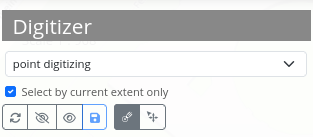
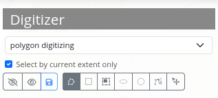

.. _digitizer_functionality:

Functionalities
***************

Digitizer allows the creating and editing of features. These are based on points, lines or polygon geometries and their attribute data. Geometries can be edited directly via the map. The attribute data is displayed in the configurable form of the Digitizer element. All in all, Digitizer offers complex editing functionalities:

* Draw points, lines and polygons (rectangles, circles or ellipses),
* Move objects,
* Add vertices (to lines or polygons),
* Generate polygons with enclaves,
* Snap to vertices of other objects that are visible on the map.

.. image:: ../../../../figures/Digitizer_geometries.png
     :width: 100%

The following sections explain the different functionalities of Digitizer.

Draw geometries
---------------

When drawing geometries, one can choose between the geometry types "point", "line" or "polygon". When different configurations are defined you can choose oe via a dropdown menu.

**Points**

A click on the button **draw point** activates/deactivates the option to draw points. 

**Lines**

A click on the button **draw line** activates/deactivates the option to draw lines. 

.. image:: ../../../../figures/Digitizer_create_lines.png
     :scale: 100

**Polygons**

Polygons, rectangles, enclaves, ellipses and circles can be drawn after activation of the corresponding button.

     
After activation, an object can be created through one or more clicks on the map. Afterwards, a pop-up window will appear, which requests attribute data in correspondence to its configured YAML-configuration.

Edit, save or delete geometries
-------------------------------

Objects are saved in the defined database table. The objects are displayed on the map and additionally as a table in the sidepane. This simplifies the administration of data. You can define which columns to list via the configuration. In this configuration the number (ID is automatically created after saving) and name of each object are displayed. It is possible to sort the columns or to search in the columns.
The list can also only display geometries of the current extent **1**. It is possible to refresh all features **2**. It is possible to hide **3** or show **4** all objects via click on the corresponding buttons. Modifications can be saved for all objects **5**. A change would, for instance, be the movement **6** of an object. After the button has been activated, geometries can be moved on the map with the mouse.

Furthermore, individual objects can be duplicated **7**, the style can be changed **8**, hidden **9** and changes saved **11**. You can change the attribute data **10**. Every object can be deleted **12**.

.. image:: ../../../../figures/Digitizer_editing.png
     :scale: 100

Previously described functions are identical for all Features. Additionally, intermediate points can be added to lines and the corners of areas modified. This option is activated via click on the Button *"Edit"*. In order to modify an object, it has to be selected beforehand.

.. image:: ../../../../figures/Digitizer_move.png
     :scale: 80

Context Menu
------------

There is a context menu is available for every feature by default. You can open the context menu via the right mouse click on an object.

.. image:: ../../../../figures/digitizer_contextmenu.png
     :scale: 80

