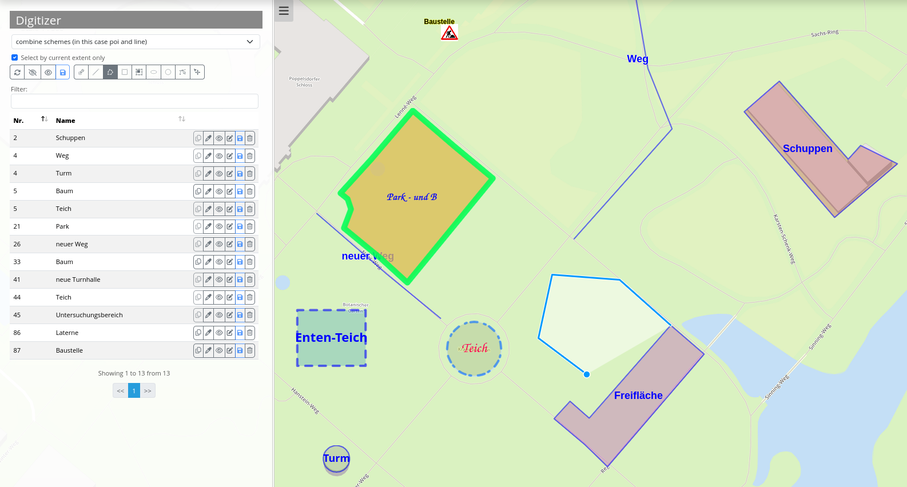
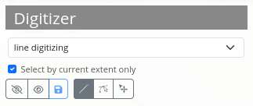

.. _digitizer_functionality:

Functionalities
===============

Digitizer allows the creating and editing of features. These are based on points, lines or polygon geometries and their attribute data. Geometries can be edited directly via the map. The attribute data is displayed in the configurable form of the Digitizer element. All in all, Digitizer offers complex editing functionalities:

* Draw points, lines and polygons (rectangles, circles or ellipses),
* Move objects,
* Add vertices (to lines or polygons),
* Generate polygons with enclaves,
* Snap to vertices of other objects that are visible on the map.

The following sections explain the different functionalities of Digitizer.

Draw geometries
---------------

When drawing geometries, one can choose between the geometry types "point", "line" or "polygon". When different configurations are defined you can choose oe via a dropdown menu.

Points
^^^^^^

A click on the button **draw point** activates/deactivates the option to draw points. 

.. image:: ../../../../figures/Digitizer_create_points.png
     :scale: 100

Lines
^^^^^

A click on the button **draw line** activates/deactivates the option to draw lines. 

Polygons
^^^^^^^^

**Polygons**, **rectangles**, **enclaves**, **ellipses** and **circles** can be drawn after activation of the corresponding button.

.. image:: ../../../../figures/Digitizer_create_polygons.png
     :scale: 100
     
After activation, an object can be created through one or more clicks on the map. Afterwards, a pop-up window will appear, which requests attribute data in correspondence to its configured YAML-configuration.

Edit, save or delete geometries
-------------------------------

The objects that are displayed on the map are stored in the predefined database table. Additionally, they are listed as a table in the sidepane for easy administration.

You can define which columns to list in the configuration. In the example below, the **number** (automatically created ID) and **name** of each object is displayed. It is possible to sort and search the columns.

The basic functions in the digitizer table are (from left to right and from the top down):

* With the checkbox **Select by current extent only**, you can filter to only show geometries in the table from the current map extent.
* It is possible to **Refresh** all features.
* It is also possible to **Hide** or **Show** all features on the map.
* You can **Save** modifications for multiple objects.
* A button to **Draw** geometries (see above).
* A button to **Edit** geometries. 
* You can also **Move** geometries with the mouse.

.. image:: ../../../../figures/Digitizer_editing.png
     :scale: 100

Next to each table entry are editing functions for individual objects. Those functions are similar for all geometry types. From left to right, it is possible to:

* **Duplicate** objects,
* **Edit** their style,
* **Hide** them (and **Show** them again),
* **Change** their attribute data,
* **Save** edited geometries,
* **Delete** geometries.

Additionally, intermediate points (nodes) can be added to lines and the corners of areas modified. This is activated after clicking on **Edit**. In order to modify an object, it has to be selected beforehand.

.. image:: ../../../../figures/Digitizer_move.png
     :scale: 80

Context Menu
------------

There is a context menu available for every feature by default. You can open it via a right mouse click on an object.

.. image:: ../../../../figures/digitizer_contextmenu.png
     :scale: 80

