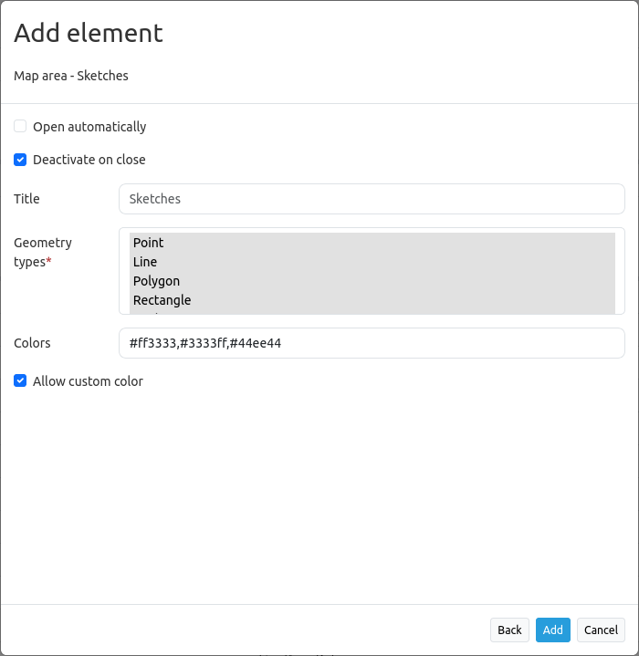
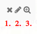

.. _sketch:

Sketches
********

The Sketches element allows creating, editing and deleting temporary objects. Sketches are not saved within a database and will be lost after the browser window is refreshed or closed.
Sketch geometries will be exported into :ref:`imageexport` and :ref:`printclient`.

The following geometry types can be sketched:

* Point
* Line
* Polygon
* Rectangle
* Circle
* Text

Configuration
=============

* **Open automatically:** Opens the Sketch element on application start (default: off).
* **Deactivate on close:** Sketches are deactivated after closure of the element.
* **Title:** Title of the element. This is referenced by the button which opens the element.
* **Geometrytypes:** Lists all geometrytypes (mandatory field).
* **Colors:** Creates buttons for custom colors in the Sketch tool. Color values must be comma separated. Needs at least one input color (mandatory field).  
* **Allow custom color:** Creates a custom color picker in the Sketch tool. Disable to show only the defined CSS colors.

Draw geometries
---------------

* **Point drawing:** is activated with a click on the "Point" button. Points are set with a simple click on the map and will appear in the Sketches table.
* **Line drawing:** is activated with a click on the "Line" button. Line segments are set via a single click on the map. To finish drawing, double click.
* **Polygon drawing:** is activated with a click on the "Polygon" button. Vertices are set via a single click. To finish drawing, double click anywhere in the map or single click on the last drawn vertex.
* **Rectangle drawing:** is activated with a click on the "Rectangle" button. Rectangles are created by two single clicks.
* **Circle drawing:** is activated with a click on the "Circle" button. For a circle, two single clicks are sufficient: One for the position of the circle center and one for the circumference. After the circle was created you can edit it and set a radius.
* **Text labels:** are activated with a click on the "Text" button. A label has to be defined in the label field before a text is set.

See the image below for sketch examples:

.. image:: ../../../figures/sketch.png
     :width: 100%

Delete, Edit and Zoom
---------------------

Drawn sketches can be individually deleted [1] or edited [2]. There is also the possibility to zoom to a particular geometry [3].

Color picker
------------

It's possible to pick colors after setting up the configuration parameters (see above). If done correctly, buttons offering the colors will appear.
Clicking on one of the color buttons determines the color for the next feature drawn, or, if currently editing a feature (click on "Edit geometry" icon in table listing), immediately updates that feature to that color. This will work with the geometry that isn't saved to the table yet, too.
The color picker that can be activated with **Allow custom color** in the configuration menu allows a free choice of color at the application level.
If the element is configured with only a single color and the frontend color picker is disabled, the color region will not be shown and the default color will be used for all geometries instead.

Stop drawing
------------

To interrupt a drawing, click the stop button: Note that this deletes your current draft.

.. image:: ../../../figures/sketch_stop_drawing.png
     :width: 100%

YAML-Definition
---------------

This template can be used to insert the element into a YAML application.

.. code-block:: yaml

   tooltip: 'Sketch'                # text of the tooltip Tooltips
   target: ~                        # ID of the element
   auto_activate: false             # (default: false)
   deactivate_on_close: true        # Drawn sketches will be deactivated if the element is closed (default: true)
   geometrytypes: point,line,polygon,rectangle,circle,text   # list of available geometry types
   colors:                          # Mentioned Hex color codes will be implemented into the tool
     - '#ff3333'                    # Default color red
     - '#3333ff'                    # Default color blue
     - '#44ee44'                    # Default color green
   allow_custom_color: true         # Implements a custom color picker for user color selection (default: true)
