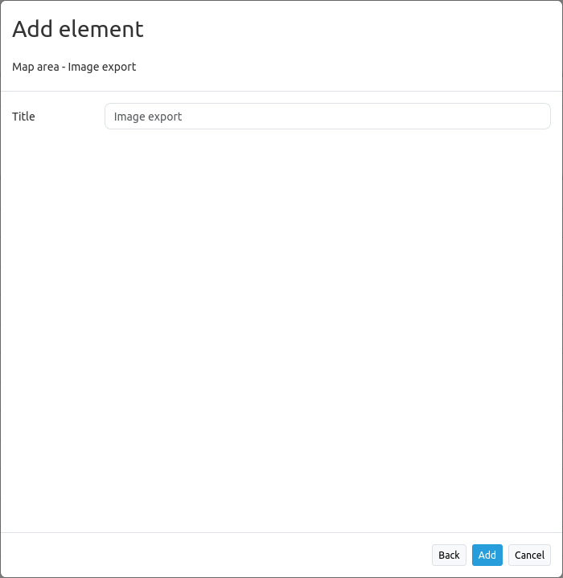

.. _imageexport:

Image Export
************

Image Export allows you to export your current map view. You can choose .png or .jpg format.

.. image:: ../../../figures/image_export.png
     :scale: 80

Configuration
=============

* **Title:** Title of the element. The title will be listed in :ref:`layouts` and allows to distinguish between different buttons. The title will be displayed besides the button if "Show label" is activated.

YAML-Definition
---------------

This template can be used to insert the element into a YAML application.

.. code-block:: yaml

   class: Mapbender\PrintBundle\Element\ImageExport
   target: map                       # Id of Map element to query (e.g. map)

You need a button to show this element. See :ref:`button` for inherited configuration options.

