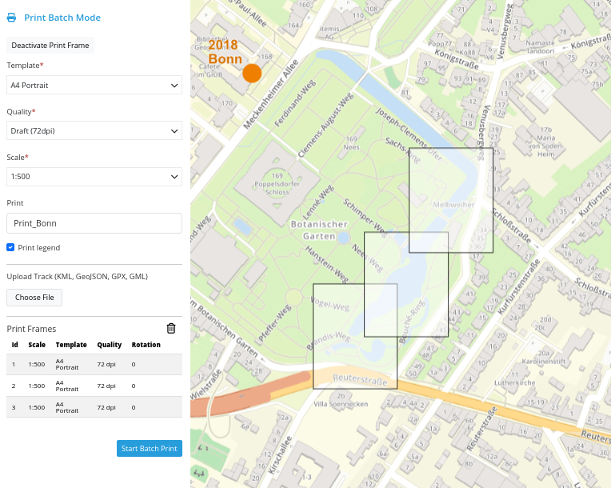
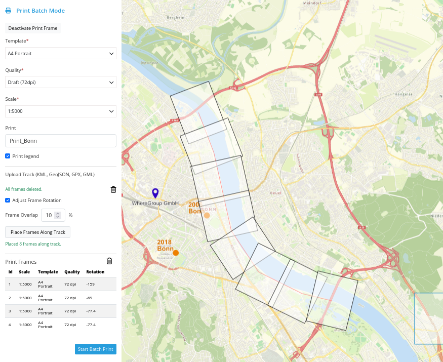
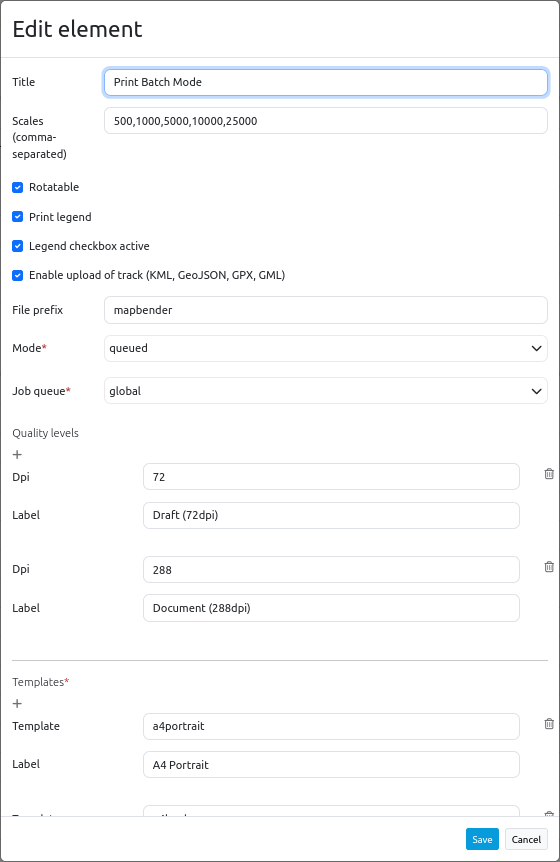

.. _printclientbatch:

PrintClient with Batch Mode
***************************

The PrintClient enables printing of a predefined map area.

The PrintClient with Batch Mode adds the ability to set and print multiple frames at once.

The frames can be place by click on the map. 

Also by uploading a linestring and generate print frames along the line.

Configuration
-------------

This documentation only decscribes the additional features of the Batch Mode Print. 

You find the documentation about general printing at PrintClient.

* **Hochladen von Geodaten aktivieren**: Das Hochladen von Linienobjekten in unterschiedlichen Formaten KML, GeoJSON, GPX, GML erlauben (Standard aktiv)
