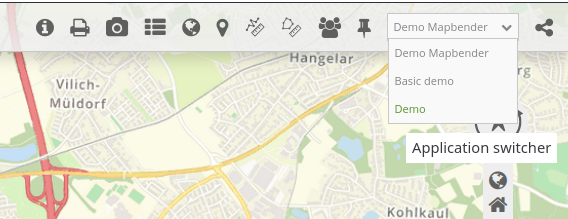
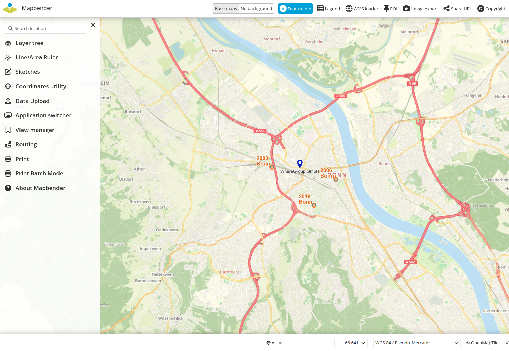
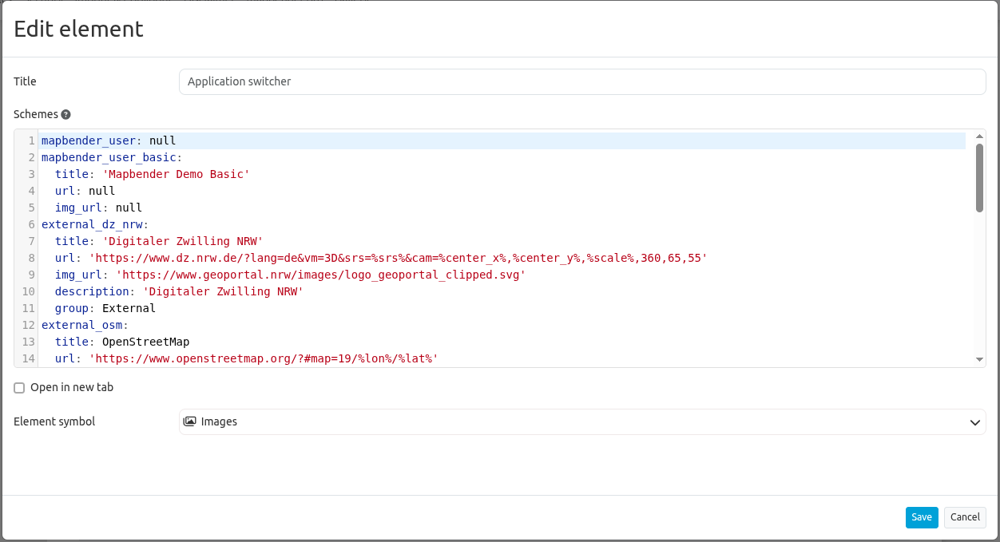

.. _applicationswitcher:

Application Switcher
********************

The Application Switcher provides the abilitiy to switch to other Mapbender application to the same extent, other portals or websites. 

The element provides placeholder, that can be used to define links.

The element can be defined in the toolbar oder footer or the sidepane. 

In the toolbar or footer it will be shown as selectbox.

When you place the element in the sidepane you can choose from cards that are devided into groups.

You can switch from one application to another. The map extent will be preserved.

If you refer to protected applications, these will only be made available for selection
if they are activated for the logged-in user or anonymous user.

Configuration
=============

* **Title:** Title of the element. The title will be shown as tooltip on mouseover on the selectbox.
* **Open in new tab:** Define whether the new application should be opened in the same window (default) or in a new tab.
* **Configuration:** Define the applications that should be offered by the applications switcher. The configuration is done in YAML syntax.

You can only refer to an application without further parameter. Or you can define additional parameters.

* **title:** Define an alternative Title. If not defined the Title of the application will be used, if you refer to an existing mapbender application of your installation. (optional)
* **url:** You can add a link and refer to a Mapbender application, a website or an alternative portal (optional)
* **imgUrl:** Link to an image, that you would like to show (optional)
* **description:** Add more Information. It wil be show as tooltip (optional)
* **group:** Define a group. Applications with the same group will be shown in a section with the group title as heading (optional)

The following placeholder are defined and provide information for the actual extent. The placeholder can be used in the url definition:

* **%scale%:** scale denominator
* **%lat%:** latitude value of the center coordinate
* **%lon%:** longitude value of the center coordinate
* **%center_x%:** x value of the center coordinate in the actual used projection 
* **%center_y%:** y value of the center coordinate in the actual used projection 
* **%rotation%:** numeric value representing the rotation of the map
* **%srs%:** EPSG code 
* **%zoom%:** zoom factor 

Example configuration

.. code-block:: yaml

    mapbender_user: # switch to another application
    mapbender_user_basic:
      title: 'Mapbender User Basic'
      url: null
      imgUrl: null
      group: 'Mapbender Demos'
    mapbender_user_basic_with_zoom:
      title: 'external: open with zoom'
      url: 'https://schulung.foss.academy/mapbender/application/mapbender_user?#%zoom%@%lat%/%lon%r%rotation%@EPSG:%srs%'
      description: Link to an external application with zoom and rotation.
      group: 'External'
    external_dz_nrw:
      title: 'www.dz.nrw.de with srs scale center_x and center_y'
      url: 'https://www.dz.nrw.de/?lang=de&vm=3D&srs=%srs%&cam=%center_x%,%center_y%,%scale%,360,65,55'
      imgUrl: null
      description: Link to Digitaler Zwilling NRW (external application).      
      group: 'External'
    external_osm:
      title: 'OSM with lon & lat'
      url: 'https://www.openstreetmap.org/?#map=19/%lon%/%lat%'
      imgUrl: 'https://upload.wikimedia.org/wikipedia/commons/b/b0/Openstreetmap_logo.svg'
      description: Link to OpenStreetMap (external application). 
      group: 'External'
    link_mapbender:
      title: 'Link: mapbender.org'
      url: 'https://mapbender.org'
      imgUrl: 'https://doc.mapbender.org/_images/mapbender_logo_font.png' #'https://mapbender.org/fileadmin/mapbender/resources/images/startseite/mapbender-stadt-markierungen.jpg'
      description: Link to the Mapbender Documentation      
      group: 'Link external Website'
    link_fossgis:
      title: 'Link: fossgis.de'
      url: 'https://fossgis.de'
      imgUrl: 'https://www.fossgis.de/mediawiki/images/d/d3/FOSSGIS_Logo_RGB_100x45mm_600dpi.png'
      description: Link to FOSSGIS e.V.      
      group: 'Link external Website'

YAML-Definition
---------------

This template can be used to insert the element into a YAML application. Please note that you have to refer to the variables with double percentage signs (%%) in the url definition.

.. code-block:: yaml

    title: Choose an Application              # Text will be displayed as tooltip
    class: Mapbender\CoreBundle\Element\ApplicationSwitcher
    open_in_new_tab: true   # false/true open application in new tab
    applications:
      mapbender_user: # switch to another application
      mapbender_user_basic:
        title: 'Mapbender User Basic'
        url: null
        imgUrl: null
        group: 'Mapbender Demos'
      mapbender_user_basic_with_zoom:
        title: 'external Mapbender: open with zoom'
        url: 'https://schulung.foss.academy/mapbender/application/mapbender_user?#%%zoom%%@%%lat%%/%%lon%%r%%rotation%%@EPSG:%%srs%%'
        description: Link to an external application with zoom and rotation.              
        group: 'External'
      external_dz_nrw:
        title: 'www.dz.nrw.de with srs scale center_x and center_y'
        url: 'https://www.dz.nrw.de/?lang=de&vm=3D&srs=%%srs%%&cam=%%center_x%%,%%center_y%%,%%scale%%,360,65,55'
        imgUrl: null
        description: Link to Digitaler Zwilling NRW (external application).         
        group: 'External'
      external_osm:
        title: 'OSM with lon & lat'
        url: 'https://www.openstreetmap.org/?#map=19/%lon%/%lat%'
        imgUrl: 'https://upload.wikimedia.org/wikipedia/commons/b/b0/Openstreetmap_logo.svg'
        description: Link to OpenStreetMap (external application).         
        group: 'External'

