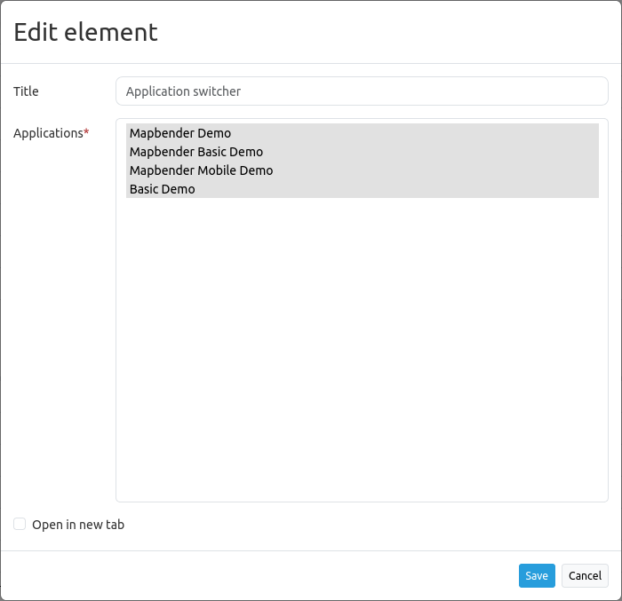

.. _applicationswitcher:

Application Switcher
********************

The Application Switcher provides a selectbox that refers to other Mapbender applications. You can switch from one application to another. The map extent will be preserved.

Configuration
=============

* **Title:** Title of the element. The title will be shown as tooltip on mouseover on the selectbox.
* **Applications:** Choose the applications that should be offered in the selectbox.
* **Open in new tab:** Define whether the new application should be opened in the same window (default) or in a new tab.

YAML-Definition
---------------

This template can be used to insert the element into a YAML application.

.. code-block:: yaml

    title: Choose an Application              # Text will be displayed as tooltip
    class: Mapbender\CoreBundle\Element\ApplicationSwitcher
    applications: ["mapbender_user","mapbender_user_basic"]     # Define the applications for the ApplicationSwitcher as array 
    open_in_new_tab: true   # false/true open application in new tab
