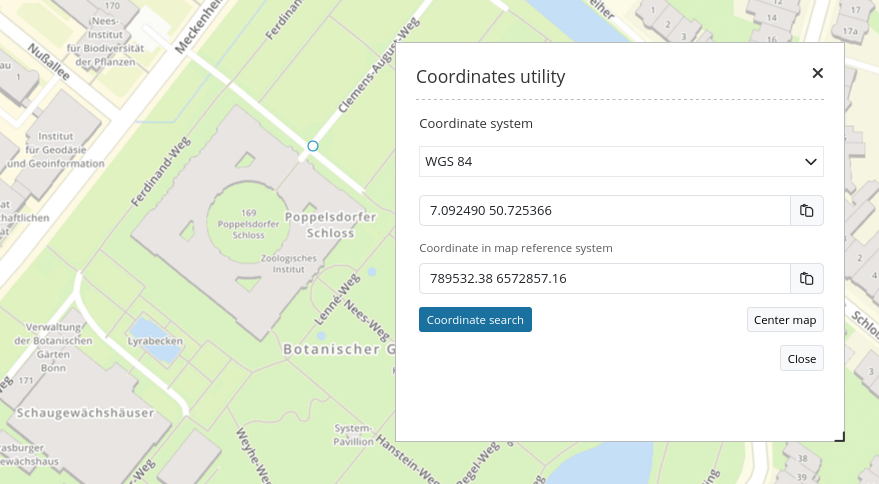

.. _coordinate_utility:

Coordinates Utility
*******************

Coordinates Utility allows two different coordinate operations:

1. Zoom to a given point coordinate
2. Show the clicked point of the map

Both functions can be accessed with one user interface:

Both cases allow a dynamic coordinate transformation. Simply insert and transform coordinates from other systems.

Configuration
=============

.. image:: ../../../figures/coordinate_utility_configuration.png
     :scale: 70

* **Title:** Title of the element.
* **SRS List:** You can define additional SRS to which the tool has to transform the coordinates. This list can be left empty.
* **Zoom level:** Zoom level of the map (default: 6)
* **Add map's srs list:** If checked, the supported coordinate systems defined in the :ref:`map` will automatically be used by this element and the :ref:`srs_selector` (default: true).

If you define Coordinates Utility as a dialog, you need a :ref:`button` that you place in the Toolbar. 

Using the tool
===============

**Get Coordinate**

* If Coordinates Utility is opened as a dialog, the map reacts on a click. Click into the map and the click-coordinate is displayed in the dialog.
* Change the coordinate system with the dropdown-list. The click-coordinate is displayed in the given coordinate system.
* The last line therefore shows the click-coordinate in the original coordinate system of the map.
* The button at the end of each text-field allows to copy the coordinate directly into the clipboard.
* If Coordinates Utility is opened via the Sidepane, the button **Coordinate search** will appear that allows switching between a pan-cursor and a coordinate-cursor.

**Zoom to coordinate**

* The text field can be used to edit your own coordinates. They must be given in the coordinate system that is chosen in the upper dropdown-list.
* With a click on the **Center map** button, the map zooms to the given coordinate and shows the position with an orange symbol.

YAML-Definition
===============

This template can be used to insert the element into a YAML application.

.. code-block:: yaml

    coordinatesutility:
        title: 'Koordinaten Utility'
        class: Mapbender\CoordinatesUtilityBundle\Element\CoordinatesUtility
        type: element
        target: map
        srsList:
            -
                name: 'EPSG:31466'
                title: '31466'
            -
                name: 'EPSG:31468'
                title: '31468'
            -
                name: 'EPSG:25833'
                title: '25832'
            -
                name: 'EPSG:4326'
                title: '4326'
                addMapSrsList: true
