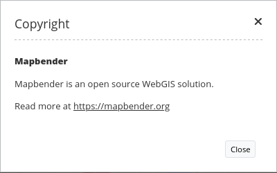
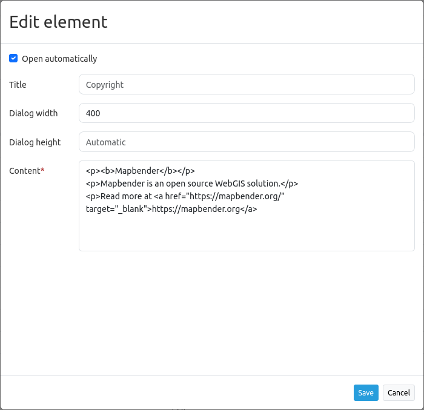
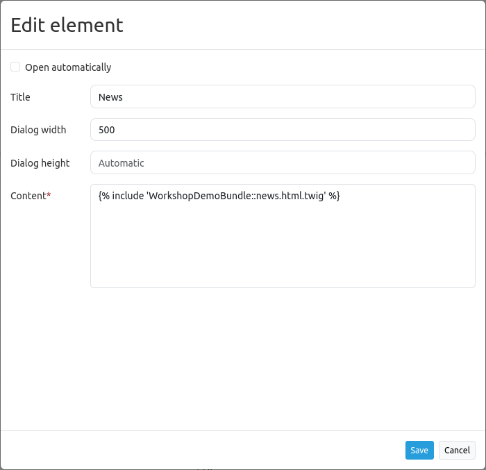

.. _copyright:

Copyright
*********

The copyright element can be used to show simple text or HTML in a window dialog. It can be opened automatically on application start. It is also possible to integrate links and images into the window (see :ref:`html`).

Configuration
=============

* **Open automatically:** Enable or disable autoopening of the copyright window while starting the application (default: off).
* **Title:** Title of the element. It will be indicated next to the button.
* **Dialog width:** Width of the Popup window (default: 300).
* **Dialog height:** Height of the Popup window (default: 170).
* **Content:** Content of the copyright window, displayed when clicking on the button (or autoopened by starting the application, if enabled).

Refer to a twig file
--------------------

You can refer to a twig file in the Content area. Please note that the twig file has to contain valid HTML.

YAML-Definition
---------------

This template can be used to insert the element into a YAML application.

.. code-block:: yaml

   class: Mapbender\CoreBundle\Element\Copyright
   title: "Copyright"              # Title of the element
   popupWidth: 300
   popupHeight: 170
   tooltip: "Copyright"            # Text to use as tooltip
   content: "Lorem ipsum"          # Edit the text you want to display as copyright text
   autoOpen: true                  # Automatically open the dialog when you start the application
   
