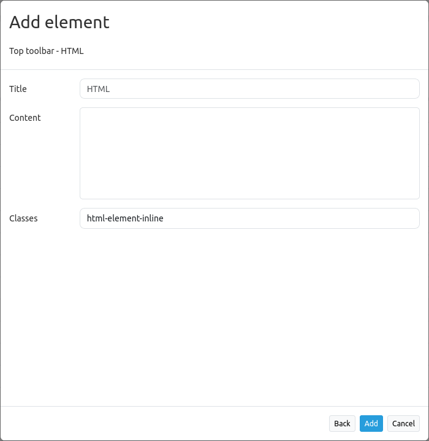
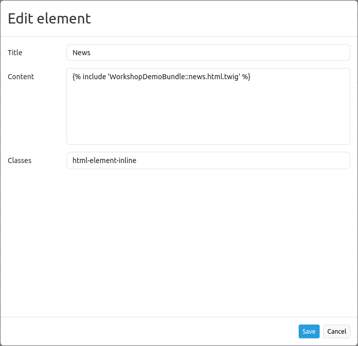

.. _html:

HTML
****

This element allows the integration of HTML anywhere in an application. Figures, links or e.g. texts can be inserted. The following illustration shows the integration of a Mapbender logo in footer, toolbar and sidepane:

.. image:: ../../../figures/html_preview_example.png
     :width: 100%
 
The following variables can be integrated in HTML:

- "application" (Entity Application)
- "entity" (Entity HTML-Element)


Configuration
=============

This element has to be integrated in the backend.



* **Title:** Title of the element. The title will be listed in "Layouts".
* **Content:** Content of the HTML-element. The variables "application" and "entity" are available.
* **Classes:** You can refer to a CSS class for the HTML element. The class can be defined in the css editor.


Configuration examples
======================

Insert picture:
---------------

In this example, the Mapbender Logo was integrated in the sidepane (````). It can be adjusted with a predefined height (``height='60px'``), background color and transparency (``background-color:rgb(240, 240, 240, 0.9)``) as well as a certain padding (``padding:10px``). These configurations were defined as styling through ``style=``.

.. code-block:: yaml

     


Insert picture with link:
-------------------------

A linkage was added to the previously inserted logo. It references to the Mapbender website (``href='https://mapbender.org'``) if the logo is clicked on. The link is opened in a new tab because of ``target='_blank'``.

.. code-block:: yaml

     <a href='https://mapbender.org' target='_blank'>
     </a>

Variables & HTML-Element
------------------------

Several variables can be integrated in the HTML-Element.

* Variable: **"application.title"**

This variable allows the integration of the application title. In the example, this corresponds to "Konfigurationsbeispiele".

The HTML-Code could look like this:

.. code-block:: yaml

     <b><span style="font-size:25px;color:#b6dd18;margin-right:50vw"> Anwendung {{ application.title }} </span></b>

The application title is defined through ``{{ application.title }}``. The term "Anwendung" is an addition and will display independently from the actual title. The style-block (``style=``) defines font size (``font-size:25px``), font width (``<b></b>``), font color (``color:#b6dd18``) as well as position (``margin-right:50vw``) of the title.

The result for the configuration example looks like this:


* Variable: **app.user.username**

This variable displays the name of the active user:

.. code-block:: yaml

	<p>Username: {{ app.user.username }}</p>

In this example, the user name is displayed in the toolbar:
	
.. image:: ../../../figures/html_example_user_name.png
     :scale: 80
    
* Variable: **group.title**

The group of a user cannot be defined in a single expression, because Twig only supports the map-filter in higher versions. In order to integrate this variable, a loop will be used:

.. code-block:: yaml

  
      <p>Group #{{ index }}: {{ group.title }}</p>
  

In this example, index and group name are displayed in the toolbar:


* Variable: **"entity"**

The variable ``{ entity }`` displays the ID and ``{ entity.title }``, which displays the title of the HTML-element. 

In the following, the variable ``{ entity.title }`` was integrated with the text addition "HTML-Element". The Styling parameters correspond to those of the example with *application.title*. Text additions, variables and position were simply adjusted for *entity.title*.

.. code-block:: yaml

	<b><span style=“font-size:25px;color:#b6dd18;margin-right:60vw“> HTML-Element
	{{ entity.title }} </span></b>

These variables could look as follows:

.. image:: ../../../figures/html_example_entity_title.png
     :width: 100%


Refer to a twig file
--------------------

You can refer to a twig file in the Content area. Please note that the twig file has to contain valid HTML.




YAML-Definition
---------------

This template can be used to insert the element into a YAML application.

.. code-block:: yaml

    title: 'HTML-Element'
    class: Mapbender\CoreBundle\Element\HTMLElement
    content: <p>Hello, World!</p><p>Application: {{ application.title |trans }}</p> # The variables "application" and "entity" are available.
    classes: my-special-css-class

