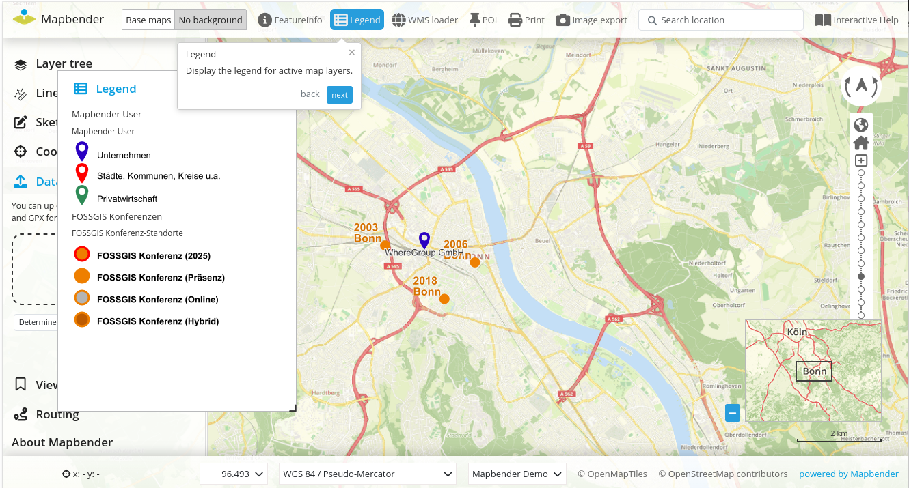
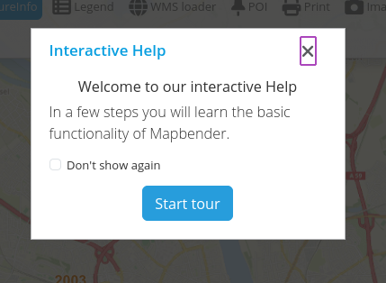
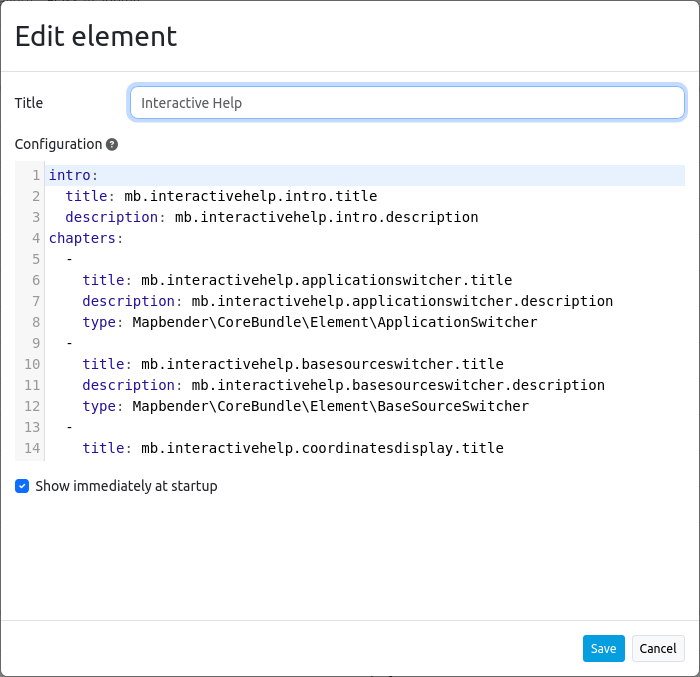

.. _interactivehelp:

Interactive Help
****************

The interactive help feature allows users to view help texts for various elements of the application. This feature can be particularly useful for onboarding new users or providing specific guidance for complex functionalities.

Configuration
=============

     
* **Title:** Title of the element. The title is displayed next to the button.
* **Configuration:** Configuration is done in YAML syntax, whereby an introduction (intro) for the start dialog can be defined. In addition, the individual stations can be defined under chapters.
* **Show immediately at startup:** Turns on/off whether the interactive help should open automatically when the application starts (default: off).

Variables have been defined and translated accordingly for language support. However, individual entries can also be made under title and description.

.. code-block:: yaml
    
    intro:
      title: mb.interactivehelp.intro.title
      description: mb.interactivehelp.intro.description
    chapters:
      -
        title: mb.interactivehelp.applicationswitcher.title
        description: mb.interactivehelp.applicationswitcher.description
        type: Mapbender\CoreBundle\Element\ApplicationSwitcher
