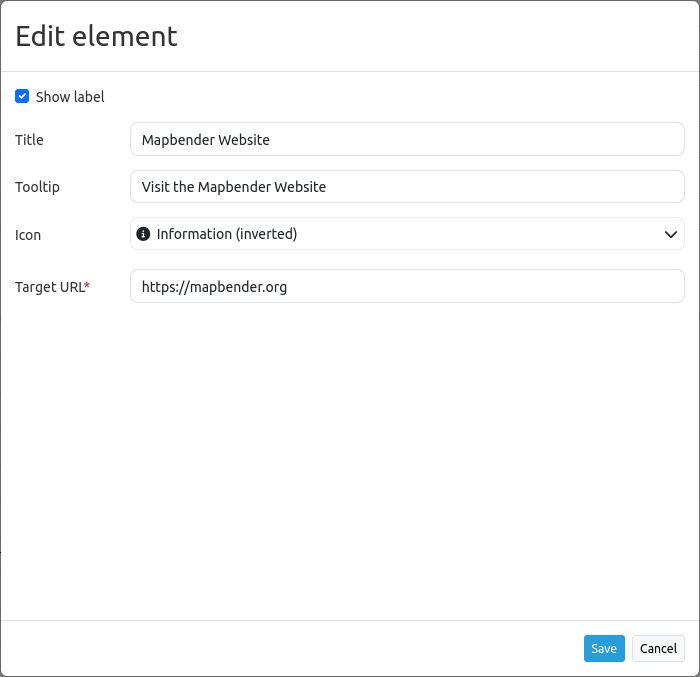
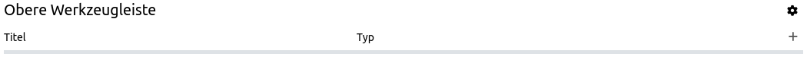

.. _link:

Link
****

The link element provides a button widget that refers a defined link like a website or script.

Configuration
=============

* **Show label:** Enables or disables text (title) next to the button (default: true).
* **Title:** Title of the element. The title will be listed in :ref:`layouts` and allows to distinguish between different buttons. It will be indicated if "Show label" is activated.
* **Tooltip:** Text, that will be indicated if the mouse hovers over the button for a longer time.
* **Icon:** Symbol of the button. Based on a CSS class.
* **Target URL** Reference to a website or a script.

Icons
-----

For some symbols you can choose between two different types of icons:

* A symbol based on a graphic (e.g. "About"),
* A symbol based on a font (e.g. "About (Font Awesome)").

The latter are based on a `IconSet <https://github.com/mapbender/icons>`_, which is delivered with Mapbender as a module. We recommend to use the symbols from this library.

.. hint:: It is also possible to deactivate an icon set and/or to use other icons. For more, see :ref:`en/customization/yaml:Customizing icons`.

More information on icons under:

* https://github.com/mapbender/icons
* http://rawgit.com/mapbender/icons/master/demo.html

Example
=======
It is possible to create and adjust different buttons with different functions.
Buttons can refer to features which are included in the Map area. For example, it is possible to create a Legend button or Line- and/or Area Ruler buttons:

Link to a Webpage
-----------------

First, you have to select the link element by clicking on the ``+`` - symbol in the Toolbar section in the Layouts tab.

After the selection of the link element, the "Add element - Link" dialog box opens, where you can configure the element.

You can set the name of the link button in the field *Title*. This title will be displayed as label next to the icon if *Show label* is active. 

In the field *Tooltip*, you can define a text that will be displaced as tooltip during hovering over the button. You can choose from a variety of icons to set the icon for your link button.

YAML-Definition
---------------

This template can be used to insert the element into a YAML application.

.. code-block:: yaml

    title: Link                                 # title
    class: Mapbender\CoreBundle\Element\Button
    tooltip: Visit the Mapbender Website        # text to use as tooltip
    icon: iconInfoActive                        # icon CSS class to use
    label: true                                 # false/true to label the button, default is true
    click: https://mapbender.org                # refer to a website or script

