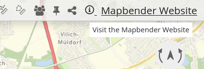
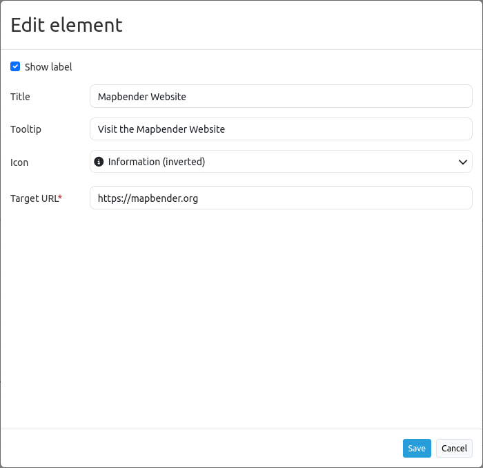

.. _link:

Link
****

 .. |mapbender-button-add| image:: ../../../figures/mapbender_button_add.png

The link element provides a button widget that refers a defined link like a website or script.

Configuration
=============

* **Show label:** Enables or disables text (title) next to the button (default: true).
* **Title:** Title of the element. The title will be listed in :ref:`layouts` and allows to distinguish between different buttons. It will be indicated if "Show label" is activated.
* **Tooltip:** Text, that will be indicated if the mouse hovers over the button for a longer time.
* **Icon:** Symbol of the button. Based on a CSS class.
* **Target URL** Reference to a website or a script.

.. hint:: It is also possible to deactivate an icon set and/or to use other icons. For more, see :ref:`en/customization/yaml:Customizing icons`.

YAML-Definition
---------------

This template can be used to insert the element into a YAML application.

.. code-block:: yaml

    title: Link                                 # title
    class: Mapbender\CoreBundle\Element\Button
    tooltip: Visit the Mapbender Website        # text to use as tooltip
    icon: iconInfoActive                        # icon CSS class to use
    label: true                                 # false/true to label the button, default is true
    click: https://mapbender.org                # refer to a website or script

