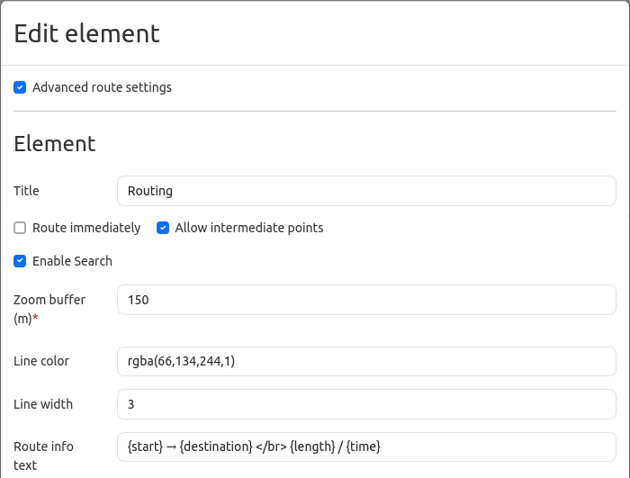
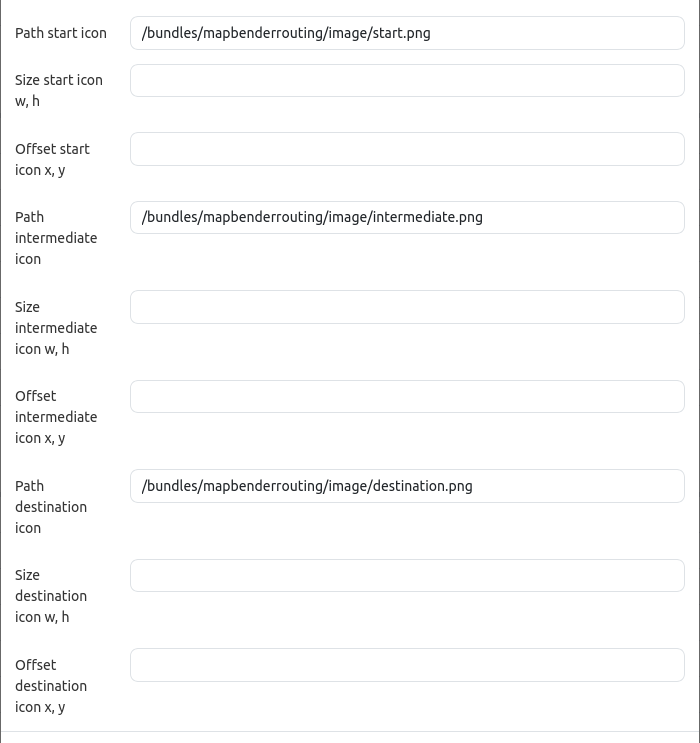
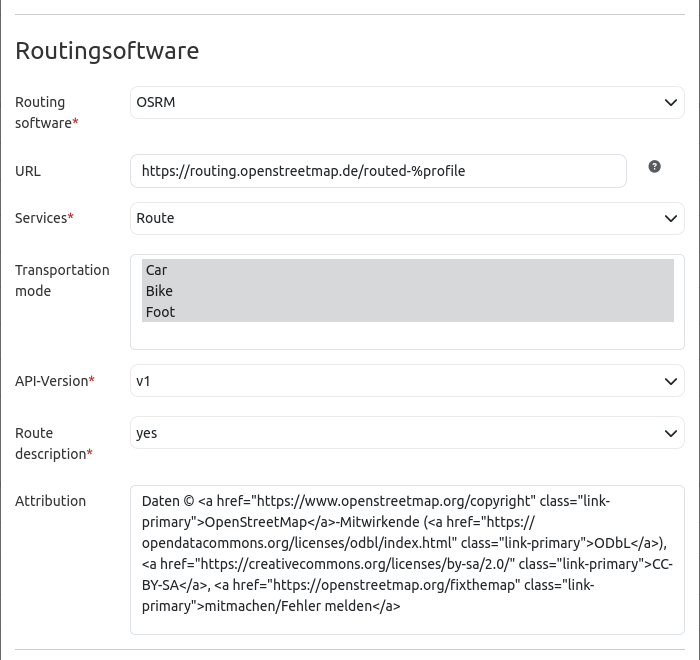
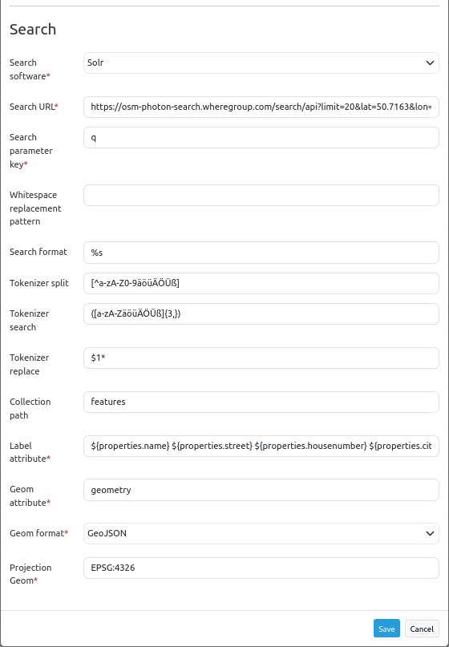

.. _routing:

Routing
*******

The routing element adds a routing tool to an application. After specifying the start, destination and any intermediate points, a suitable route is displayed on the map. Information about the route can also be displayed.

.. image:: ../../../figures/de/routing.png
     :scale: 70

Configuration
=============

* **Advanced route settings:** Allows you to make further settings (default: false).
* **Title:** Elements Title.
* **Route immediately:** Configuration to deactivate/activate automatic routing without the users interaction (default: false).
* **Allow intermediate points:** Configuration for deactivating/activating intermediate points (default: false).
* **Enable Search:** Configuration to deactivate/activate the search option (default: false).
* **Zoom buffer (m):** Definition of a zoom buffer for the result display in meters (default: 0).
* **Line color:** Option to adjust the line color and opacity with the rgba standard (default: rgba(66, 134, 244, 1)).
* **Line width:** Option to adjust the line width (default: 3).
* **Route info text:** Option to add an info text for the rout (default: {start} → {destination}   {length} will take {time}).

* **Path start icon:** Customize the start icon (default: /bundles/mapbenderrouting/image/start.png).
* **Path intermediate icon:** Customize the intermediate icon (default: /bundles/mapbenderrouting/image/intermediate.png):
* **Path destination icon:** Customize the destination icon (default: /bundles/mapbenderrouting/image/destination.png).
* **Size Icon:** Adjust the size of the different icons.
* **Offset Icon:** Adjust the offset of the different icons.

* **Routing software:** Select the routing software (OSRM).
* **URL:** Set the URL address for the routing software (default: https://).
* **Services:** Select from various services (defaut: Route).
* **Transportation mode:** Select the routing profiles (car, bicycle, pedestrian). It is also possible to select more than one (default: none).
* **API-Version:** Determine the version of the API (default: v1).
* **Route description:** Select whether there should be a route description or not (default: no).

* **Search software:** Select the search service (default: Solr).
* **Search URL:** Set the URL address for the search software.
* **Search parameter key:** Set the search parameter key (default: q).
* **Whitespace replacement pattern:**  Set parameters to replace the search term.
* **Search format:** Set the search format (default: %s). 
* **Token split/search/replace (JavaScript regex):** Tokenizer splits/searches/replaces regexp.
    * **Token split**, z.B.: ``[^a-zA-Z0-9äöüÄÖÜß]``
    * **Token search**, z.B..: ``([a-zA-ZäöüÄÖÜß]{3,})``
    * **Token replace**, z.B..: ``$1*``
* **Collection path:** Set the attribute path that is extracted from the query result (default: response.docs).
* **Label attribute:** Name of the attribute's to show as result (default: label).
* **Geom attribute:** Name of the geometry attribute (default: geom).
* **Geom format:** Geometry data format, can be WKT or GeoJSON (default. WKT).
* **Projection Geom:** EPSG code of the spatial reference system(default EPSG:4326).

YAML-Definition
---------------

