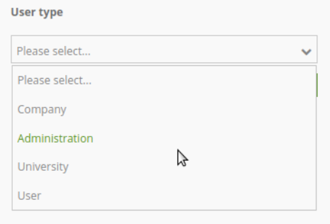

.. _search_router:

Search Router
*************

 .. |mapbender-button-add| image:: ../../../figures/mapbender_button_add.png

The Search Router element enables users to locate items within the map by interfacing with a specified database connected via the :ref:`backend`. Both the search form and table output are customizable and facilitate generic SQL search functionality via PostgreSQL tables. This is achieved through the storage of geometries in the database, allowing users to query and display dynamic results on the map.

.. image:: ../../../figures/search_router.png
     :scale: 50

Configuration
=============

.. note:: Search Router needs access to the database where the search tables are. You have to define a new database configuration to be able to connect with the geo database. Read more about this at :ref:`yaml`.

The element may be integrated into the sidepane or with a :ref:`button` into the toolbar.

.. image:: ../../../figures/search_router_configuration.png
     :scale: 80

* **Title:** Title of the element. The title will be listed in the Layouts section in the :ref:`backend`. It is shown as sidepane tab/button title (usage in sidepane) or dialog title (usage via :ref:`button`).
* **Width:**  Width of the dialog (only for dialog, not sidepane).
* **Height:**  Height of the dialog (only for dialog, not sidepane).

You can define Searches (Routes) with the |mapbender-button-add| button. Each Search has its own title that will show up in the search form in a selectbox. The definition of the search is done in YAML syntax in the textarea configuration. 

* **Routes:** Collection of search routes.
* **Title**: Search Title (appears when a search is added to Routes by using |mapbender-button-add|),
* **Configuration**: Field to configure the search (appears when a search is added to Routes by using |mapbender-button-add|).

Route Configuration
-------------------

Here, you define all important information for each search: 

* the database connection,
* the search tables/views and columns,
* the design of the form,
* and the design of the result table,
* the design of the results on the map.

.. code-block:: yaml

    class: Mapbender\CoreBundle\Component\SQLSearchEngine
    class_options:
        connection: geodata_db   # database alias from doctrine.yaml
        relation: polygons       # search table
        attributes:              # columns that are used in the form and in the result table
          - gid
          - name
          - type
          - city
        geometry_attribute: geom # reference to the geometry column
    form:
        name:
            type: Symfony\Component\Form\Extension\Core\Type\TextType
            options:
                required: true
            compare: exact
        city:
            type: Symfony\Component\Form\Extension\Core\Type\TextType
            options:
                required: false
                label: City/Town
            compare: ilike
    results:
        view: table
        count: true
        exportcsv: true
        sortBy: name
        sortOrder: asc #desc
        zoomToResultExtent: true
        headers:
            gid: ID
            name: Name
            city: City/Town
        callback:
            event: click
            options:
                buffer: 10
                minScale: null
                maxScale: null

Class and Class options
-----------------------

The configuration starts with the definition of the class (always ``class: Mapbender\CoreBundle\Component\SQLSearchEngine``) followed by the information about the database connection, definition of the search table, the columns that are used and the geometry column.

Form
----

In the form section, you can define the setup of the form and define textfields and selectboxes. You refer to the table columns and define the *type*, *options* and *compare*.

Type
----

The form supports two types - *text* and *choice*.

You have to define a configuration for each table column you would like to provide in the search form. The configuraton starts with the column name (in the example it is the column called *name*).

* **label**: You can define a label parameter (if not defined, the capitalized column name will be used).

* **required**: You can define whether a type should be required (default is false). With ``required: true``, a mandatory field is defined. That means that the user has to define a search term here before the search can run. Headings of required fields are marked with a red '*'.

You also can define the :ref:`en/elements/search/search_router:comparison`.

Type text
~~~~~~~~~

Type **text** allows you to provide text fields for your search formular.

Type text supports autocomplete. If you want to add autocomplete to the field you have to add additional parameters:

Supported autocomplete parameters are:

* **data-autocomplete**: 'on' - parameter to activate autocomplete
* **data-autocomplete-distinct**: 'on' - paramter to activate distinct autocomplete
* **data-autocomplete-using**: column1, column2 - define other column/s that should be also considered on autocomplete

* **Type text** example with autocomplete:

.. image:: ../../../figures/search_router_text_en.png
     :scale: 80

.. code-block:: yaml

    form:
        name:
	    type: Symfony\Component\Form\Extension\Core\Type\TextType                                                      # input box for text
            options:
                label: Name 
                required: true
            attr:
                data-autocomplete: 'on'          # activate autocomplete
                data-autocomplete-distinct: 'on' # only show equal results once
                data-autocomplete-using: type, city     # autocomplete, list of input fields (with comma seperated), WHERE input           
            compare: exact                                          

Type choice
~~~~~~~~~~~

Type **choice** allows you to provide a selectbox in your search formular.

For type choice you can define a **placeholder**. This is a text that is shown before an option is selected.

You have to define the choices for the selectbox. You define a value and a key. 

* **key**: will be send in the search query,
* **value**: is show as text in selectbox.

.. note:: From Mapbender 3.2 on onwards, you should use the ``value: key`` definition and use ``type: Symfony\Component\Form\Extension\Core\Type\ChoiceType``.

**type choice** example with different selection options via dropdown:

.. code-block:: yaml

    type:                                                         
        type: Symfony\Component\Form\Extension\Core\Type\ChoiceType                                                      # box with selection options as dropdown list
        options:
            label: User type
            required: false
            placeholder: 'Please select...'
            choices:                        
                Company: A
                Administration: B
                University: C
                User: D
                Something else: E
        compare: exact     

Comparison
----------

For every field a comparison mode can be set. This is used by the engine when the query is sent. 

The following comparison modes are supported:

* **exact:** exact comparison (key = val)
* **iexact:** comparison ignoring cases (case-insensitive)
* **like:** Standard, both-side 'like'
* **like-left:** left-hand 'like'
* **like-right:** right-hand 'like'
* **ilike**: both-side 'like', (case-insensitive - \*searchstring\*)
* **ilike-left:** left-side 'like' (case-insensitive - \*searchstring)
* **ilike-right:** right-side 'like' (case-insensitive - searchstring\*)

Result
------

In the section **results** the definition for the result table and styling is none.

.. code-block:: yaml

    results:
        view: table
        count: true
        exportcsv: true
        sortBy: name
        sortOrder: asc #desc
        zoomToResultExtent: true
        headers:
            gid: ID
            name: Name
            city: City/Town
        callback:
            event: click
            options:
                buffer: 10
                minScale: null
                maxScale: null

* **view**: is always set to ``table``. No more options are possible.
* **count**: shows the number of results (default: true).
* **exportcsv**: generates a download button to give out the results as CSV file (default: false). 
* **sortBy**:  optional, define an attribute by attribute name the search results should be sorted by (default no sorting).
* **sortOrder**: optional, define how to sort the results ascending (asc) or descending (desc) (default: asc)
* **zoomToResultExtent**: define whether zoom to result should be activated (default: false).
* **headers**: definition of the columns to display and the alternative labeling.
* **callback**: define the action for the click event on a result item.
* **event**: only ``click`` is supported.
* **buffer**: zoom to the result item with a defined buffer.
* **minScale and maxScale**: zoom to the result item in a scale between minScale and maxScale.

Styling the Results
-------------------

By default the results are shown in the default-OpenLayers Style.

.. image:: ../../../figures/de/search_router_example_colour_orangeblue.png
     :scale: 80

You can overwrite this by handing over a styleMap-Configuration.

Three different styles are configured:

* **default**: default style
* **select**: style on select
* **temporary**: style on mouse-over

.. code-block:: yaml

    results:
        [...]
        styleMap:
            default:
                strokeColor: '#00ff00'  # border color
                strokeOpacity: 1        # border opacity (1 - opaque / no transparency)
                strokeWidth: 3          # border width
                fillColor: '#f0f0f0'    # fill color               
                fillOpacity: 0          # fill opacity, (0 full transparency)
                pointRadius: 6          # size of the point symbol
                label: ${name} - ${gid} # Attribut to use for labeling or fiexed text
                fontColor: "#ff0000"    # font color
                fontSize: 30px          # font size in piexels
                fontFamily: 'Arial, Courier New, monospace'
                fontWeight: bold        # font weight 
                labelOutlineColor: '#ffff00' # font outline
                labelOutlineWidth: 1    # font outline width
                labelXOffset: -18       # Offset X-axis
                labelYOffset: -18       # Offset Y-axis
            select:
                strokeColor: '#0000ff'
                strokeOpacity: 1
                strokeWidth: 4
                fillColor: '#ff00ff'
                fillOpacity: 0.8
                pointRadius: 10
                label: ${name}
            temporary:
               strokeColor: '#0000ff'
               fillColor: '#0000ff'
               fillOpacity: 1
               label: 'fixed Text'
          
In the default style the point-symbol interior is transparent (``fillOpacity: 0``). Only their outlines will be drawn in green. 
The selected features will be drawn with a purple fill and an opacity of 0.8. The outline of the symbol is blue. 
The temporary symbols on mouse-hover are blue points. 

.. image:: ../../../figures/de/search_router_example_colour_purplegreen.png
     :scale: 80

The styleMap settings override the default settings, so you only have to define the sections you want to overwrite. No extra styleMap is set the default style will be used.

.. note:: Note that the hexadeximal color values have to be stated in quotation marks, because # would be interpreted as a comment instead.

Configuration Examples
======================

1. Example
----------

In this example, a search was configured for the Mapbender user and added into the sidepane with |mapbender-button-add| in the :ref:`layouts`.

.. image:: ../../../figures/add_sidepane.png
     :scale: 80

The confguration dialogue for this example looks like this:

.. image:: ../../../figures/search_router_example_dialog.png
     :scale: 80

The element title (*Title*) is Search. It is again displayed as a title in the sidepane. The checkbox is unchecked, because the element is implemented into the sidepane and not as a button. The *Timeout factor* is set to 2. The fields *Width* and *Height* are filled, but they won't be used in this application, because the element is configured in the sidepane. It is implemented via the |mapbender-button-add| and *Routes* into the search, called (*Title*) Mapbender User. The yaml-Configuration of the Element is written in *Configuration*. Here is the complete configuration:

.. code-block:: yaml

  class: Mapbender\CoreBundle\Component\SQLSearchEngine
  class_options:
    connection: geodata_db                 # database (on which the element has access)
    relation: mapbender_user               # table (on which the element has access)
    attributes:                            # table columns (which the element addresses)
      - gid
      - orga
      - town
      - usertype
    geometry_attribute: the_geom           # definition of the geometry column
  form:                                    # configuration of the form
    orga:                                  # search field (e.g. search for specific Mapbender User)
      type: Symfony\Component\Form\Extension\Core\Type\TextType
      options:
        required: false                    # no mandatory field
        label: 'Mapbender User'            # caption of the search field
        attr:                              # additional definable attributes
          data-autocomplete: 'on'          # auto-completion of search words
          data-autocomplete-distinct: 'on'
      compare: ilike                       # see section 'comparison mode' on this page
    town:                                  # search field (e.g. search for specific city)
      type: Symfony\Component\Form\Extension\Core\Type\TextType
      options:
        required: false                    # no mandatory field
        label: City                        # caption of the search field
        attr:
          data-autocomplete: 'on'
          data-autocomplete-distinct: 'on'
      compare: ilike
    usertype:                              # search field (search for specific User type)
      type: Symfony\Component\Form\Extension\Core\Type\ChoiceType
      options:
        placeholder: 'Please select...'    # displayed text in field before entering a search
        choices:                           # choices need to have the following format: "entry in the database column": "displayed name in the drop down list"
          1: Company
          2: Administration
          3: University
          4: User
        required: false                    # no mandatory field
        label: User type                   # caption of the search field
      compare: exact                       # see section 'comparison mode' on this page
  results:                                 # configuration of the shown results list
    view: table                            # display results as table
    count: true                            # show number of results
    headers:                               # column title; format: column title in the database: column title shown in the table 
      gid: ID
      orga: 'Mapbender User'
      town: City
    callback:
      event: click               
      options:
        buffer: 10
        minScale: null
        maxScale: 10000
    styleMap:                              # Styling points on the map
      default:                             # Styling of all points on the map
        strokeColor: '#003366'
        strokeOpacity: 1
        fillColor: '#3366cc'
        fillOpacity: 0.5
      select:                              # Styling of the selected point on the map
        strokeColor: '#330000'
        strokeOpacity: 1
        fillColor: '#800000'
        fillOpacity: 0.5
      temporary:
        strokeColor: '#0000ff'
        fillColor: '#0000ff'
        fillOpacity: 1

This picture illustrates which consequences the configurations in the yaml-definition have for the search formula:

.. image:: ../../../figures/search_router_example_search_description.png
     :scale: 80

Displayed is the excerpt of the yaml-definition configuring the formula. Columns *orga*, *town* and *usertype* are used in the formula and implemented as the fields *Mapbender User*, *Town* and *Usertype*. *Mapbender User* and *Town* are type text, *Usertype* can be of various types.

A complete search for the Mapbender User WhereGroup, in the Town Bonn, of the Usertype Company and the found results will look like this:

.. image:: ../../../figures/de/search_router_example_search_WG.png
     :scale: 80

This picture illustrates the consequences our configuration of the yaml-defnition had on the display of the results.

.. image:: ../../../figures/de/search_router_example_results_description.png
     :scale: 80

Here, only the configuration of the results is shown. The number of results is shown because ``count: true`` is enabled. The titles of the columns are defined in *headers*. Here, the name of the column is mentioned first, to define which results are referenced. After the colon, we set the title which will be displayed in the application.

In the block *styleMap*, the points are styled. The block *default* references all points, and the block *select* only selected points.

Because none of these fields are mandatory, the search will work wih only on field.

2. Example
-----------

The following example uses the german geographical names data in 1:250.000 from the `Bundesamt für Kartographie und Geodäsie <http://www.geodatenzentrum.de/geodaten/gdz_rahmen.gdz_div?gdz_spr=deu&gdz_akt_zeile=5&gdz_anz_zeile=1&gdz_unt_zeile=20>`_. The data was extracted to ``gn250_p`` table in the ``gisdb`` database and can be used for the search. The data has some specific columns:

- **id**: the id of the dataset
- **name**: the name of the dataset
- **kreis**: the administrative county (not for every dataset)
- **oba_wert**: the type of data (e.g. station, museum, etc.)

Example of a route configuration in the ``configuration`` area:

.. code-block:: yaml

    class: Mapbender\CoreBundle\Component\SQLSearchEngine
    class_options:
      connection: geodata_db
      relation: gn250_p
      attributes:
        - id
        - name
        - kreis
        - oba_wert
      geometry_attribute: geom
    form:
      name:
        type: Symfony\Component\Form\Extension\Core\Type\TextType
        options:
          required: true
        compare: ilike
    results:
      view: table
      count: true
      exportcsv: true
      sortBy: name
      sortOrder: asc
      zoomToResultExtent: true
      headers:
        id: ID
        name: Name
        kreis: Landkreis
        oba_wert: Art
      callback:
        event: click
        options:
          buffer: 10
          minScale: null
          maxScale: null

YAML-Definition 
---------------

This template can be used to insert the element into a YAML application.

.. code-block:: yaml

   target: map                                               # ID map element
   asDialog: true                                            # true: results in dialog box
   timeoutFactor:  3                                         # timeout factor (multiplied by autocomplete deceleration) to prevent autocorrect after a search has been started
   height: 500                                               # height of dialog
   width: 700                                                # width of dialog
   routes:                                                   # collection of search routes
       demo_polygon:                                         # machine-readable name
       class: Mapbender\CoreBundle\Component\SQLSearchEngine  # path to used search engine
      class_options:                                         # options passed to the search engine
          connection: geodata_db                             # search_db, DBAL connection name, ~ for default
          relation: polygons          
          attributes: 
              - gid                                          # list of columns, expressions are possible
              - name 
              - type
              - city
          geometry_attribute: geom                           # name of the geometry column, attention: projection needs to match with the projection of the map element
      form:                                                  # declaration of the search form
          name:                                              # field name, column name
              type: Symfony\Component\Form\Extension\Core\Type\TextType        # input field, normally text or numbers
              options:                                       # declaration of the input field
                  required: false                            # HTML5, required attributes
                  label: Name                                # custom label, otherwise field name used
                  attr:                                      # HTML5, required attributes
                      data-autocomplete: on                  # attribute to activate autocomplete
                      data-autocomplete-distinct: on         # attribute to activate distinct autocomplete
                      data-autocomplete-using: type          # autocomplete, list of input fields (with comma seperated), WHERE input           
              compare: ilike                                 # see section 'comparison mode' on this page
          city:
              type: Symfony\Component\Form\Extension\Core\Type\TextType
              options:
                  required: false
                  label: City/Town
              compare: ilike
          type:
              type: Symfony\Component\Form\Extension\Core\Type\ChoiceType 
              options:
                  placeholder: Please select a type.
                  required: false
                  choices:
                      A Company: A
                      B Administration: B
                      C University: C
                      D User: D
                      E Something else: E
      results:
          view: table                                         # display results as table 
          count: true                                         # show number of results
          exportcsv: true
          headers:                                            # column title
              gid: ID                                         # column name -> header
              name: Name
              type: Type
              city: City/Town
          callback:                                           # click event
              event: click                                    # click or mouseover event
              options:
                  buffer: 10                                  # buffer (before zoom)
                  minScale: ~                                 # scaling boundaries for zoom, ~ for no boundaries
                  maxScale: ~
          styleMap:
              default:
                  strokeColor: '#00ff00'
                  strokeOpacity: 1
                  fillOpacity: 0
              select:
                  strokeColor: '#ff0000'
                  fillColor: '#ff0000'
                  fillOpacity: 0.4
              temporary:
                  strokeColor: '#0000ff'
                  fillColor: '#0000ff'
                  fillOpacity: 1

