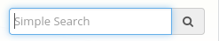
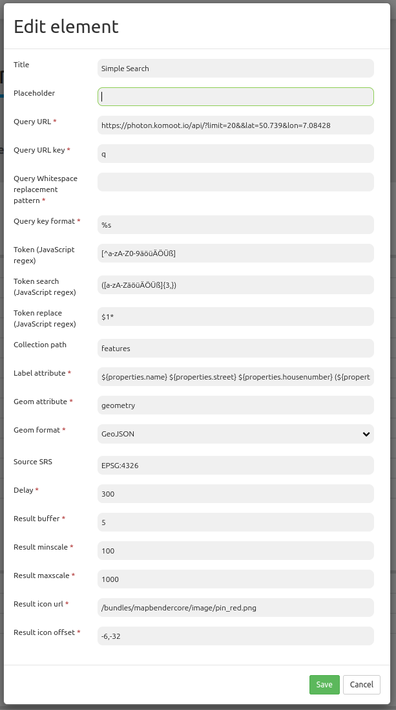

.. _simplesearch:

Simple Search
*************

Simple Search offers a single field search or keyword search. The search query is transmitted 
to a search service. 
The search servers Apache Solr, Nominatim, photon or an OGC API Features service can be used.

An input field is offered which can be integrated directly into any region. Added to content you have to define the position. 
Simple Search sends the entered search term to a configurable URL and receives JSON-formatted data, which contain a label and geometry attributes for each entry.

The geometry data can be encoded in WKT or GeoJSON format.

It is configurable which information from the result json should be shown as result

Configuration
=============

* **Title:** Title of the element. The title will be listed in "Layouts" and allows to distinguish between different buttons. It will be indicated if "Show label" is activated.
* **Position:** Position (only when used in Map area). Options: 'left-top', 'right-top', 'left-bottom', 'right-bottom'
* **Placeholder:** Text to display when the search fiels is empty. If a placeholder is not defined, the content of the title is used instead.
* **Query URL:** Solr URL for the search (e.g. ``http://localhost:8080/solr/core0/select?wt=json&indent=true``) or Nominatim URL.
* **Query URL key:** The query parameter key to append  (e.g. ``q``).
* **Query Whitespace replacement pattern:** Pattern for replacing white spaces.
* **Query key format:** Simple search format  (e.g. ``%s``).
* **Token search/ replace (JavaScript regex):** Tokenizer split/ search/ replace regexp.
  * Token, e.g.: ``[^a-zA-Z0-9äöüÄÖÜß]``
  * Token search, e.g.: ``([a-zA-ZäöüÄÖÜß]{3,})``
  * Token replace, e.g.: ``$1*``  
* **Collection path:** Can be a dotted attribute path to extract from the query result (e.g. ``response.docs``).
* **Label attribute:** Name of the attribute/s to show as result.
* **Geom attribute:** Name of the geometry data attribute (e.g. ``geom``).
* **Geom format:** Geometry data format, can be WKT or GeoJSON (e.g. ``WKT``).
* **Source SRS:** EPSG code of the spatial reference system (e.g. ``EPSG:25832``)
* **Delay:** Autocomplete delay. Use 0 to disable autocomplete (e.g. ``300``).
* **Result buffer:** Buffer result geometry with this (map units) before zooming (e.g. ``10``).
* **Result minscale/maxscale:** Scale restrictions for zooming, ~ for none  (e.g. ``1000`` und ``5000``).
* **Result icon url:** Icon to display as result marker (e.g. ``/bundles/mapbendercore/image/pin_red.png``).
* **Result icon offset:**  Offset x and y for the icon (e.g. ``0,0``).

Flexible configuration via label_attribute
------------------------------------------

The result JSON provides different information. It is possible to define one or several attributes for the result text.

.. code-block:: yaml

   label_attribute: label

The definition is relative to the Collection path. It is possible to use additional text to separate the attributes.

.. code-block:: yaml

   label_attribute:  '${properties.address.city} ${properties.address.road} ${properties.address.house_number}'

.. code-block:: yaml

   label_attribute:  'Town: ${properties.address.city}: ${properties.address.road} - ${properties.address.house_number}'

YAML-Definition
---------------

.. code-block:: yaml

   placeholder: 'please search'                                                       # Text to display when the search fiels is empty. If a placeholder is not defined, the content of the title is used.
   anchor: 'right-bottom'                                                             # Position (only when used in Map area). Options: 'left-top', 'right-top', 'left-bottom', 'right-bottom'
   query_url: http://example.com/solr/core/0/select?wt=json&indent=true&rows=8        # Example Solr URL (e.g. ``http://localhost:8080/solr/core/0/select?wt=json&indent=true``) or Nominatim URL.
   query_key: q                                                                       # The query parameter key to append
   query_ws_replace:                                                                  # Pattern for replacing white spaces.
   query_format: '%s'                                                                 # Simple search format.
   token_regex: [^a-zA-Z0-9äöüÄÖÜß]                                                   # Tokenizer split regexp.
   token_regex_in: ([a-zA-ZäöüÄÖÜß]{3,})                                              # Tokenizer search regexp.
   token_regex_out: '$1*'                                                             # Tokenizer replace regexp.
   collection_path: response.docs                                                     # Can be a dotted attribute path to extract from the query result.                                             
   label_attribute: label                                                             # Name of the attribute to use for entry labeling
   geom_attribute: geom                                                               # Name of the geometry data attribute
   geom_format: WKT                                                                   # geometry data format, can be WKT or GeoJSON
   sourceSrs: 'EPSG:25832'                                                            # Projection of the result data
   delay: 300
   result:                                                                            # Autocomplete delay. Use 0 to disable autocomplete.
     buffer: 50                                                                       # buffer result geometry with this (map units) before zooming
     minscale: 1000                                                                   # scale restrictions for zooming, ~ for none
     maxscale: 5000                                                                   # scale restrictions for zooming, ~ for none
     icon_url: /bundles/mapbendercore/image/pin_red.png                               # icon to display as result marker
     icon_offset: -6,-38                                                              # Offset x and y for the icon
 

Set-up of Solr
==============

* **Download**: https://solr.apache.org/downloads.html
* **Documentation**: https://solr.apache.org/guide
* **Quickstart**: https://solr.apache.org/guide/solr-tutorial.html

Set up of Nominatim
===================

* **Download**: http://nominatim.org/release-docs/latest/admin/Installation/
* **Documentation**: http://nominatim.org/release-docs/latest/

Set up of photon
================
photon is an open source geocoder built for OpenStreetMap data.

* **Download & Documentation**: https://github.com/komoot/photon

Set up of OGC API Features
==========================
Several projects support OGC API Features like QGIS, GeoServer, pygeoapi.

HTTP Callbacks
==============

- /search: Widget proxy which then queries configured URL. In dev-mode the final query URL will be returned as a x-mapbender-simplesearch-url header for easier debugging.
