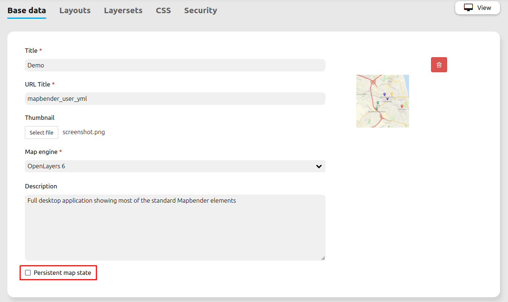

.. _persistant_map_view:

Persistent map view
*******************

This feature makes certain view parameters and certain source settings persistent. This enables an application to be closed and opened up again in the same browser without losing certain information.

Persisted and restored settings encompass:

* view parameters (center, scale, rotation, SRS)
* per-layerset selected or deselected states
* per-source and source layer selected or deselected states
* per-source opacity

.. note:: Persistence is purely based on local browser storage, which means it is private to a user's local browser. It also remains private for multi-user systems. There is no interaction whatsoever with the Mapbender login.

Not-supported map view parameters are:

* Dimension parameter values
* Source additions (via WMS Loader)
* Layer / entire source removals (via Layertree context menu)
* Source / layer reordering operations via Layertree (via drag&drop)
* States of per-layer featureinfo checkboxes

Configuration
=============

Persistent map view is enabled on a per-application basis with a new checkbox under the "Base data" tab.

This change introduces a new column in the *mb_core_application* table and therefore requires *bin/console doctrine:schema:update --force* to be run.

YAML-Definition
---------------

This template can be used to insert the element into a YAML application with a new *persistentView* entry on the top level. Omitting this entry is the same as setting it to false.

.. code-block:: yaml

  parameters:
      applications:
          mapbender_user:
              title: Mapbender Demo Map
              screenshot: screenshot.png
              published: true
              persistentView: true      # parameter to activate Persistent map view
              template:  Mapbender\CoreBundle\Template\Fullscreen

