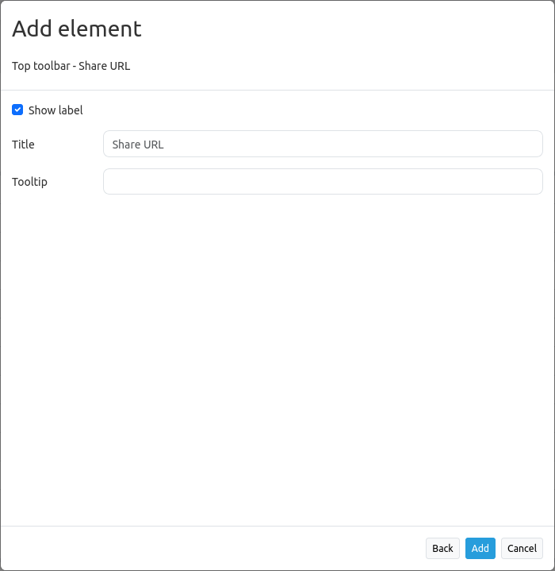

.. _shareurl:

Share URL
*********

URL sharing can be further simplified by integrating a respective element in the toolbar or footer.

.. image:: ../../../figures/share_url.png
     :scale: 80

After clicking on the button, the URL is saved to the clipboard. Default browser interactions (e.g. open in new tab) are also possible.

This element stores the following information:

* basic view parameters (center, scale, rotation, SRS)
* layer and layerset settings changes (selected / deselected layersets, sources and layers, layer opacity settings)

.. note:: The URL does not transfer dynamically added sources (via WmsLoader), dynamically removed layers or sources (via Layertree context menu) or changes to the source or layer order (via Layertree drag&drop)

Configuration
=============

* **Show label:** Enables or disables text (title) next to the button (default: true).
* **Title:** Title of the element. 
* **Tooltip:** Text to use as tooltip.

YAML-Definition
---------------

This template can be used to insert the element into a YAML application.

.. code-block:: yaml

    title: Share this map view          # Optional custom title, uses default title "Share URL" if omitted (string or empty).
    class: Mapbender\CoreBundle\Element\ShareUrl
    tooltip: I am displayed on hover    # Optional custom tooltip, same as title if omitted (string or empty).
    label: true                         # Enables display of title, set as false will only display icon (default: true).

