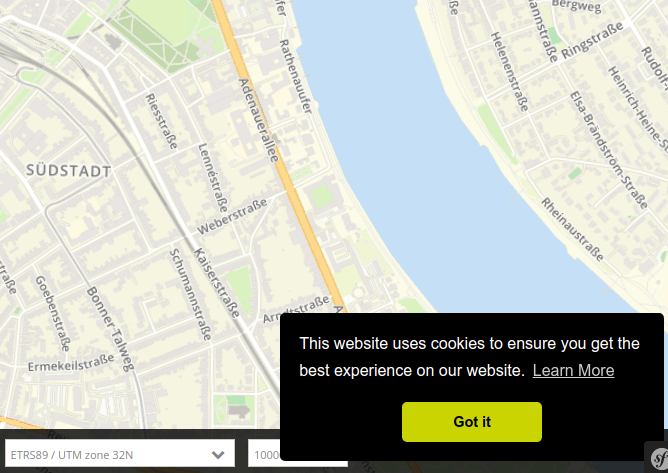

.. _cookieconsent:

Cookie-Banner
=============

(since 3.0.7.0)

Applications support displaying a Cookie-Banner which is customized via the Mapbender configuration files. We use the code from `Cookie Consent <https://cookieconsent.insites.com/>`_ without making an additional call to the internet.

The banner is displayed in any application on the first run.

Das Banner erscheint in einer beliebigen Anwendung.

After this banner is dismissed it doesn't appear again, until you have deleted the cookie in your Webbrowser. Mapbender depends on cookies and stores its PHP-session there.

Configuration
-------------

Configuration takes place in the ``app/config/config.yml`` file and accounts for the whole Mapbender instance. In the sections ``twig`` and ``globals`` an additional entry ``cookieconsent`` is added. If this sections is not available the banner will not be displayed.

.. tip:: After changing these parameters you have to clean the contents of the cache-directory (``app/cache/\*``).

.. code-block:: yaml

   # Twig Configuration
   twig:
       [...]
       globals:
       [...]
        cookieconsent:
            backgroundColor: "#000000"
            backgroundTextColor: "#ffffff"
            buttonColor: "#f1d600"
            buttonTextColor: "#000000"
            message: "This website uses cookies to ensure you get the best experience on our website."
            dismissText: "OK"
            linkText: "Learn more"
            linkUrl: "http://www.myurl.loc/privacy-policy"
            theme: "classic"
            position: "bottom-right"
       [...]

The parameters follow the configuration of the Cookie Consent template.

- **backgroundColor:** Background-Color of the banner in HEX-Code.
- **backgroundTextColor:** Text-Color of the banner in HEX-Code.
- **buttonColor:** Color of the Dismiss (OK) button in HEX-Code.
- **buttonTextColor:** Text-color of this button in HEX-Code.
- **message:** The main text in double quotes.
- **dismissText:** The button-text in double quotes.
- **linkText:** The link-text. Written in double quotes.
- **linkUrl:** The URL of the link, normally referring to the Privacy Terms. Written in double quotes. 
- **theme:** The theme of the banner. Please refer to the Cookie Consent webpage.
- **position:** The position of the banner.  Please refer to the Cookie Consent webpage.
