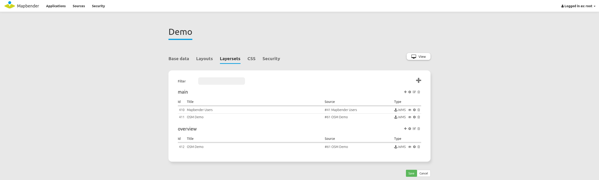
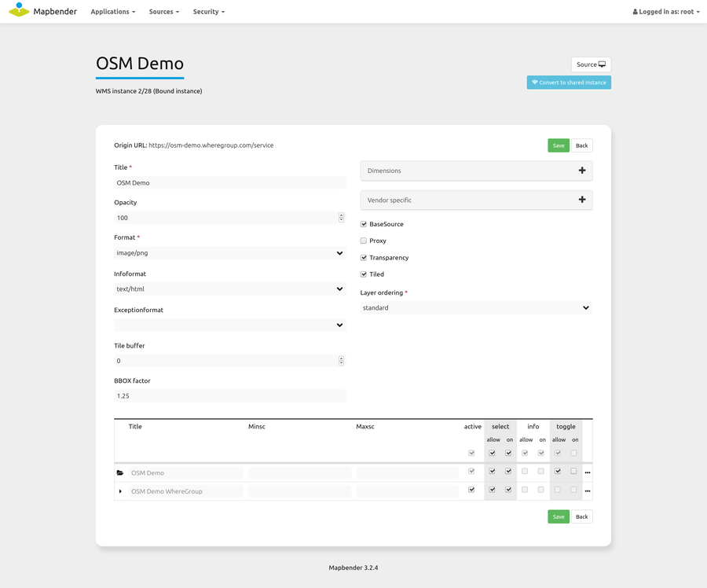
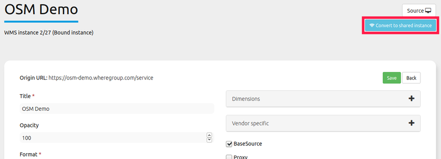
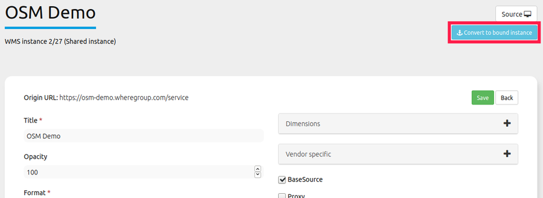
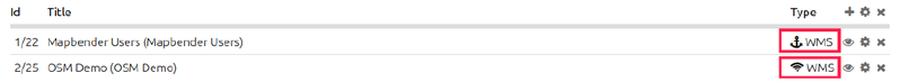
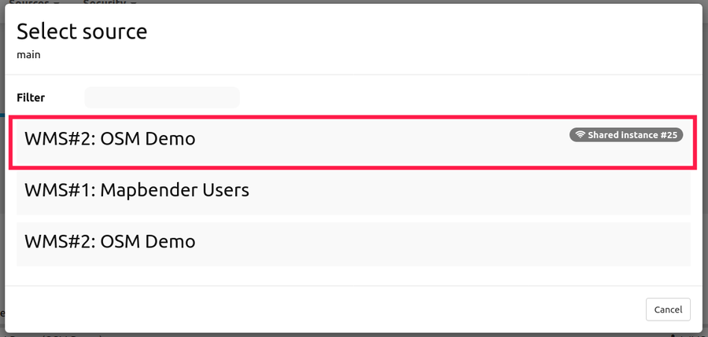
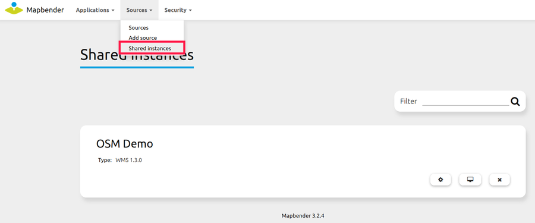
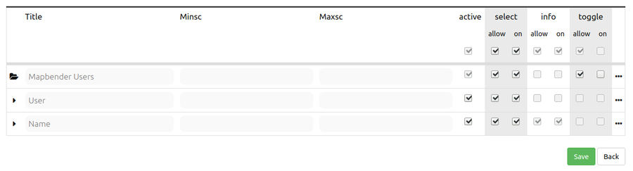
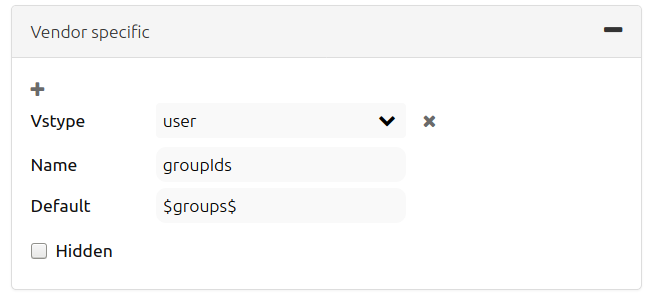

.. _layerset:

Layerset
********

Layersets are logical containers, that can contain one or more layerset-instances (WMS services). A typical example is the differentiation between a layerset "main" for the main map and a layerset "overview" for the overview map. You can define more layersets to show them optionally on the map or to use them in the layertree in their own folders (thematic layers).

Layerset-instances
==================

Layerset-instances contain options to configurate certain WMS parameters: image-format, info-format, exception-format, scales for the different layers etc. Layerset-instances can be configured by clicking on the gear symbol. 

As soon a WMS service is integrated in a layerset, it is linked as a layerset-instance within the application.

The screenshot above shows the `bound instance <layerset.rst#shared-and-bound-instances>`_ ``2/28`` based on a WMS service. The associated data source is number 2, the layerers instance itself has the number 28. It is based on the WhereGroup OSM service and can be configured for the application in this dialog.

**The properties of the WMS-Capabilities:**

- **Title:** Title of the instance that is shown in the layerset list and their instances.

- **Format:** The image format which is used to get the map images for the application via the GetMap request. For raster data and aerial imagery the JPG format is recommended, in case of street maps the PNG format should be preferred. If you are in doubt use PNG.

- **Infoformat:** The format which is used for the GetFeatureInfo requests to the WMS. If you are in doubt use text/html or an analog HTML format that can be used in the dialog of the `FeatureInfo <../basic/feature_info>`_ element. Another possibility is text/plain.

- **Exceptionformat:** The format for error-messages that are returned by the WMS service.

**The properties for the application**

- **Opacity:** Choose the Opacity in percent. This value can be changed by the user in the  `Layertree <../basic/layertree>`_, if it's made available in the corresponding menu.

- **Tile buffer:** This parameter applies to services that are tiled and specifies whether to retrieve more surrounding tiles. With that they are already downloaded and visible during a pan movement. The higher the value, the more surrounding tiles are retrieved. Default: 0.

- **BBOX-Factor:** This parameter applies to services that are not tiled. You can specify how big the returned image should be. A value greater than 1 will request a larger map image. Default: 1.25 and you are free to set it to 1.

- **Vendor Specific Parameters:** See below.

- **Visible:** The service can be set visible with this option.

- **BaseSource:** The service should be treated as a BaseSource. This affects the `BaseSourceSwitcher <../basic/basesourceswitcher>`_, which should only display BaseSources, and the `Layertree <../basic/layertree>`_, where these BaseSources can be hidden. See also the `hints <hints-layersets_>`_ below.

- **Proxy:** If activated, the service will be requested via a proxy in Mapbender. See the `hints <hints-layersets_>`_ below.

- **Transparency:** If this switch is enabled (that is the default), the service is requested with a transparent background. So in the WMS GetMap request with the parameter ``TRANSPARENT=TRUE``.

- **Tiled:** The service is requested in tiles. The standard is not tiled. See the following `hints <hints-layersets_>`_.

**Layer-Order:**

There are two ways to pass a layer order to the layer tree:

- **Standard**
- **QGIS Style**

This distinction has its origins in the way WMS services and capabilities documents are built.

The `OGC reference-implementierung of a WMS <http://www.opengeospatial.org/standards/wms/quickstart>`_ describes the structure of an example WMS at: `http://metaspatial.net/cgi-bin/ogc-wms.xml?REQUEST=GetCapabilities&SERVICE=WMS&VERSION=1.3 <http://metaspatial.net/cgi-bin/ogc-wms.xml?REQUEST=GetCapabilities&SERVICE=WMS&VERSION=1.3>`_

This WMS displays some point, line and polygon objects and raster images. The Capabilities document lists images (e.g. DTM) more at the top of the document than points (e.g. osm_points as the penultimate layer). Mapbender takes this approach both in the DataSources, where the service is loaded and registered in Mapbender, as well as in the Layerset instances.

In the layer tree, however, this order revolves. That is because, from our experience, users are accustomed to find layers that are higher up in the layer-tree also displayed as top layers. This configuration is also commonly found in a desktop GIS. Furthermore, points are displayed in the layer-tree above raster data.

The `QGIS Server <https://www.qgis.org/>` _ behaves differently here. A WMS can be easily deployed to a QGIS server using the QGIS project file. Order of the layers in the WMS Capabilities is then the same as the order used in your own QGIS project. So in general: points above, further below the lines, then finally the polygon data or raster images. QGIS and QGIS servers are not the only programs that can do this. But they are the best. However, this information is irrelevant for the GetMap call, because the order of the requests and how they are delivered to the server and back is solved in the WMS specification.

The following table summarizes the behavior again:

+----------------------------------------+----------------------+------------------------+
|                                        | layer order standard | layer order QGIS style |
+========================================+======================+========================+
| WMS Capabilities (from top to bottom)  | polygon, line, point | point, line, polygon   |
+----------------------------------------+----------------------+------------------------+
| Layerset-Instance (from top to bottom) | polygon, line, point | point, line, polygon   |
+----------------------------------------+----------------------+------------------------+
| Layertree  (from top to bottom)        | point, line, polygon | point, line, polygon   |
+----------------------------------------+----------------------+------------------------+

This allows Mapbender to respond in the different ways that a WMS Capabilities document can be built up by simply adjusting the order in the layer tree.

Shared and bound instances
--------------------------

By default, all layerset-instances are created as bound instances. Bound instances must be configured individually for each application. Shared instances allow the use of a configured layerset-instance across multiple applications. Therefore, if multiple applications share the same configuration of a layerset-instance, the use of a shared instance saves the time of manually configuring the layerset-instance for each application. Changes made to a shared instance take effect in all applications using said instance. 

A bound instance can be transformed into a shared instance by clicking on the blue button labeled "Convert to shared instance". To transform a shared instance back into a bound instance the same button, now labeled "Convert to private instance", can be used.

Shared instances are marked with a Wi-Fi symbol in the "type" column of the layerset overview.

Bound instances are marked with an anchor symbol in the "type" column of the layerset overview.

Shared instances will appear as sepatrate data sources. To incorporate a shared instance into an application simply add a data source to the application and select the shared instance from the list.    

All shared instances can be viewed under **Sources -> Shared instances**

.. _layer_configuration:

Layer Configuration
===================

The layer table offers several checkboxes and two scale visibility fields that adjust the functionality of your Service Instance. Please note that the checkbox on top changes all the layer instances for the respective configuration at once.

* Title: Layer title from Service information shown in Mapbender, adjustable.
* Active (on/off): Enables/disables a layer for the individual application layer. If not set, all other checkboxes of the same layer will be ignored.
* Select on: Selectable in geodata explorer.
* Select allow: Layer is active when the application starts.
* Info on: Layer provides feature info requests, info default activates the feature info functionality.
* Info allow: layer info is active when the application starts.
* Minscale / maxscale: the scale range in which the layer should be displayed, 0 or no entry = no scale limitation.
* Toggle: Opens the folder on start of the application.
* Reorder: Allows to reorder the layers with drag & drop while using the application.

* ... -> Opens a dialog with more information:
* Layer's name: Layer name of the service information (for getMap-Requests, not adjustable).
* Style: If a WMS provides more than one style, you can choose a different style than the default style.

.. _hints-layersets:

Notes on the effects of each configuration
===========================================

Basesources
-----------

There are many ways to fill the Layertree and work with basic services:
- e.g. by hiding them in the layer tree and using the `BaseSourceSwitcher <../basic/basesourceswitcher>`_.
- or by work with the possibilities of the `thematic layer tree <../basic/layerertree>`_, to create different layersets and distribute the basic services and thematic services in them to place them in the layer tree.

Which option you choose depends entirely on your preferences.

Proxy
-----

What is this switch for? The use of a proxy makes sense, if you want to avoid that the web browser accesses the service as a client directly, which is the default for OpenLayers-based applications. If this switch is activated, Mapbender accesses the services from its own URL, processes the images and displays them on the map. With that it is easy to provide a network-protected service secured by firewalls that can only be accessed by the web server on which Mapbender is running.

Tiling, map-size and performance
--------------------------------

The "Tiled" parameter is used to request the map image in individual tiles rather than as a whole image. This should be turned on in general, if you use `Mapproxy <https://mapproxy.de/>`_ to provide a tiled service. But it also makes sense for normal, un-tiled services, since the perceived waiting time for the user gets lower: The map image appears, although not all tiles have been retrieved yet.

But you have to keep in mind: The number of requests to a WMS increases rapidly: Depending on the screen resolution and the set tile size in the `Map element <../basic/map>`_ many requests are sent to the server. Although the returned images are not very large (usually you set tile sizes of 256x256 or 512x512 pixels), they are large in numbers. This is also valid in regard to the **tile buffer**. So it is a trade-off and a case-by-case distinction how to address the service. The performance can also be increased by setting the scales of a layer in the layerset-instance.

There are also some WMS services that only support a maximum image size that cannot be used with the high resolutions request that Mapbender can call. The Fullscreen template can be sized to the maximum screen width and the requested map image is then approximately the width and height of the visible browser window.

Vendor Specific Parameter
-------------------------

In a layererset instance, vendor specific parameters are appended to the WMS request. The implementation follows the specifications of the multi-dimensional data in the WMS specification. In Mapbender, the vendor specific parameters can be used to append user and group information of the logged-in user to the WMS request. Fixed values ​​can also be transmitted. The following example shows the definition of a parameter "group", which passes on the group of the user currently logged into Mapbender.

* Name: Parameter name in WMS request.
* Default: Default value.
* Vstype: Mapbender specific variables: group, user (users), simple.
* Hidden: If this value is set, the requests are sent on the server so that the parameters are not directly visible.

The item is useful for passing the service on only to specific users and groups. This happens e.g. for users via the ``$id$`` and for groups via the parameter ``$groups$``.

Further information
-------------------

* You can find information about using layersets in the `Quickstart <../../quickstart#configure-sources>`_.

* Further tips on manipulating WMS can be found in the `FAQs <../../faq#performance>`_.

* The relevance of layersets for the display in the layertree is described in the Thematic Layers section of the `layertree documentation <../basic/layertree>`_

* Likewise layersets can be switched on or off in the `Map element <../basic/map>`_.
