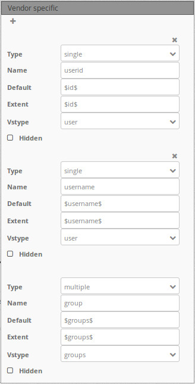
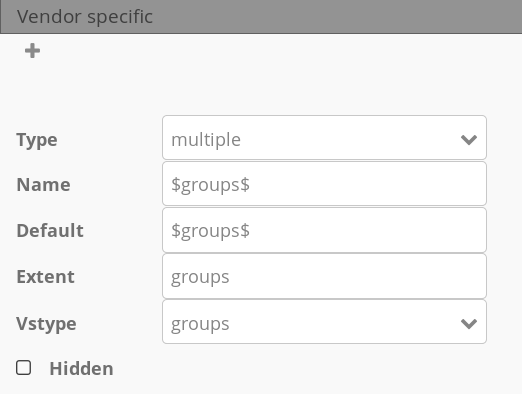

.. _layerset:

Layerset
========

Layersets are logical containers, that can contain one or more layerset-instances (WMS services). A typical example is the differentiation between a layerset "main" for the main map and a layerset "overview" for the overview map. You can define more layersets to show them optionally on the map or to use them in the layertree in their own folders (thematic layers).

.. image:: ../../../figures/mapbender3_service_edit.png
           :scale: 80

Layerset-instances
------------------

Layerset-instances contain the options how a WMS is called: image-format, info-format, exception-format, scales for the different layers and many more.

.. image:: ../../../figures/mapbender3_wms_application_settings.png
           :scale: 80

As soon a WMS service is integrated in a layerset, it is linked as a layerset-instance with the application.

The screenshot above shows the instance ``7/24`` based on a WMS service. The associated data source is number 7, the layerers instance itself has the number 24. It is based on the WhereGroup OSM service and can be configured for the application in this dialog.

**The properties of the WMS-Capabilities:**

- **Title:** Title of the instance that is shown on the list of layersets and their instances.

- **Format:** The image-format which is used to get the map-images for the application via the GetMap request. For raster-data and aerial imagery the JPG format is recommended, in case of street-maps the PNG format should be preferred. If you are in doubt: PNG.

- **Infoformat:** The format which is used for the GetFeatureInfo requests to the WMS. In doubt: text/html or an analog HTML-format which can be used in the Dialog of the `FeatureInfo <../basic/feature_info>`_ element.

- **Exceptionformat:** The format for error-messages that are returned by the WMS service.

**The properties for the application**

- **Opacity:** Choose the Opacity in percent. This value can be changed by the user in the  `Layertree <../basic/layertree>`_ , if it's made available in the corresponding menu.

- **Tile buffer:** This parameter applies to services that are tiled and specifies whether to retrieve more surrounding tiles. With that they are already downloaded and visible during a pan movement. The higher the value, the more surrounding tiles are retrieved. Default: 0.

- **BBOX-Factor:** This parameter applies to services that are not tiled. You can specify how big the returned image should be. A value greater than 1 will request a larger map image. Default: 1.25 and you are free to set it to 1.

- **Visible:** The service can be set visible with this option.

- **BaseSource:** The service should be treated as BaseSource. This affects the `BaseSourceSwitcher <../basic/basesourceswitcher>`_, which should only display BaseSources, and the `Layertree <../basic/layerertree>`_, where these BaseSources can be hidden. See also the `hints <hints-layersets_>`_ below.

- **Proxy:** If activated, the service will be requested via a proxy in Mapbender. See the `hints <hints-layersets_>`_ below.

- **Transparency:** If this switch is enabled (that is the default), the service is requested with a transparent background. So in the WMS GetMap request with the parameter ``TRANSPARENT=TRUE``.

- **Tiled:** The service is requested in tiles. The standard is not tiled. See the following `hints <hints-layersets_>`_.

**Layer-Reihenfolge:**

There are two ways to pass the layer order to the layer tree:

- **Standard**
- **QGIS Style**

This distinction has its origins in the way WMS services and capabilities documents are built.

The `OGC reference-implementierung of a WMS <http://www.opengeospatial.org/standards/wms/quickstart>`_ describes the structure of an example WMS at: `http://metaspatial.net/cgi-bin/ogc-wms.xml?REQUEST=GetCapabilities&SERVICE=WMS&VERSION=1.3 <http://metaspatial.net/cgi-bin/ogc-wms.xml?REQUEST=GetCapabilities&SERVICE=WMS&VERSION=1.3>`_

This WMS displays some point, line and polygon objects and raster images. The Capabilities document lists the image data (e.g., DTM) more at the top of the document than the points (e.g., osm_points as the penultimate layer). Mapbender takes this approach both in the DataSources, where the service is loaded and registered in Mapbender, as well as in the Layerset instances.

In the layer tree, however, the order revolves, because from our experience the user is used to the fact that the layer that is listed higher up in the layer-tree is also drawn as the top layer. A user also has this experience when using a desktop GIS. Points are then in the layer tree above raster data, which is usually placed below.

The `QGIS Server <https://www.qgis.org/>` _ behaves differently here. A WMS can be easily deployed to a QGIS server using the QGIS project file, and the order of the layers in the WMS Capabilities is then the same as the order used in your own QGIS project. So in general: points above, further below the lines, then finally the polygon data or raster images. QGIS and QGIS servers are not the only programs that do that, but the best of these. This whole thing is again irrelevant for the GetMap call, because the order of the requests and how they are delivered to the server and back is solved in the WMS specification.

The following table summarizes the behavior again:

+----------------------------------------+----------------------+------------------------+
|                                        | layer order standard | layer order QGIS style |
+========================================+======================+========================+
| WMS Capabilities (from top to bottom)  | polygon, line, point | point, line, polygon   |
+----------------------------------------+----------------------+------------------------+
| Layerset-Instance (from top to bottom) | polygon, line, point | point, line, polygon   |
+----------------------------------------+----------------------+------------------------+
| Layertree  (from top to bottom)        | point, line, polygon | point, line, polygon   |
+----------------------------------------+----------------------+------------------------+

This allows Mapbender to respond in the different ways that a WMS Capabilities document can be built up by simply adjusting the order in the layer tree.

<<<<<<< 1df435f06bc85e6b0187013d40995fd462ffc25f
**Vendor Specific Parameter:**

You can define Vendor Specific Parameters in a layerset instance to add them to a WMS request. This principle follows Multi-Dimensions in the WMS specification.

You can use Vendor Specific Parameters in Mapbender for example to add the user- and group information of the logged-in user to a WMS request. You can also add hard coded values.

The following example shows the definition of the parameter "group" which transfers the group-value of the logged-in user.

The following example shows the currently available configurations for the Vstypes "user" und "groups":

* Type: „single“, „multiple“, „interval“ (multiple values in dimensions)
* Name: parameter name of the WMS request.
* Default: the default value.
* Extent: available values (multiple as a comma seperated list).
* Vstype: Mapbender specific variables. Group (groups), User (users), Simple.
* Hidden: If this value is set, requests are send via a server so that the parameters are not directly visible.

Currently, the element can be used to transfer user- and groupinformation. For users $id$ and $username$ may be applied, for groups the value $groups$.
=======
Vendor Specific
---------------

You can define Vendor Specific Parameters in a layerset instance to add them to a WMS request. The indications of such additional parameters are necessary in order to obtain multi-dimensional data, e.g. to support the indication of a temporal dimension. More details on the supported formats can be found in the WMS specification in Annex C.

It should be noted that the Mapbender only supports the passing of the parameters to the request, the query of this information with a module is not possible. 

In Mapbender, the Vendor Specific information can be used to attach user and group information of the user to the WMS request. An extension of the temporal dimension via WMS-T is currently only possible via an experimental module, but is also defined in this module via the vendor specific information. The element supports the following time formats: single time, list of times, or time interval. In addition to the transfer of these dynamic values, fixed values ​​can also be conveyed.

**Supported Parameters ?** 

* angle (e.g. 45, for 45° rotation to the right) 
* buffer (e.g. 5, for 5 addditional pixel at the border of the getmap and getfeature info request) 
* sortBy (sort the features or elements)
* filter und featureid (filter by an attribut or id)
* format_options (e.g.  dpi for the definition of the resolution)

** Example configuration**

The following table shows three example configurations for the vendor specifics:

* Passing user ID of the user via $id$. Use case: Username should be stored with each request and transferred to a database.
* Passing the group ID of the logged in user via $groups$. Use case: Users in a specific group are only allowed to see the predefined map section assigned to the group, so the group ID is passed to the MapProxy and its authentication system.
* Filter and transfer of the temporal dimension. Use case: In the WMS statistical data of every month in the year can be added for the comparison in the map, therefore, the requested month and the year must always be handed over.

+------------+----------------------+------------------------+------------------------+
| Parameter  | 1) User transfer     | 2) Group transfer      | 3) Time Dimension      |
+============+======================+========================+========================+
| URL-Request| &user_id=1234&       | &group_ids=1,4&        | &time=1,4&             |
+------------+----------------------+------------------------+------------------------+
| type       | single               | multiple               | nearest                |
+------------+----------------------+------------------------+------------------------+
| name       | user_id              | $groups$               | time                   |
+------------+----------------------+------------------------+------------------------+
| default    | $id$                 | $groups$               | 2018-02                |
+------------+----------------------+------------------------+------------------------+
| extent     | $id$                 | groups                 | 2017-01/2018-07/P1M    |
+------------+----------------------+------------------------+------------------------+
| vstype     | user                 | groups                 |                        |
+------------+----------------------+------------------------+------------------------+
| time       | k.A.                 | k.A.                   | activate Checkbox      |
+------------+----------------------+------------------------+------------------------+
| units      | k.A.                 | k.A.                   | ISO8601                |
+------------+----------------------+------------------------+------------------------+
|unit symbol | k.A.                 | k.A.                   |                        |
+------------+----------------------+------------------------+------------------------+

WMS-Time (Dimensions Handler)
-----------------------------

The dimension handler can be used to integrate WMS services with a time dimension. WMS-Time services are registered as a normal WMS data source. If a dimension is specified in the service, it is displayed in the layer metadata.

.. code-block::

    Dimension:
 		name:'time', units:'ISO8601', unitSymbol:'', default:'2018-01', multipleValues:'', nearestValue:'1', current:'', extent:'2014-01/2018-01/P1M'

.. image:: ../../../figures/wmst_source.png
     :scale: 80

WMS-T are inserted almost exactly like traditional WMS in the layersets, but the time parameter still has to be activated. If this is not activated, the dimensions of the service are ignored and the standard value is used when calling the layer in the map content.

If the service supports a time dimension, the instance displays the "Dimensions" button. By clicking on this button, the supported time parameters are displayed and the time can be activated by clicking the checkbox.
After another click on the button, the detailed form opens, in which the usage can be further defined. Here you can further restrict the values ​​from the WMS service. To set up the service, the following definitions of time parameters are necessary:

* **Query type**: multiple, nearest oder current
* **Name**: value TIME (name=time)
* **Units**: format for temporal dimensions (ISO 8601:2000)
* **Unit symbol**:
* **Default**: default time
* **Extent (extent slider)**: Supported extent for the time dimension 

.. image:: ../../../figures/wmst_layer.png
     :scale: 80

The element supports the following time variables:

* single time parameter
* list of times
* time interval

There are two ways to control the time in the map. On the one hand, each service with an active time parameter can be controlled via the context menu of the layer in the layertree. In addition, a central slider can be integrated, which can be displayed in any area of ​​the application. The slider can be used to combine several layers with the same extent to control them centrally.

**Supported Parameters**

* Checkbox time: active
* Type: selection between "multiple", "nearest" or "current"
* Name: parameter-name in WMS request
* Units: ??
* Unit symbol: ??
* Default: default value.
* Extent: available value range, the time axis  for the dimension slider

** integration in context menue**

The timeslider can be integrated via the layertree as an option in the context menu of the layer. To do this, the "Dimension" option must be activated in the layertree element.

.. image:: ../../../figures/wmst_layertree.png
     :scale: 80

Nach der Aktivierung in dem Ebenenbaum erscheint ein Zeitslider in dem Kontextmenü. Für die Nutzung der zeitlichen Anzeige muss das Element über die Checkbox aktviert werden. Danch kann über die Maus die Zeitachse verschoben werden. 

After activation in the layertree, a time slider appears in the context menu. To use the time, the element must be activated via the checkbox. Then you can move the timeslider via the mouse.

.. image:: ../../../figures/wmst_context_menu.png
     :scale: 80

** integration in slider element**

The layers can be controlled by the dimensions handler element via a central slider. This element can be integrated into the sidepane, toolbar and footer.
The configuration of the dimension handler is done in three steps:

* **Creating the element**: First the element needs to be created and saved. Afterwards the element closes (see configuration).
* **Creating a dimensionsset**: To define a dimensionsset, you need to create a new set in the element via the "+" button. After entering a title, the item must be saved. Then the element closes.
* **Definition the slider**: Then you can select the layer instances for the "group" in the element, that you want to control via the slider. Multiselect is supported, but only instances that have the same extent can be combined with each other.
When an instance is selected, all instances that do not conform to this default are no longer selectable. In addition, after the first selection of an instance, a slider appears. There you can restrict the extent for the time display.

.. image:: ../../../figures/wmst_element.png
     :scale: 80
>>>>>>> documentaiton for wmst features and the vendor specific parameter for ticket 807

.. _hints-layersets:

Hinweise zu den Auswirkungen der einzelnen Konfigurationen
----------------------------------------------------------

**Basesources:**

There are many ways to fill the Layertree and work with basic services:
- e.g. by hiding them in the layer tree and using the `BaseSourceSwitcher <../basic/basesourceswitcher>`_.
- Or to work with the possibilities of the `thematic layer tree <../basic/layerertree>`_, to create different layersets and distribute the basic services and thematic services in them to place them in the layer tree.

Which option you choose depends entirely on your preferences.

**Proxy:**

What is this switch for? The use of the proxy makes sense, if you want to avoid that the web browser accesses the service as a client directly, which is the default for OpenLayers based applications. If this switch is activated, Mapbender accesses the service from its own URL, processes the images and displays them on the map. With that it is easy to provide a network-protected service secured by firewalls that can only be accessed by the web server on which Mapbender is running.

**Tiling, map-size and performance:**

The "Tiled" parameter is used to request the map image in individual tiles rather than as a whole image. This should be turned on in general, if you use `Mapproxy <https://mapproxy.de/>`_ to provide a tiled service. But it also makes sense for normal, un-tiled services, since the perceived waiting time for the user gets lower: The map image appears, although not all tiles have been retrieved yet.

But you have to keep in mind: The number of requests to a WMS increases rapidly: Depending on the screen resolution and the set tile size in the `Map element <../basic/map>`_ many requests are sent to the server. Although the returned images are not very large (usually you set tile sizes of 256x256 or 512x512 pixels), but large in numbers. This is also valid in regard to the **tile buffer**. So it's a trade-off and a case-by-case distinction how to address the service. The performance can also be increased by setting the scales of a layer in the layerset-instance.

There exist also some WMS services that support only a maximum image size that cannot be used with the high resolutions request Mapbender can call. The Fullscreen template can be sized to the maximum screen width and the requested map image is then approximately the width and height of the visible browser window.

Further information
-------------------

* You can find information about using layersets in the `Quickstart <../../quickstart#configure-your-wms>`_.

* The relevance of layersets for the display in the layertree is described in the Thematic Layers section of the `layertree documentation <../basic/layertree>`_

* Likewise layersets can be switched on or off in the `Map element <../basic/map>`_.
