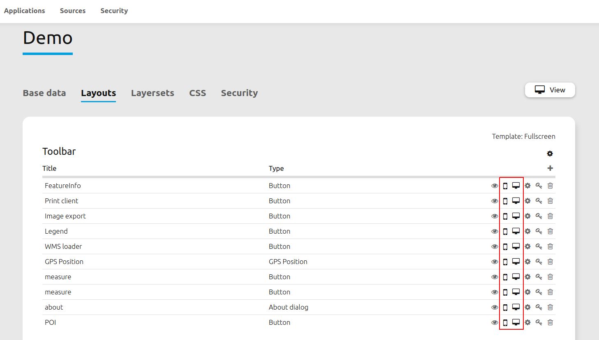
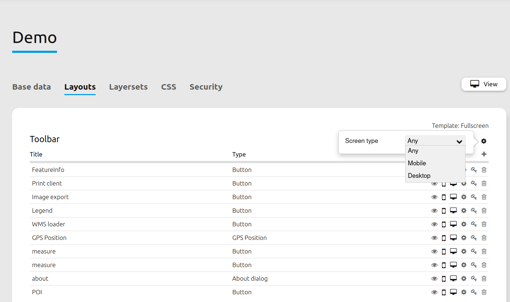
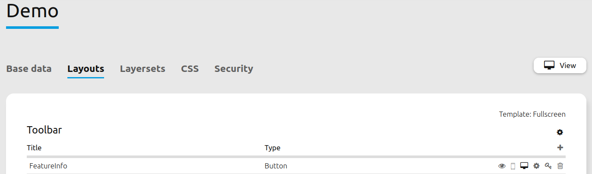
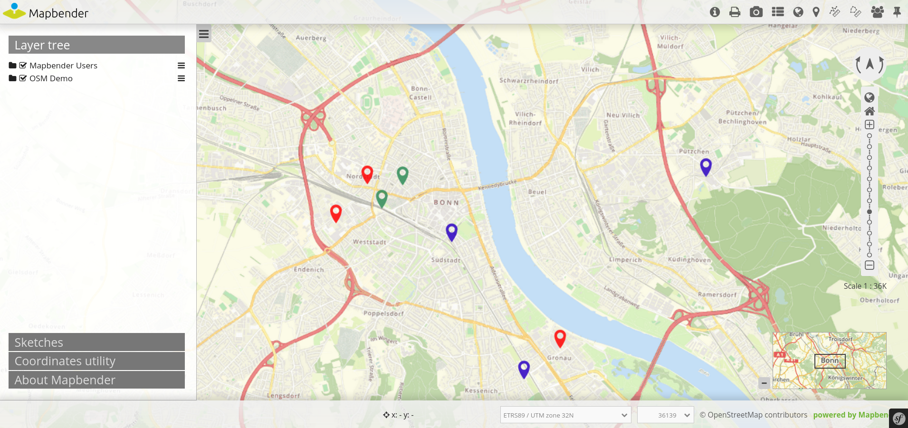
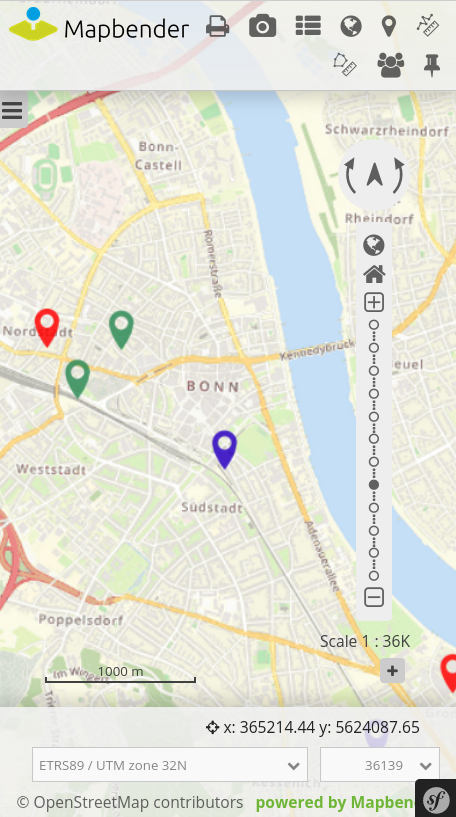

.. _responsive:

Responsives Design
******************

Mapbender offers a responsive design for greater usability. Every element in toolbar and sidepane can be individually configurated to appear during desktop, mobile or both view(s).

Note: This feature is only available in Open Layers 6.

Is is also possible to define templates for whole layout sections. This way, all associated elements will be automatically invisible when entering the respective view mode.

Example:
========

In the following example, the FeatureInfo element is removed from the mobile view.

The desktop view still displays the element in the toolbar.
     

The element is not visible anymore during mobile view.

