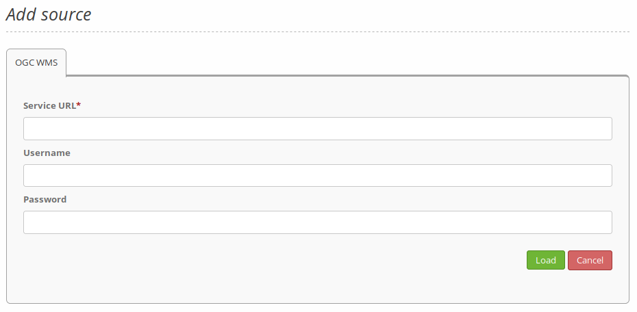

.. _source:

Source
======

With the data sources, you can register OGC WMS in version 1.1.1 and 1.3.0 into Mapbender. 

Further information about the registration process of services and their usage in Mapbender applications is available in the `Quickstart document <../../quickstart.html#loading-web-map-services>`_.

Load sources
------------

.. tip:: You should check your capabilties document in your browser before uploading the service.

#. To upload a source, click on ``Add source``:

* **Type**: Mandatory service type selection (OGC WMS or OGC WMTS / TMS).

* **Service URL**: URL to the Capabilities document of the WMS service (e.g.: ``http://osm-demo.wheregroup.com/service?SERVICE=WMS&Version=1.3.0&REQUEST=GetCapabilities``)

* **Username / Password**: Input of the username and the password for secured services.

#. Click on ``Load`` to upload the service in the repository.

After a successful upload, Mapbender will provide an overview of the WMS information.

  .. image:: ../figures/mapbender_add_source.png
     :scale: 80

In general, OGC WMS Capabilities refer to ``xsi:schemaLocation="http://www.opengis.net/wms http://schemas.opengis.net/wms/1.3.0/capabilities_1_3_0.xsd``. The supported namespaces in that schema are:

  * http://www.w3.org/1999/xlink,
  * http://www.opengis.net/wms,
  * http://www.w3.org/2001/XMLSchema

Sources Overview
----------------

The Sources and Shared instances sections list and provide additional information about the services registered in Mapbender:

* **Filter**: Search for services names, URLs, types and descriptions.
* **Show metadata**: Shows metadata about a specific service. Opens a new field that lists specific metadata, Mapbender applications that use the source, contact information, details (e.g. WMS version) and layers.
* **Update source**: Click the button to show a new field that allows a refresh of the service and its metadata.
* **Delete source**: Removes the registered service from Mapbender.

Sources menu button
-------------------

In the metadata dialog of a specific service, it is also possible to interact with a hamburger button menu (top right) that allows:

* **Update source**: Click the button to show a new field that allows a refresh of the service and its metadata.
* **Create shared instance**: Creates a new shared instance from the specific service. The instance is listed in the Shared instances tab. 
* **Delete**: Removes the registered service from Mapbender.