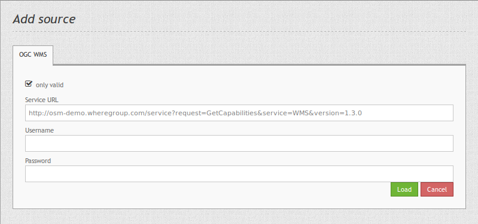

.. _source:

Source
======

With the data sources, you can register OGC WMS in version 1.1.1 and 1.3.0 into Mapbender. 

Further information about the registration process of services and their usage in Mapbender is available in the `Quickstart document <../../quickstart.html#loading-web-map-services>`_.

* **Service URL**: URL to the Capabilities document of the WMS service (z.B.: ``http://osm-demo.wheregroup.com/service?SERVICE=WMS&Version=1.3.0&REQUEST=GetCapabilities``)

* **Username / Password**: Input of the username and the password for secured services.

  Gernerally, OGC WMS Capabilities refer to ``xsi:schemaLocation="http://www.opengis.net/wms http://schemas.opengis.net/wms/1.3.0/capabilities_1_3_0.xsd``. The supported namespaces in that schema are:
  
  * http://www.w3.org/1999/xlink,
  * http://www.opengis.net/wms,
  * http://www.w3.org/2001/XMLSchema
