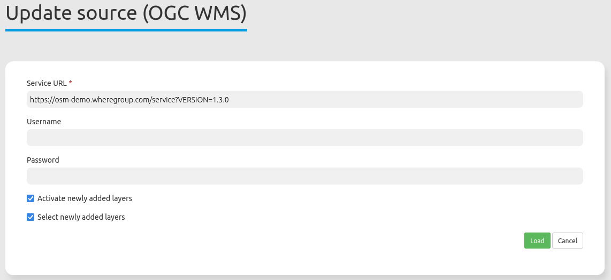

.. _sources:

  .. |mapbender-button-update| image:: ../../../figures/mapbender_button_update.png

Sources
=======

With the sources backend tab, you can register OGC WMS or OGC WMTS / TMS sources in version 1.1.1 and 1.3.0 into your Mapbender applications. Further information about the registration process of services and their usage in Mapbender is available in the `Quickstart document <../../quickstart.html#loading-web-map-services>`_.

* **Type**: Predefined service type selection (OGC WMS or OGC WMTS / TMS).

* **Service URL**: URL to the Capabilities document of the WMS service (e.g.: ``http://osm-demo.wheregroup.com/service?SERVICE=WMS&Version=1.3.0&REQUEST=GetCapabilities``)

* **Username / Password**: Input of the username and the password for secured services.

Updating sources
----------------
To update a source in the backend, you first need to navigate to the ``Sources`` backend list.
On this page, look for the layer you wish to update via scrolling or use the search box.
After you've found it, click on its |mapbender-button-update| ``Refresh`` button.
You can then update the WMS: If you wish, modify the URL or other settings, such as user name and/or password.

.. hint:: Of course, it is possible to update a source without changing any parameters.

Moreover, there are two checkboxes handling layer updates:

* **Activate newly added layers**: If active, the newly added layers will automatically set active in embedded applications. If the checkbox is not checked, new layers will not appear in the layertree.
* **Select newly added layers**: If active, the newly added layers will automatically be visible and set active in embedded applications. However, ``Activate newly added layers`` must also be set for this. If ``Select newly added layers`` is not set, the layer will appear in the layertree but will not be activated.

If you want to save the changes, click the ``Load`` button to refresh the WMS. This will re-read the getCapabilities document. The updated version will be displayed in the configuration settings, with changes applied in applications using the service.