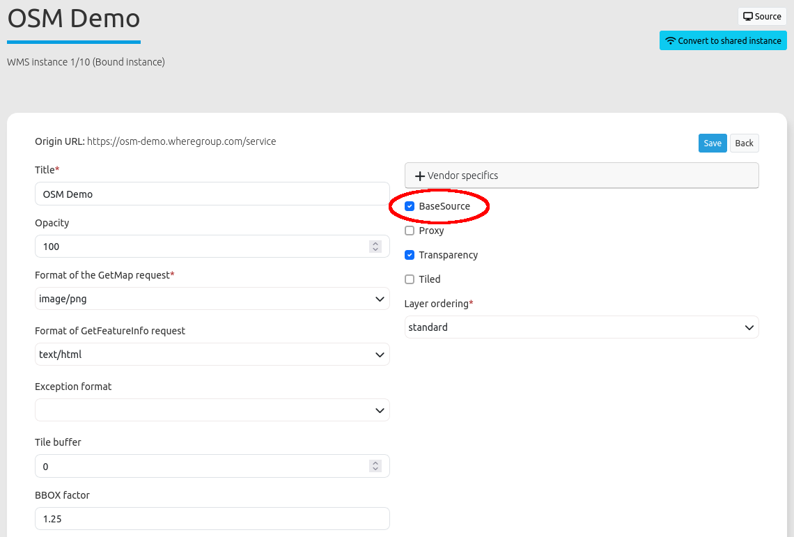
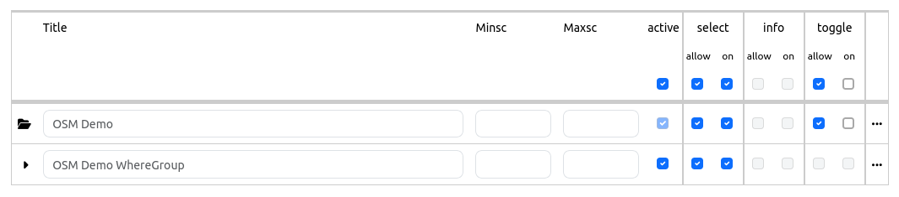
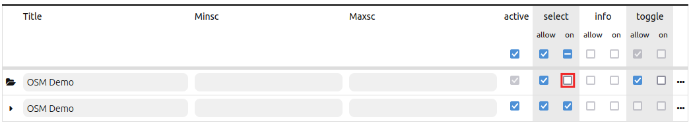
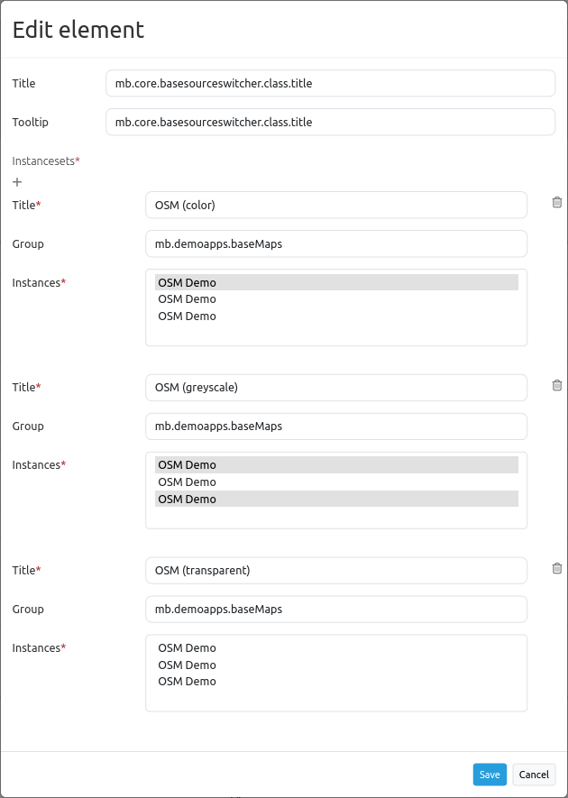
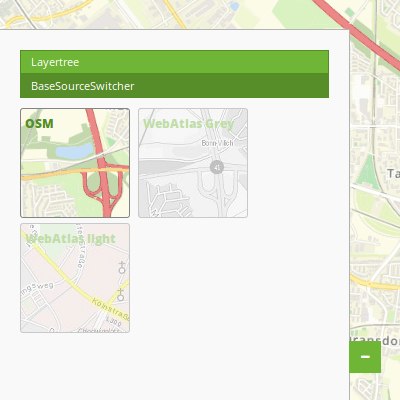

.. _basesourceswitcher:

BaseSourceSwitcher
******************

With this element you can switch between different predefined layers (BaseSources), e. g. background maps. You can define the layer as a BaseSource in the tab "Layersets" in the application. You have to edit the layer and set a checkmark at "BaseSource":

BaseSourceSwitcher is a button group to change the map's background sources. The BaseSourceSwitcher allows you to switch between the predefined source sets. For every sourceset a button will be displayed in the client. Only one source set can be active at the same time.

You have the possibility to define groups. All sourcesets of the same group will be listed in a dropdown list with the group name as title.

.. image:: ../../../figures/basesourceswitcher.png
     :scale: 80

Configuration
=============

Preparation: In order to be able to configura the BaseSourceSwitcher you have to define Service
 instances as Basesource (checkbox Basesource checked).
Please not that on start of an application all sourcesets with an activated root layer are active.

Configuration with selected root-layer - sourceset is active on start:

Configuration with selected root-Layer - sourceset is not active on start:

The configuration occurs in 2 steps:

#. Create a BaseSourceSwitcher Element with Title, Tooltip and Target
#. Add Sourceset(s) with one or more sources and definition of a group (optional)

* **Title:** Title of the element.
* **Tooltip:** The text entered as a tooltip will be indicated by hovering over the element with the mouse cursor a longer time.
* **Target:** Id of Map element, activated after the click.
* **Instancesets:** List of Sourcesets, defined by a title and group: (optional) group name to group of sourcesets by "group name"

In the configuration example you can see that either one, none or several entries per instanceset can be selected. You can create groups, which are then grouped together in the drop-down list.

* **Title**: Title of the BaseSource
* **Group**: Optional group name possibility to group sourcesets by "group name"
* **Instances**: Sources for the BaseSource

Integration into the sidepane
------------------------------
The BaseSourceSwitcher can be integrated in the sidepane with a preview of the background map.

The styling of the application is adapted via CSS. As a preparation you have to create screenshots of the background maps with the size 110x110px and place them in the web-folder (the screenshots have to be accessible from the outside).
After that, you have to include the BaseSourceSwitcher in the sidepane, as explained in "Configuration". **The inclusion with the preview of the background map only works in the sidepane, not in the toolbar! Additionally you have to remove all groups, if you have previously used them.**

Then you have to insert the CSS-defintion in your application under the "CSS" tab. To adapt the CSS-definition to your application you need to change the numbers of the data-sourcesets and the image paths for each service.
The numbers for the data-sourcesets can be found in the "Layerset" tab under ID (you only have to define the InstanceID).

CSS-Definition:
---------------

.. code-block:: css

     .mb-element-basesourceswitcher li[data-state='active'] {
          position: static;
          background-color: #578e2a;
          color: #578e2a;
          font-size: 12px;
          font-weight: 800;
          padding: 4px;
          border-right-width: 1px;
          margin-bottom: 5px;
          margin-right: 5px; }

     .mb-element-basesourceswitcher li[data-state=''] {
          background-color: #ffffff;
          color: #6fb536;
          font-weight: 800;
          font-size: 12px;
          padding: 4px;
          margin-bottom: 5px;
          margin-right: 5px;
          opacity: 0.4; }

     .mb-element-basesourceswitcher li:hover {
          border-color: #6fb536;
          background-color: #6fb536;
          color: #6fb536;
          padding: 4px;
          margin-bottom: 5px;
          margin-right: 5px;
          opacity: 1; }

     .mb-element-basesourceswitcher li {
          position: relative;
          border-radius: 3px;
          border: 1px solid;
          border-color: #848484; }

     .mb-element-basesourceswitcher li[data-sourceset='8'] {
          background: url("osm.png");
          width: 110px;
          height: 110px; }

     .mb-element-basesourceswitcher li[data-sourceset='11'] {
          background: url("webatlas_grey.png");
          width: 110px;
          height: 110px; }

     .mb-element-basesourceswitcher li[data-sourceset='10'] {
          background: url("webatlas_color.png");
          width: 110px;
          height: 110px; }

YAML-Definition:
----------------

.. code-block:: yaml

    title: 'BaseSourceSwitcher'                         # title
    tooltip: 'BaseSourceSwitcher'                       # text to use as tooltip
    target: map                                         # Id of Map element
    sourcesets:                                         # List of sourcesets
        - { title: sourcesetname, group: groupname,
            sources: [sourceId]}                        # sourceset: title,
                                                        # group: (optional) group name to group of sourcesets by "group name"
                                                        # sources list of sources
      sourcesets:
        - { title: sourcesetname, group: groupname,
            sources: [sourceId]}

