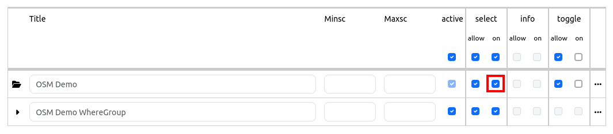

.. _basesourceswitcher:

BaseSourceSwitcher
******************

With this element you can switch between different predefined layers (BaseSources), e. g. background maps. You can define the layer as a BaseSource in the tab "Layersets" in the application. You have to edit the layer and set a checkmark at "BaseSource".

The BaseSourceSwitcher is a button group to change the map's background sources. It allows you to switch between predefined sourcesets. For every sourceset a button will be displayed in the client. Only one source set can be active at the same time.

You have the possibility to define groups. All sourcesets of the same group will be listed in a dropdown list with the group name as title.

.. image:: ../../../figures/basesourceswitcher.png
     :scale: 80

The BaseSourceSwitcher can also be used in the sidepane. The definition of groups is not possible in the sidepane. 

.. image:: ../../../figures/basesourceswitcher_sidepane.png
     :scale: 80

Configuration
=============

**Preparation**: In order to be able to configure the BaseSourceSwitcher you have to define Service instances as Basesource (checkbox "Basesource" on). Please note that on start of an application all sourcesets with an activated root layer are active.

.. image:: ../../../figures/basesourceswitcher_basesource.png
     :scale: 80

Configuration with selected root layer - sourceset is active on start:

Configuration with selected root layer - sourceset is not active on start:

.. image:: ../../../figures/basesourceswitcher_instance_not_active.png
     :scale: 80

The configuration occurs in 2 steps:

#. Create a BaseSourceSwitcher Element with Title, Tooltip and Target
#. Add sourceset(s) with one or more sources and definition of a group (optional)

.. image:: ../../../figures/basesourceswitcher_configuration.png
     :scale: 80

* **Title:** Title of the element.
* **Tooltip:** The text entered as a tooltip will be indicated by hovering over the element with the mouse cursor a longer time.
* **Target:** Id of Map element, activated after the click.
* **Instancesets:** One or many Instancesets can be defined. Select one or more instances and assign a title and group (optional).

In the configuration example you can see that either one, none or several entries per instanceset can be selected. You can create groups, which are then grouped together in the drop-down list.

* **Title**: Title of the BaseSource.
* **Group**: Optional group name.
* **Instances**: Sources for the BaseSource.

YAML-Definition:
----------------

This template can be used to insert the element into a YAML application.

.. code-block:: yaml

    title: 'BaseSourceSwitcher'                         # title
    tooltip: 'BaseSourceSwitcher'                       # text to use as tooltip
    target: map                                         # Id of Map element
    sourcesets:                                         # List of sourcesets
        - { title: sourcesetname, group: groupname,
            sources: [sourceId]}                        # sourceset: title,
                                                        # group: (optional) group name to group of sourcesets by "group name"
                                                        # sources list of sources
      sourcesets:
        - { title: sourcesetname, group: groupname,
            sources: [sourceId]}

