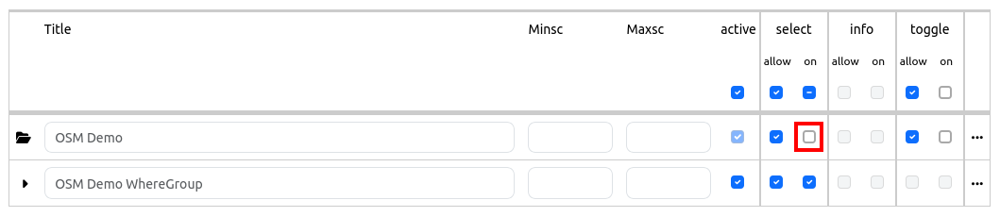

.. _basesourceswitcher:

Base source switcher
********************

With this element you can switch between different predefined layers (BaseSources), e. g. background maps. The Base source switcher is a button group to change the map's background sources. For every sourceset a button will be displayed in the client. Only one source set can be active at the same time.
You have the possibility to define groups. All sourcesets of the same group will be listed in a dropdown list with the group name as title.

.. image:: ../../../figures/basesourceswitcher.png
     :scale: 80

The Base source switcher can also be used in the sidepane. The definition of groups is not possible in the sidepane. 

Configuration
=============

**Preparation**: In order to be able to configure the Base source switcher, you have to define Service instances as BaseSource (checkbox "Basesource" on). You can define the layer as a BaseSource in the tab "Layersets" in the backend of the application. You have to edit the layer and set a checkmark at "BaseSource".
Please note that on start of an application all sourcesets with an activated root layer are active.

Configuration with selected root layer - sourceset is active on start:

.. image:: ../../../figures/basesourceswitcher_instance_active.png
     :scale: 80

Configuration with selected root layer - sourceset is not active on start:

The configuration of the element itself occurs in two steps:

#. Create a Base source switcher element with Title, Tooltip (and, if configured in Map area: Position)
#. Add sourceset(s) with one or more sources and definition of a group (optional)

* **Title:** Title of the element.
* **Tooltip:** The text entered as a tooltip will be indicated by hovering over the element with the cursor.
* **Instancesets:** One or more instancesets can be defined. Select one or more instances and assign a title and group (optional).

.. image:: ../../../figures/basesourceswitcher_configuration.png
     :scale: 80

In the configuration example either one, none or several entries per instanceset can be selected. You can create groups, which are then grouped together in the drop-down list. It's possible to move an instanceset in the configuration window via drag and drop.

* **Title**: Title of the BaseSource.
* **Group**: Optional group name.
* **Position:** Position (only when used in Map area). Options: 'left-top', 'right-top', 'left-bottom', 'right-bottom'
* **Instances**: Sources for the BaseSource.

YAML-Definition:
----------------

This template can be used to insert the element into a YAML application.

.. code-block:: yaml

    title: 'BaseSourceSwitcher'                         # title
    tooltip: 'BaseSourceSwitcher'                       # text to use as tooltip
    target: map                                         # Id of Map element
    anchor: 'right-bottom'                              # Position (only when used in Map area). Options: 'left-top', 'right-top', 'left-bottom', 'right-bottom'
    sourcesets:                                         # List of sourcesets
        - { title: sourcesetname, group: groupname,
            sources: [sourceId]}                        # sourceset: title,
                                                        # group: (optional) group name to group of sourcesets by "group name"
                                                        # sources list of sources
      sourcesets:
        - { title: sourcesetname, group: groupname,
            sources: [sourceId]}

