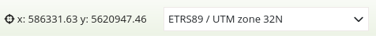
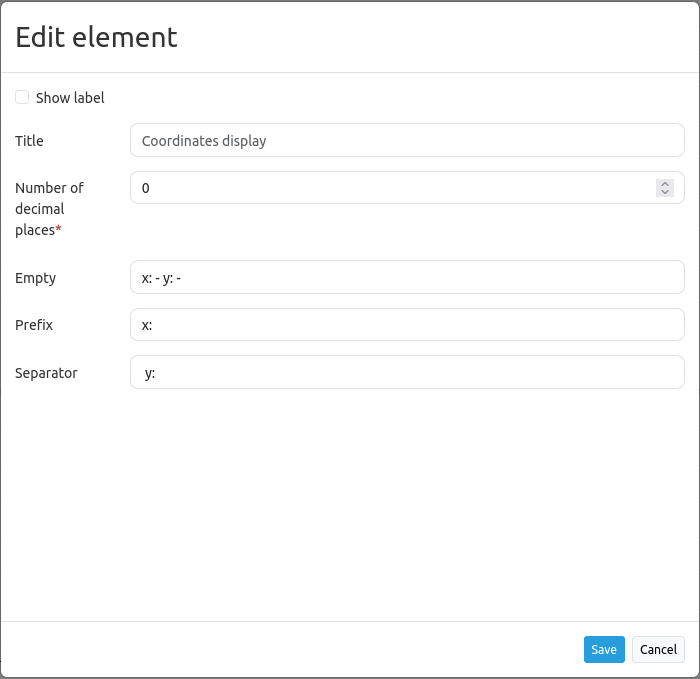

.. _coordinates_display:

Coordinates Display
*******************

The coordinates display element shows your mouse position in map coordinates.
The coordinates are dependent on the selected spatial reference system which may be changed in the
`Spatial Reference System Selector <srs_selector.html>`_.

The coordinates display for different coordinate systems looks like this:

ETRS89 / UTM zone 32N (EPSG:25832):

DHDN / 3-degree Gauss-Kruger zone 2 (EPSG:31466):

.. image:: ../../../figures/de/coordinates_display_gauss_krueger_zone2.png
     :scale: 80

WGS 84 (EPSG:4326):

.. image:: ../../../figures/de/coordinates_display_wgs84.png
     :scale: 80

WGS 84 / Pseudo-Mercator (EPSG:3857):

.. image:: ../../../figures/de/coordinates_display_wgs84_pseudo_mercator.png
     :scale: 80

Configuration
=============

* **Show label:** Show a label which incorporates the title and appears next to the coordinates.
* **Title:** Title of the element. It will appear next to the coordinates if "Show label" is activated.
* **Num digits:** Number of decimal digits of the coordinates.
* **Target:** ID of the map element to which the element refers.
* **Empty:** Text displayed when the mouse is not on the map (default: 'x = - y = -').
* **Prefix:** Prefix in front of the X coordinate (default: '= x').
* **Separator:** Separator in between the X coordinate and Y coordinate (default: ' y= ').

YAML-Definition:
----------------

This template can be used to insert the element into a YAML application.

.. code-block:: yaml

   numDigits: 2                   # the number of digits each coordinate shall have when being rendered (default: 2)
   target: ~                      # id of Map element to query
   label: true                    # true/false to label coordinates display (default: false)
   empty: 'x= - y= -'             # show this text if the mouse is not on the map
   prefix: 'x= '                  # show prefix before x coordinate
   separator: ' y= '              # show separator before y coordinate

CSS-Styling
===========

The element can be customized with the following CSS-style, for example to increase the width.

.. code-block:: css

                .mb-element-coordsdisplay {
                    width: 500px;
                }

