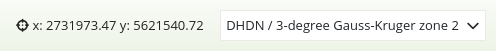

.. _coordinates_display:

Coordinates Display
*******************

The coordinates display element shows your mouse position in map coordinates.
The coordinates are dependent on the selected spatial reference system which may be changed in the
`Spatial Reference System Selector <srs_selector.html>`_.

The coordinates display for different coordinate systems looks like this:

ETRS89 / UTM zone 32N (EPSG:25832):

.. image:: ../../../figures/de/coordinates_display_etrs89_zone32.png
     :scale: 80

DHDN / 3-degree Gauss-Kruger zone 2 (EPSG:31466):

WGS 84 (EPSG:4326):

WGS 84 / Pseudo-Mercator (EPSG:3857):

.. image:: ../../../figures/de/coordinates_display_wgs84_pseudo_mercator.png
     :scale: 80

Configuration
=============

.. image:: ../../../figures/coordinates_display_configuration.png
     :scale: 80

* **Show title label:** Enable or disable text (title).
* **Title:** Title of the element. The title will be listed in "Layouts". It will be indicated if "Show label" is activated.
* **Tooltip:** Text that will be indicated if the mouse hovers over the button for a longer time.
* **Anchor:** Anchoring of the element (left-top, left-bottom, right-top, right-bottom). Determines the position of the element in the layout.
* **Num digits:** Number of decimal digits of the coordinates.
* **Target:** ID of the map element to which the element refers.
* **Empty:** Text displayed when the mouse is not in the map (default: 'x = - y = -').
* **Prefix:** Prefix in front of the X-coordinate (Standard '= x').
* **Separator:** Separator following the X-coordinate and before Y-coordinate (default: ' y= ').

YAML-Definition:
----------------

.. code-block:: yaml

   tooltip: 'coordinates display' # text to use as tooltip
   numDigits: 2                   # the number of digits each coordinate shall have when being rendered, default 2
   target: ~                      # id of Map element to query
   label: true                    # true/false to label coordinates display, default is false
   empty: 'x= - y= -'             # show the following text, if the mouse is not on the map
   prefix: 'x= '                  # show prefix before x-coordinate
   separator: ' y= '              # show separator before y-coordinate

CSS-Styling
===========

The element can be customized with the following CSS-style, for example to increase the width.

.. code-block:: css

                .mb-element-coordsdisplay {
                    width: 500px;
                }

Class, Widget & Style
=====================

* **Class:** Mapbender\\CoreBundle\\Element\\CoordinatesDisplay
* **Widget:** mapbender.element.coordinatesdisplay.js
* **Style:** mapbender.elements.css

HTTP Callbacks
==============

None.
